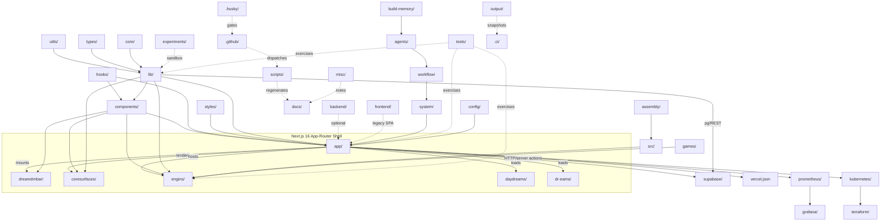

# DREAMengin — Repository Mirror Spec

**Generated:** 2026-04-18  
**Branch:** `completedream` (rewrite branch: `copilot/rewrite-gameenginspec-md`)  
**SHA:** `8f985a93e524123d9eaf43d6f7a571bda0a119bf`  
**Document type:** literal, high-detail mirror of the working tree at the SHA above.  
**Total tracked files:** 1654  
**Code files parsed (.ts/.tsx/.js/.jsx/.mjs/.cjs):** 1255  

## Repo summary

DREAMengin is a **DreamDM-Bar-led, stacked-runtime spatial operating environment** (canonical name per `docs/NAMING_AUTHORITY.md`). The runtime is privacy-first and dual: a Next.js 16 / React 19 / TypeScript / Tailwind App-Router shell (`app/`, `components/`, `lib/`, `hooks/`) hosts the always-mounted **DreamDMBar** (`dreamdmbar/`), three Core Surfaces — **HomeDream**, **EditProfileDream**, **ViewProfile** (`coresurfaces/`, `app/homedream/`, `app/edit-profiledream/`, `app/view-profile/`), six **Daydreams** (`daydreams/{brand,code,create,games,lab,music}`), six **Engins** (`engins/{Branding,Code,Forge,Lab,Game,StarMaker}Engin.tsx` + `ContentEngin.tsx`), and the **Dr-Eams** voice/capability surface (`dr-eams/`). A second Babylon.js 9 / WebGPU / Havok game runtime is layered through `games/`, `assembly/`, `src/`, and the GameEngin host. Persistence is **Supabase** (`supabase/migrations/*.sql`, `lib/supabase*`). Observability is OpenTelemetry → Prometheus + Grafana (`prometheus/`, `grafana/`). Deployments target Vercel (`vercel.json`), Kubernetes (`kubernetes/`), and Terraform-provisioned infra (`terraform/`). An optional Express social aggregator lives in `backend/` and a legacy Vite SPA in `frontend/`. Author: José Mancilla · pnpm 10.30.0 · Node 24/25.

## Legend

| Symbol | Meaning |
|---|---|
| 📺 | User-facing surface (rendered text, route, aria label, page title) |
| 🧠 | Engine / runtime code (no direct UI) |
| 🗄 | Data / database (SQL, schemas, seeds) |
| ⚙ | Config / infra (CI, deploy, lint, build) |
| 🧪 | Tests / experiments |
| ➡ | Imports / calls (forward) |
| ⬅ | Called by (reverse) |

## §2 Top-level architecture map



## §3 Per-folder deep section

Every tracked source/doc/config file gets a row. Public binary assets are listed in a single bullet summary. Lockfiles, generated `output/`, and the `.scratch_*` build artifacts of this generator are skipped.

### /(repo root)
**Purpose:** Root-level configuration, manifests, and entry markers.
**Screen label (if user-facing):** —

| File | 📺 Label | ➡ Imports | ⬅ Called by |
|---|---|---|---|
| `.env.example` | — | — | — |
| `.env.local.example` | — | — | — |
| `.gitignore` | — | — | — |
| `.gitleaks.toml` | — | — | _(entrypoint)_ |
| `AGENTS.md` | — | — | _(entrypoint)_ |
| `CHANGELOG.md` | — | — | _(entrypoint)_ |
| `GameENGINspec.md` | — | — | _(entrypoint)_ |
| `LICENSE` | — | — | — |
| `README.md` | — | — | _(entrypoint)_ |
| `REPO_STATE.md` | — | — | _(entrypoint)_ |
| `eslint.config.mjs` | — | _ext:_ eslint-config-next | _(entrypoint)_ |
| `kill-lib.sh` | — | — | — |
| `next-env.d.ts` | — | — | _(orphan)_ |
| `next.config.mjs` | — | _ext:_ next | _(entrypoint)_ |
| `package.json` | — | — | — |
| `playwright.config.ts` | — | _ext:_ @playwright/test | _(entrypoint)_ |
| `pnpm-workspace.yaml` | — | — | _(entrypoint)_ |
| `postcss.config.js` | — | — | _(entrypoint)_ |
| `postcss.config.mjs` | — | — | _(entrypoint)_ |
| `tailwind.config.ts` | — | — | _(entrypoint)_ |
| `tailwindcss-animate.d.ts` | — | _ext:_ tailwindcss | _(orphan)_ |
| `tsconfig.games.json` | — | — | — |
| `tsconfig.gamesengin.json` | — | — | — |
| `tsconfig.json` | — | — | — |
| `vercel.json` | — | — | — |
| `vitest.config.ts` | — | _ext:_ path, vitest | _(entrypoint)_ |

### /.ci
**Purpose:** CI snapshot artifacts (diff + markdown summary written by preflight workflow).
**Screen label (if user-facing):** —

| File | 📺 Label | ➡ Imports | ⬅ Called by |
|---|---|---|---|
| `snapshot.diff.txt` | — | — | — |
| `snapshot.md` | — | — | _(entrypoint)_ |

### /.github
**Purpose:** GitHub Actions, agents, PR templates, repo automation.
**Screen label (if user-facing):** —

| File | 📺 Label | ➡ Imports | ⬅ Called by |
|---|---|---|---|
| `PULL_REQUEST_TEMPLATE.md` | — | — | _(entrypoint)_ |
| `actions/setup-node/action.yml` | — | — | _(entrypoint)_ |
| `agents/Spec-Engin HyperSICC.agent.md` | — | — | _(entrypoint)_ |
| `agents/dreamengin.agent.md` | — | — | _(entrypoint)_ |
| `agents/error-tracker.agent.md` | — | — | _(entrypoint)_ |
| `agents/gameengin-ai-agent.yml` | — | — | _(entrypoint)_ |
| `agents/gameengin.md` | — | — | _(entrypoint)_ |
| `agents/humanAI.agent.md` | — | — | _(entrypoint)_ |
| `agents/idari.agent.md` | — | — | _(entrypoint)_ |
| `agents/my-agent.agent.md` | — | — | _(entrypoint)_ |
| `agents/newagent.agent.md` | — | — | _(entrypoint)_ |
| `agents/videogameAi.md` | — | — | _(entrypoint)_ |
| `pull_request_template.md` | — | — | _(entrypoint)_ |
| `scripts/check-root-hygiene.sh` | — | — | _(entrypoint)_ |
| `scripts/issue-bot.js` | — | _ext:_ child_process, fs, path | _(entrypoint)_ |
| `workflows/autofixvercelbuild.yml` | — | — | _(entrypoint)_ |
| `workflows/bot-pr-automerge.yml` | — | — | _(entrypoint)_ |
| `workflows/bouncer.yml` | — | — | _(entrypoint)_ |
| `workflows/copilot-setup-steps.yml` | — | — | _(entrypoint)_ |
| `workflows/daydream-all.yml` | — | — | _(entrypoint)_ |
| `workflows/daydream-brand-engin.yml` | — | — | _(entrypoint)_ |
| `workflows/daydream-code-engin.yml` | — | — | _(entrypoint)_ |
| `workflows/daydream-create-engin.yml` | — | — | _(entrypoint)_ |
| `workflows/daydream-engin-build-cycle.yml` | — | — | _(entrypoint)_ |
| `workflows/daydream-engin-sicc-refinement.yml` | — | — | _(entrypoint)_ |
| `workflows/daydream-games-engin.yml` | — | — | _(entrypoint)_ |
| `workflows/daydream-lab-engin.yml` | — | — | _(entrypoint)_ |
| `workflows/daydream-music-engin.yml` | — | — | _(entrypoint)_ |
| `workflows/db-extension-audit.yml` | — | — | _(entrypoint)_ |
| `workflows/db-extension-check.yml` | — | — | _(entrypoint)_ |
| `workflows/deploy-artifact.yml` | — | — | _(entrypoint)_ |
| `workflows/docs-auto-update.yml` | — | — | _(entrypoint)_ |
| `workflows/dreamengin-preflight.yml` | — | — | _(entrypoint)_ |
| `workflows/elite-gameengin-evolution.yml` | — | — | _(entrypoint)_ |
| `workflows/engin-all.yml` | — | — | _(entrypoint)_ |
| `workflows/exportrepo.yml` | — | — | _(entrypoint)_ |
| `workflows/game-engin-patrol.yml` | — | — | _(entrypoint)_ |
| `workflows/game-library-research.yml` | — | — | _(entrypoint)_ |
| `workflows/gameengin-ai-agent.yml` | — | — | _(entrypoint)_ |
| `workflows/gameengin-artisan.yml` | — | — | _(entrypoint)_ |
| `workflows/gameengin-maestro.yml` | — | — | _(entrypoint)_ |
| `workflows/gameengin-mechanic.yml` | — | — | _(entrypoint)_ |
| `workflows/gameengin-prophet.yml` | — | — | _(entrypoint)_ |
| `workflows/gameengin-upgrader.yml` | — | — | _(entrypoint)_ |
| `workflows/gameengin-writer.yml` | — | — | _(entrypoint)_ |
| `workflows/games-library-ai-agent.yml` | — | — | _(entrypoint)_ |
| `workflows/garbageman.yml` | — | — | _(entrypoint)_ |
| `workflows/generatesupabasetypes.yml` | — | — | _(entrypoint)_ |
| `workflows/github-actions.yml` | — | — | _(entrypoint)_ |
| `workflows/idari-daily.yml` | — | — | _(entrypoint)_ |
| `workflows/issue-bot.yml` | — | — | _(entrypoint)_ |
| `workflows/mobile-ps5-spec-evolution.yml` | — | — | _(entrypoint)_ |
| `workflows/neural_decision_engine.yml` | — | — | _(entrypoint)_ |
| `workflows/optimize-dreamengin.yml` | — | — | _(entrypoint)_ |
| `workflows/portfolio-optimization.yml` | — | — | _(entrypoint)_ |
| `workflows/preflight.yml` | — | — | _(entrypoint)_ |
| `workflows/readme-spec-bot-army.yml` | — | — | _(entrypoint)_ |
| `workflows/refreshlock.yml` | — | — | _(entrypoint)_ |
| `workflows/repo-snapshot.yml` | — | — | _(entrypoint)_ |
| `workflows/report-driven-coding-agent.yml` | — | — | _(entrypoint)_ |
| `workflows/root-hygiene.yml` | — | — | _(entrypoint)_ |
| `workflows/spec-engin-ai-agent.yml` | — | — | _(entrypoint)_ |
| `workflows/sql-migration-guard.yml` | — | — | _(entrypoint)_ |
| `workflows/sync-build-memory.yml` | — | — | _(entrypoint)_ |
| `workflows/update-embed-feed.yml` | — | — | _(entrypoint)_ |
| `workflows/vercel-deploy.yml` | — | — | _(entrypoint)_ |

### /.husky
**Purpose:** Git hook scripts (pre-commit / pre-push).
**Screen label (if user-facing):** —

| File | 📺 Label | ➡ Imports | ⬅ Called by |
|---|---|---|---|
| `pre-commit` | — | — | — |
| `pre-push` | — | — | — |

### /agents
**Purpose:** Top-level agent registry (Daydreams agent metadata).
**Screen label (if user-facing):** —

| File | 📺 Label | ➡ Imports | ⬅ Called by |
|---|---|---|---|
| `.gitkeep` | — | — | — |

### /app
**Purpose:** Next.js 16 App Router — every user-facing route, server action, and API endpoint.
**Screen label (if user-facing):** Routed surfaces (Next.js)

| File | 📺 Label | ➡ Imports | ⬅ Called by |
|---|---|---|---|
| `about/page.tsx` | Welcome to DREAMengin | …mponents/ui/PlatformBadge.tsx<br>_ext:_ lucide-react, next | _(entrypoint)_ |
| `actions/dream-docs.ts` | — | lib/ai/triad.ts, lib/dream-docs/embed.ts, lib/supabase/server.ts +1 | _(orphan)_ |
| `admin/page.tsx` | Admin Dashboard | …mponents/ChildSafetyPanel.tsx, components/IDariPanel.tsx, lib/admin/upgrade-readiness.ts +3<br>_ext:_ lucide-react, next | _(entrypoint)_ |
| `admin/platform-health/page.tsx` | IDARi — Platform Health | …ents/idari/PlatformHealth.tsx, lib/supabase/server.ts<br>_ext:_ next | _(entrypoint)_ |
| `ads/create/page.tsx` | Create Ad Slot | lib/supabase/client.ts<br>_ext:_ lucide-react, next, react | _(entrypoint)_ |
| `ads/page.tsx` | Ads | components/ui/DreamWord.tsx, lib/supabase/server.ts, types/ads.ts<br>_ext:_ lucide-react, next | _(entrypoint)_ |
| `ads/slot/[id]/page.tsx` | Ad Slot | lib/supabase/server.ts, types/ads.ts<br>_ext:_ lucide-react, next | _(entrypoint)_ |
| `api/account/delete-data/route.ts` | — | lib/ai/audit.ts, lib/api/route.ts, lib/supabase/server.ts<br>_ext:_ next, uuid, zod | _(entrypoint)_ |
| `api/account/delete-dream/route.ts` | — | lib/agents/agentBus.ts, lib/ai/audit.ts, lib/api/route.ts +1<br>_ext:_ next, uuid, zod | _(entrypoint)_ |
| `api/account/export-data/route.ts` | — | lib/api/route.ts, lib/supabase/server.ts<br>_ext:_ next | _(entrypoint)_ |
| `api/activity/track/route.ts` | — | lib/activity/scoring.ts, lib/activity/types.ts, lib/supabase/server.ts<br>_ext:_ next | _(entrypoint)_ |
| `api/admin/ai-chat/route.ts` | — | lib/admin/lockout.ts, lib/ai/groq.ts, lib/ai/triad.ts +1<br>_ext:_ next | _(entrypoint)_ |
| `api/admin/ai-request/route.ts` | — | lib/supabase/server.ts<br>_ext:_ next | _(entrypoint)_ |
| `api/admin/child-safety/route.ts` | — | lib/ai/triad.ts, lib/api/route.ts, lib/supabase/server.ts<br>_ext:_ next, zod | _(entrypoint)_ |
| `api/admin/code-files/route.ts` | — | lib/admin/lockout.ts, lib/supabase/server.ts<br>_ext:_ fs, next, path | _(entrypoint)_ |
| `api/admin/observability/route.ts` | — | lib/ai/triad.ts, lib/api/route.ts, lib/observability/collector.ts +4<br>_ext:_ next | _(entrypoint)_ |
| `api/ads/orders/route.ts` | — | lib/supabase/server.ts<br>_ext:_ next | tests/platform-utils.test.ts |
| `api/ads/view/route.ts` | — | lib/activity/aqs.ts, lib/activity/types.ts, lib/supabase/server.ts<br>_ext:_ next | _(entrypoint)_ |
| `api/agent/session/route.ts` | — | lib/agentOS.ts, lib/agentOS/hostTools.ts<br>_ext:_ next | _(entrypoint)_ |
| `api/ai/boogieman/child-safety/route.ts` | — | lib/ai/audit.ts, lib/ai/boogieman.ts, lib/ai/rateLimit.ts +6<br>_ext:_ crypto, next, uuid +1 | _(entrypoint)_ |
| `api/ai/boogieman/privacy-event/route.ts` | — | lib/ai/audit.ts, lib/ai/boogieman.ts, lib/api/route.ts +1<br>_ext:_ next, uuid, zod | _(entrypoint)_ |
| `api/ai/boogieman/route.ts` | — | lib/ai/audit.ts, lib/ai/boogieman.ts, lib/ai/rateLimit.ts +3<br>_ext:_ next, uuid, zod | _(entrypoint)_ |
| `api/ai/boogieman/status/route.ts` | — | lib/ai/boogie-policy.ts<br>_ext:_ next | _(entrypoint)_ |
| `api/ai/eams/route.ts` | — | lib/ai/audit.ts, lib/ai/boogieman.ts, lib/ai/confirm.ts +5<br>_ext:_ next, uuid | _(entrypoint)_ |
| `api/ai/execute/route.ts` | — | lib/ai/audit.ts, lib/ai/confirm.ts, lib/ai/rateLimit.ts +5<br>_ext:_ next | _(entrypoint)_ |
| `api/ai/idari/route.ts` | — | lib/agents/idari.ts, lib/ai/audit.ts, lib/ai/boogieman.ts +6<br>_ext:_ next, uuid | _(entrypoint)_ |
| `api/appeal/route.ts` | — | lib/ai/audit.ts, lib/ai/boogie-policy.ts, lib/ai/schemas.ts +2<br>_ext:_ next, uuid | _(entrypoint)_ |
| `api/auth/logout/route.ts` | — | lib/supabase/server.ts<br>_ext:_ next | _(entrypoint)_ |
| `api/auth/providers/route.ts` | — | lib/supabase/env.ts<br>_ext:_ next | …/auth-providers-route.test.ts |
| `api/blocks/route.ts` | — | lib/api/route.ts, lib/supabase/server.ts<br>_ext:_ next, zod | _(entrypoint)_ |
| `api/ci/run/route.ts` | — | _ext:_ child_process, next | _(entrypoint)_ |
| `api/close-friends/route.ts` | — | lib/supabase/server.ts<br>_ext:_ next | _(entrypoint)_ |
| `api/comments/route.ts` | — | …safety/childSafetyDetector.ts, …child-safety/ncmecReporter.ts, lib/supabase/server.ts<br>_ext:_ crypto, next, zod | _(entrypoint)_ |
| `api/connectors/[provider]/connect/route.ts` | — | …nnectors/providers/bluesky.ts, …onnectors/providers/github.ts, …nectors/providers/mastodon.ts +5<br>_ext:_ next | _(entrypoint)_ |
| `api/connectors/[provider]/disconnect/route.ts` | — | lib/supabase/server.ts<br>_ext:_ next | _(entrypoint)_ |
| `api/connectors/[provider]/items/route.ts` | — | lib/supabase/server.ts<br>_ext:_ next | _(entrypoint)_ |
| `api/connectors/[provider]/sync/route.ts` | — | lib/connectors/normalise.ts, …nnectors/providers/bluesky.ts, …onnectors/providers/github.ts +6<br>_ext:_ next | _(entrypoint)_ |
| `api/connectors/[provider]/verify/route.ts` | — | …nnectors/providers/bluesky.ts, …onnectors/providers/github.ts, …nectors/providers/mastodon.ts +5<br>_ext:_ next | _(entrypoint)_ |
| `api/connectors/instagram/oauth/callback/route.ts` | — | lib/supabase/server.ts<br>_ext:_ next | _(entrypoint)_ |
| `api/connectors/instagram/oauth/start/route.ts` | — | _ext:_ next | _(entrypoint)_ |
| `api/connectors/status/route.ts` | — | …nnectors/connectorRegistry.ts, lib/supabase/server.ts<br>_ext:_ next | _(entrypoint)_ |
| `api/connectors/youtube/oauth/callback/route.ts` | — | lib/supabase/server.ts<br>_ext:_ next | _(entrypoint)_ |
| `api/connectors/youtube/oauth/start/route.ts` | — | _ext:_ next | _(entrypoint)_ |
| `api/content/generative-fill/route.ts` | — | lib/supabase/server.ts<br>_ext:_ next, zod | …contentengin-features.test.ts |
| `api/content/intelligence/route.ts` | — | lib/supabase/server.ts<br>_ext:_ next, zod | …t-intelligence-routes.test.ts |
| `api/content/transcribe/route.ts` | — | …b/content/transcriptEditor.ts, lib/supabase/server.ts<br>_ext:_ next, zod | …contentengin-features.test.ts |
| `api/content/voice-clone/route.ts` | — | lib/content/voiceClone.ts, lib/supabase/server.ts<br>_ext:_ next, zod | …contentengin-features.test.ts |
| `api/dr-eams/hf/route.ts` | — | _ext:_ next | _(entrypoint)_ |
| `api/dr-eams/run/route.ts` | — | _ext:_ next | _(entrypoint)_ |
| `api/drafts/[id]/route.ts` | — | lib/supabase/server.ts<br>_ext:_ next, zod | _(entrypoint)_ |
| `api/drafts/route.ts` | — | lib/supabase/server.ts<br>_ext:_ next, zod | _(entrypoint)_ |
| `api/dream-windows/[id]/route.ts` | — | …indow/DreamWindowLifecycle.ts, lib/supabase/server.ts<br>_ext:_ next | _(entrypoint)_ |
| `api/dream-windows/route.ts` | — | …indow/DreamWindowLifecycle.ts, lib/supabase/server.ts<br>_ext:_ next | _(entrypoint)_ |
| `api/dreamengin/os-status/route.ts` | — | lib/supabase/server.ts<br>_ext:_ next | _(entrypoint)_ |
| `api/dreamr/feed/route.ts` | — | …algorithms/dreamrAlgorithm.ts, lib/media/postMedia.ts, lib/supabase/server.ts<br>_ext:_ next | _(entrypoint)_ |
| `api/dreamr/suggested/route.ts` | — | …algorithms/dreamrAlgorithm.ts, lib/media/postMedia.ts, lib/supabase/server.ts<br>_ext:_ next | _(entrypoint)_ |
| `api/embed-feed/route.ts` | — | lib/feeds/embedFeedLoader.ts, lib/supabase/env.ts<br>_ext:_ @supabase/supabase-js, next | _(entrypoint)_ |
| `api/favorites/route.ts` | — | lib/supabase/server.ts<br>_ext:_ next | _(entrypoint)_ |
| `api/feed/route.ts` | — | …/activity/visibility-score.ts, lib/media/postMedia.ts, lib/supabase/server.ts<br>_ext:_ next | _(entrypoint)_ |
| `api/follow/route.ts` | — | lib/supabase/server.ts<br>_ext:_ next | _(entrypoint)_ |
| `api/forge/build/route.ts` | — | lib/ai/groq.ts, lib/ai/triad.ts, lib/forge/forgeBuild.ts +1<br>_ext:_ next | _(entrypoint)_ |
| `api/gal/route.ts` | — | lib/supabase/server.ts<br>_ext:_ next | tests/platform-utils.test.ts |
| `api/game-scores/route.ts` | — | lib/supabase/server.ts<br>_ext:_ next, zod | _(entrypoint)_ |
| `api/gameengin/crash-report/route.ts` | — | lib/gameengin/brain-reader.ts<br>_ext:_ next | tests/gameengin-loop.test.ts |
| `api/home-layout/route.ts` | — | lib/supabase/server.ts<br>_ext:_ next | _(entrypoint)_ |
| `api/journey/route.ts` | — | lib/supabase/server.ts, types/supabase.ts<br>_ext:_ next | _(entrypoint)_ |
| `api/lab/benchmarks/route.ts` | — | lib/supabase/server.ts<br>_ext:_ next | …t-intelligence-routes.test.ts |
| `api/ledger-media/route.ts` | — | lib/media/ledger.ts, lib/supabase/server.ts<br>_ext:_ next | _(entrypoint)_ |
| `api/likes/route.ts` | — | lib/supabase/server.ts<br>_ext:_ next | _(entrypoint)_ |
| `api/marketplace/request/route.ts` | — | lib/marketplace/request.ts, lib/supabase/server.ts<br>_ext:_ next | _(entrypoint)_ |
| `api/marketplace/route.ts` | — | lib/supabase/server.ts<br>_ext:_ next | _(entrypoint)_ |
| `api/messages/boards/route.ts` | — | lib/supabase/server.ts<br>_ext:_ next, zod | _(entrypoint)_ |
| `api/messages/route.ts` | — | …safety/childSafetyDetector.ts, …child-safety/ncmecReporter.ts, …child-safety/scanMediaUrls.ts +1<br>_ext:_ crypto, next | _(entrypoint)_ |
| `api/metrics/platform/route.ts` | — | lib/activity/types.ts, lib/supabase/server.ts<br>_ext:_ next | _(entrypoint)_ |
| `api/metrics/route.ts` | — | lib/observability/otel.ts, …b/observability/otelBridge.ts<br>_ext:_ next | _(entrypoint)_ |
| `api/metrics/user/[userId]/route.ts` | — | lib/activity/types.ts, lib/supabase/server.ts, types/supabase.ts<br>_ext:_ next | _(entrypoint)_ |
| `api/music/route.ts` | — | lib/supabase/server.ts<br>_ext:_ next | _(entrypoint)_ |
| `api/notifications/route.ts` | — | lib/supabase/server.ts<br>_ext:_ next | _(entrypoint)_ |
| `api/posts/[id]/route.ts` | — | lib/supabase/server.ts<br>_ext:_ next | _(entrypoint)_ |
| `api/posts/[id]/save/route.ts` | — | lib/supabase/server.ts<br>_ext:_ next | _(entrypoint)_ |
| `api/posts/[id]/view/route.ts` | — | lib/supabase/server.ts<br>_ext:_ next | _(entrypoint)_ |
| `api/posts/profile/[userId]/route.ts` | — | lib/supabase/server.ts<br>_ext:_ next | _(entrypoint)_ |
| `api/posts/route.ts` | — | …safety/childSafetyDetector.ts, …child-safety/ncmecReporter.ts, …child-safety/scanMediaUrls.ts +2<br>_ext:_ crypto, next | _(entrypoint)_ |
| `api/profile/route.ts` | — | lib/supabase/server.ts<br>_ext:_ next | _(entrypoint)_ |
| `api/projects/route.ts` | — | lib/supabase/server.ts<br>_ext:_ next | _(entrypoint)_ |
| `api/scheduled-posts/route.ts` | — | lib/supabase/server.ts<br>_ext:_ next | _(entrypoint)_ |
| `api/security/scan/route.ts` | — | _ext:_ child_process, next, util | _(entrypoint)_ |
| `api/settings/appearance/route.ts` | — | lib/supabase/server.ts<br>_ext:_ next | _(entrypoint)_ |
| `api/settings/feed/route.ts` | — | lib/supabase/server.ts<br>_ext:_ next | _(entrypoint)_ |
| `api/settings/notifications/route.ts` | — | lib/supabase/server.ts<br>_ext:_ next | _(entrypoint)_ |
| `api/settings/privacy/route.ts` | — | lib/supabase/server.ts<br>_ext:_ next | _(entrypoint)_ |
| `api/setup/check/route.ts` | — | lib/setup/checks.ts<br>_ext:_ next | _(entrypoint)_ |
| `api/setup/google-oauth/route.ts` | — | lib/supabase/env.ts<br>_ext:_ next | _(entrypoint)_ |
| `api/shellhub/devices/route.ts` | — | …nectors/providers/shellhub.ts, lib/supabase/server.ts<br>_ext:_ next | _(entrypoint)_ |
| `api/shop/route.ts` | — | lib/shop/listings.ts, lib/supabase/server.ts<br>_ext:_ next | _(entrypoint)_ |
| `api/skip-credits/balance/route.ts` | — | lib/supabase/server.ts<br>_ext:_ next | _(entrypoint)_ |
| `api/skip-credits/earn/route.ts` | — | lib/activity/types.ts, lib/supabase/server.ts<br>_ext:_ next | _(entrypoint)_ |
| `api/skip-credits/use/route.ts` | — | lib/activity/types.ts, lib/supabase/server.ts<br>_ext:_ next | _(entrypoint)_ |
| `api/social/rss-feed/route.ts` | — | lib/social/rss-feed.ts, types/connector.ts<br>_ext:_ next | _(entrypoint)_ |
| `api/upload/route.ts` | — | lib/supabase/server.ts<br>_ext:_ crypto, next, zlib | _(entrypoint)_ |
| `api/views/track/route.ts` | — | lib/activity/types.ts, lib/supabase/server.ts<br>_ext:_ next | _(entrypoint)_ |
| `api/widgets/feed/route.ts` | — | lib/supabase/server.ts, lib/widgets/feed-resolver.ts, types/widget-system-v2.ts<br>_ext:_ next | _(entrypoint)_ |
| `api/widgets/instances/route.ts` | — | lib/supabase/server.ts, types/widget-system-v2.ts<br>_ext:_ next, zod | _(entrypoint)_ |
| `api/youtube/channel/route.ts` | — | …nnectors/providers/youtube.ts, types/connector.ts<br>_ext:_ next | _(entrypoint)_ |
| `api/youtube/discovery/route.ts` | — | …nnectors/providers/youtube.ts, types/connector.ts<br>_ext:_ next | _(entrypoint)_ |
| `api/youtube/live-feed/route.ts` | — | …nnectors/providers/youtube.ts, types/connector.ts<br>_ext:_ next | _(entrypoint)_ |
| `auth/callback/route.ts` | — | lib/supabase/env.ts<br>_ext:_ @supabase/ssr, next | _(entrypoint)_ |
| `auth/reset-password/page.tsx` | — | lib/supabase/client.ts<br>_ext:_ next, react | _(entrypoint)_ |
| `auth/update-password/page.tsx` | — | …onents/auth/PasswordField.tsx, lib/supabase/client.ts<br>_ext:_ next, react | _(entrypoint)_ |
| `codespace/CodeSpaceClient.tsx` | ✨ Dreamengin CodeSpace | _ext:_ , , lucide-react, next +1 | _(orphan)_ |
| `codespace/page.tsx` | — | _ext:_ next | _(entrypoint)_ |
| `connectors/ConnectorsClient.tsx` | Mastodon | …/connectors/AddSliceSheet.tsx, …ctors/ConnectWidgetPrompt.tsx, …s/connectors/ConnectorRow.tsx +7<br>_ext:_ lucide-react, react | app/connectors/page.tsx, …ts/panels/ConnectorsPanel.tsx |
| `connectors/page.tsx` | System Integrations | …nnectors/ConnectorsClient.tsx, lib/supabase/server.ts<br>_ext:_ lucide-react, next | _(entrypoint)_ |
| `daydream/brand/engin/page.tsx` | — | _ext:_ next | _(entrypoint)_ |
| `daydream/brand/page.tsx` | — | …am/BrandDaydreamDashboard.tsx, …ts/daydream/DaydreamShell.tsx, …i/AuthenticatedPageHeader.tsx +2<br>_ext:_ lucide-react, next | _(entrypoint)_ |
| `daydream/code/engin/page.tsx` | — | _ext:_ next | _(entrypoint)_ |
| `daydream/code/page.tsx` | Code Vault | …ts/daydream/DaydreamShell.tsx, …m/OpenDaydreamSideBButton.tsx, …i/AuthenticatedPageHeader.tsx +2<br>_ext:_ lucide-react, next | _(entrypoint)_ |
| `daydream/constellation/ConstellationClient.tsx` | — | …eam/DreamConstellationMap.tsx<br>_ext:_ lucide-react, next | …ydream/constellation/page.tsx |
| `daydream/constellation/page.tsx` | — | …ation/ConstellationClient.tsx, lib/supabase/server.ts<br>_ext:_ next | _(entrypoint)_ |
| `daydream/create/engin/page.tsx` | — | _ext:_ next | _(entrypoint)_ |
| `daydream/create/page.tsx` | Ready to Create? | …ts/daydream/DaydreamShell.tsx, …m/OpenDaydreamSideBButton.tsx, …i/AuthenticatedPageHeader.tsx +2<br>_ext:_ lucide-react, next | _(entrypoint)_ |
| `daydream/field/page.tsx` | — | …nents/daydream/DREAMfield.tsx, lib/supabase/server.ts<br>_ext:_ next | _(entrypoint)_ |
| `daydream/forge/page.tsx` | Creative Momentum | …ts/daydream/DaydreamShell.tsx, …forge/ForgeMomentumWidget.tsx, …i/AuthenticatedPageHeader.tsx +3<br>_ext:_ lucide-react, next | _(entrypoint)_ |
| `daydream/game/GamePageClient.tsx` | — | …games/BabylonSideScroller.tsx | _(orphan)_ |
| `daydream/game/ImmersiveGameShell.tsx` | — | components/games/GameHUD.tsx, components/games/GamesHub.tsx, lib/games/hooks.ts +1<br>_ext:_ next, react | _(orphan)_ |
| `daydream/game/page.tsx` | — | _ext:_ next | _(entrypoint)_ |
| `daydream/games/engin/page.tsx` | — | _ext:_ next | _(entrypoint)_ |
| `daydream/games/page.tsx` | Side A | …ts/daydream/DaydreamShell.tsx, …m/OpenDaydreamSideBButton.tsx, …ponents/games/AvatarMaker.tsx +7<br>_ext:_ lucide-react, next | _(entrypoint)_ |
| `daydream/lab/engin/page.tsx` | — | _ext:_ next | _(entrypoint)_ |
| `daydream/lab/page.tsx` | Experiment Vault | …ts/daydream/DaydreamShell.tsx, …m/OpenDaydreamSideBButton.tsx, …i/AuthenticatedPageHeader.tsx +2<br>_ext:_ lucide-react, next | _(entrypoint)_ |
| `daydream/lab/portfolio/page.tsx` | Optimizero | …ts/daydream/DaydreamShell.tsx, …/portfolio/PortfolioEngin.tsx, lib/supabase/server.ts<br>_ext:_ lucide-react, next | _(entrypoint)_ |
| `daydream/media-vault/page.tsx` | — | _ext:_ next | _(entrypoint)_ |
| `daydream/music/engin/page.tsx` | — | _ext:_ next | _(entrypoint)_ |
| `daydream/music/page.tsx` | — | …ts/daydream/DaydreamShell.tsx, …nents/music/SoundRecorder.tsx, …i/AuthenticatedPageHeader.tsx +2<br>_ext:_ lucide-react, next | _(entrypoint)_ |
| `daydream/play/page.tsx` | — | lib/games/navigation.ts<br>_ext:_ next | _(entrypoint)_ |
| `discover/page.tsx` | Discover | lib/supabase/server.ts<br>_ext:_ lucide-react, next | _(entrypoint)_ |
| `dream-effects/page.tsx` | Dream Effects Engine | …mponents/three/DreamScene.tsx, lib/gsap/useGsapEntrance.ts, lib/utils.ts +1<br>_ext:_ framer-motion, lucide-react, next +1 | _(entrypoint)_ |
| `dreamengin/DreamenginClient.tsx` | — | …/dreamengin/DreamenginApp.tsx<br>_ext:_ next | _(orphan)_ |
| `dreamengin/page.tsx` | — | _ext:_ next | _(entrypoint)_ |
| `edit-profile/page.tsx` | — | _ext:_ next | _(entrypoint)_ |
| `edit-profiledream/page.tsx` | Edit Profile | …profile/ProfileWidgetGrid.tsx, components/ui/DreamWord.tsx, lib/supabase/client.ts<br>_ext:_ lucide-react, next, react | _(entrypoint)_ |
| `engines/brand/campaigns/page.tsx` | — | …and/panels/CampaignsPanel.tsx, …nents/engines/shared/index.ts, lib/dev-bypass.ts +1<br>_ext:_ next | _(entrypoint)_ |
| `engines/brand/identity/page.tsx` | — | …rand/panels/IdentityPanel.tsx, …nents/engines/shared/index.ts, lib/dev-bypass.ts +1<br>_ext:_ next | _(entrypoint)_ |
| `engines/brand/layout.tsx` | — | _ext:_ react | _(entrypoint)_ |
| `engines/brand/page.tsx` | — | …gines/brand/BrandEnginApp.tsx, lib/dev-bypass.ts, lib/supabase/server.ts<br>_ext:_ next | _(entrypoint)_ |
| `engines/code/ai/page.tsx` | — | …gines/code/panels/AIPanel.tsx, …nents/engines/shared/index.ts, lib/dev-bypass.ts +1<br>_ext:_ next | _(entrypoint)_ |
| `engines/code/layout.tsx` | — | _ext:_ react | _(entrypoint)_ |
| `engines/code/notebook/page.tsx` | — | …code/panels/NotebookPanel.tsx, …nents/engines/shared/index.ts, lib/dev-bypass.ts +1<br>_ext:_ next | _(entrypoint)_ |
| `engines/code/page.tsx` | — | …engines/code/CodeEnginApp.tsx, lib/dev-bypass.ts, lib/supabase/server.ts<br>_ext:_ next | _(entrypoint)_ |
| `engines/code/projects/page.tsx` | — | …code/panels/ProjectsPanel.tsx, …nents/engines/shared/index.ts, lib/dev-bypass.ts +1<br>_ext:_ next | _(entrypoint)_ |
| `engines/create/calendar/page.tsx` | — | …eate/panels/CalendarPanel.tsx, …nents/engines/shared/index.ts, lib/dev-bypass.ts +1<br>_ext:_ next | _(entrypoint)_ |
| `engines/create/editor/page.tsx` | — | …create/panels/EditorPanel.tsx, …nents/engines/shared/index.ts, lib/dev-bypass.ts +1<br>_ext:_ next | _(entrypoint)_ |
| `engines/create/layout.tsx` | — | _ext:_ react | _(entrypoint)_ |
| `engines/create/page.tsx` | — | …nes/create/CreateEnginApp.tsx, lib/dev-bypass.ts, lib/supabase/server.ts<br>_ext:_ next | _(entrypoint)_ |
| `engines/create/queue/page.tsx` | — | …/create/panels/QueuePanel.tsx, …nents/engines/shared/index.ts, lib/dev-bypass.ts +1<br>_ext:_ next | _(entrypoint)_ |
| `engines/games/builder/page.tsx` | — | …games/panels/BuilderPanel.tsx, …nents/engines/shared/index.ts, lib/dev-bypass.ts +1<br>_ext:_ next | _(entrypoint)_ |
| `engines/games/layout.tsx` | — | _ext:_ react | _(entrypoint)_ |
| `engines/games/library/page.tsx` | — | …games/panels/LibraryPanel.tsx, …nents/engines/shared/index.ts, lib/dev-bypass.ts +1<br>_ext:_ next | _(entrypoint)_ |
| `engines/games/page.tsx` | — | …ngines/games/GameEnginApp.tsx, lib/dev-bypass.ts, lib/supabase/server.ts<br>_ext:_ next | _(entrypoint)_ |
| `engines/games/scores/page.tsx` | — | …/games/panels/ScoresPanel.tsx, …nents/engines/shared/index.ts, lib/dev-bypass.ts +1<br>_ext:_ next | _(entrypoint)_ |
| `engines/lab/data/page.tsx` | — | …s/lab/panels/DataVizPanel.tsx, …nents/engines/shared/index.ts, lib/dev-bypass.ts +1<br>_ext:_ next | _(entrypoint)_ |
| `engines/lab/experiments/page.tsx` | — | …b/panels/ExperimentsPanel.tsx, …nents/engines/shared/index.ts, lib/dev-bypass.ts +1<br>_ext:_ next | _(entrypoint)_ |
| `engines/lab/layout.tsx` | — | _ext:_ react | _(entrypoint)_ |
| `engines/lab/page.tsx` | — | …s/engines/lab/LabEnginApp.tsx, lib/dev-bypass.ts, lib/supabase/server.ts<br>_ext:_ next | _(entrypoint)_ |
| `engines/lab/quantum/page.tsx` | — | …s/lab/panels/QuantumPanel.tsx, …nents/engines/shared/index.ts, lib/dev-bypass.ts +1<br>_ext:_ next | _(entrypoint)_ |
| `engines/layout.tsx` | — | _ext:_ react | _(entrypoint)_ |
| `engines/music/arrange/page.tsx` | — | …music/panels/ArrangePanel.tsx, …nents/engines/shared/index.ts, lib/dev-bypass.ts +1<br>_ext:_ next | _(entrypoint)_ |
| `engines/music/layout.tsx` | — | _ext:_ react | _(entrypoint)_ |
| `engines/music/library/page.tsx` | — | …/panels/MusicLibraryPanel.tsx, …nents/engines/shared/index.ts, lib/dev-bypass.ts +1<br>_ext:_ next | _(entrypoint)_ |
| `engines/music/page.tsx` | — | …gines/music/MusicEnginApp.tsx, lib/dev-bypass.ts, lib/supabase/server.ts<br>_ext:_ next | _(entrypoint)_ |
| `engines/music/studio/page.tsx` | — | …/music/panels/StudioPanel.tsx, …nents/engines/shared/index.ts, lib/dev-bypass.ts +1<br>_ext:_ next | _(entrypoint)_ |
| `engines/page.tsx` | — | lib/dev-bypass.ts, lib/supabase/server.ts<br>_ext:_ next | _(entrypoint)_ |
| `error.tsx` | — | lib/supabase/client.ts<br>_ext:_ react | _(entrypoint)_ |
| `feed-settings/FeedSettingsClient.tsx` | Feed | _ext:_ lucide-react, next, react | app/feed-settings/page.tsx |
| `feed-settings/page.tsx` | — | …ttings/FeedSettingsClient.tsx, lib/supabase/server.ts<br>_ext:_ next | _(entrypoint)_ |
| `gameengin/cartridges/[id]/page.tsx` | — | …meengin/CartridgeLauncher.tsx, …eengin/cartridges/manifest.ts<br>_ext:_ next | _(entrypoint)_ |
| `gameengin/cartridges/page.tsx` | — | …ameengin/CartridgeBrowser.tsx<br>_ext:_ next | _(entrypoint)_ |
| `gameengin/page.tsx` | — | _ext:_ next | _(entrypoint)_ |
| `global-error.tsx` | System hiccup. | _ext:_ react | _(entrypoint)_ |
| `globals-enhanced.css` | — | — | — |
| `globals.css` | — | — | — |
| `home/page.tsx` | — | _ext:_ next | _(entrypoint)_ |
| `homedream/page.tsx` | — | …mbar/homedream/HomeSystem.tsx, lib/ai/triad.ts, lib/dev-bypass.ts +3<br>_ext:_ next | …s/homedream-page-auth.test.ts |
| `join/page.tsx` | Email | …onents/auth/PasswordField.tsx, lib/supabase/client.ts<br>_ext:_ next, react | _(entrypoint)_ |
| `lab/[id]/codespace/page.tsx` | Hello Dreamengin! ✨ | _ext:_ , , lucide-react, next +1 | _(entrypoint)_ |
| `lab/[id]/page.tsx` | Physics Simulation | lib/supabase/server.ts<br>_ext:_ lucide-react, next | _(entrypoint)_ |
| `lab/new/page.tsx` | New Project | lib/supabase/client.ts<br>_ext:_ lucide-react, next, react | _(entrypoint)_ |
| `lab/page.tsx` | Lab | lib/supabase/server.ts<br>_ext:_ lucide-react, next | _(entrypoint)_ |
| `layout.tsx` | Main content | components/CommandPalette.tsx, components/KonamiDream.tsx, components/ThemeApplicator.tsx +12<br>_ext:_ next, react | _(entrypoint)_ |
| `loading.tsx` | — | — | _(entrypoint)_ |
| `login/page.tsx` | — | …onents/auth/PasswordField.tsx, lib/supabase/client.ts<br>_ext:_ next, react | _(entrypoint)_ |
| `marketplace/[id]/page.tsx` | Marketplace | …/MarketplaceRequestButton.tsx, components/ui/DreamWord.tsx, lib/supabase/server.ts<br>_ext:_ lucide-react, next | _(entrypoint)_ |
| `marketplace/page.tsx` | Marketplace | …ce/MarketplaceListingCard.tsx, …i/AuthenticatedPageHeader.tsx, components/ui/DreamWord.tsx +1<br>_ext:_ lucide-react, next | _(entrypoint)_ |
| `marketplace/sell/page.tsx` | List an Item | lib/supabase/client.ts<br>_ext:_ lucide-react, next, react | _(entrypoint)_ |
| `messages/boards/[id]/page.tsx` | No posts yet | …s/messaging/BoardComposer.tsx, lib/supabase/server.ts<br>_ext:_ lucide-react, next | _(entrypoint)_ |
| `messages/boards/new/page.tsx` | New Board | _ext:_ lucide-react, next, react | _(entrypoint)_ |
| `messages/boards/page.tsx` | Boards | lib/supabase/server.ts<br>_ext:_ lucide-react, next | _(entrypoint)_ |
| `messages/page.tsx` | — | components/MessagesClient.tsx, lib/supabase/server.ts<br>_ext:_ next | _(entrypoint)_ |
| `mission/page.tsx` | Build a social home that rewards you. | _ext:_ next | _(entrypoint)_ |
| `music/page.tsx` | — | _ext:_ next | _(entrypoint)_ |
| `music/upload/page.tsx` | Upload Music | lib/supabase/client.ts<br>_ext:_ lucide-react, next, react | _(entrypoint)_ |
| `not-found.tsx` | Page not found | _ext:_ next | _(entrypoint)_ |
| `notes/page.tsx` | Notes | lib/supabase/server.ts<br>_ext:_ lucide-react, next | _(entrypoint)_ |
| `onboarding/page.tsx` | Getting Started | lib/supabase/server.ts<br>_ext:_ lucide-react, next | _(entrypoint)_ |
| `page.tsx` | — | components/LandingHero.tsx, lib/dev-bypass.ts<br>_ext:_ next | _(entrypoint)_ |
| `physics-lab/page.tsx` | — | _ext:_ next | _(entrypoint)_ |
| `policy/page.tsx` | Community + Safety Policy | lib/ai/boogie-policy.ts<br>_ext:_ lucide-react, next | _(entrypoint)_ |
| `profile/[handle]/page.tsx` | — | …onents/ProfileShareButton.tsx, …/activity/ActivityProfile.tsx, …ponents/feed/FollowButton.tsx +5<br>_ext:_ lucide-react, next, react | _(entrypoint)_ |
| `profile/page.tsx` | — | _ext:_ next | _(entrypoint)_ |
| `settings/account/DangerZoneActions.tsx` | Close | _ext:_ lucide-react, react | app/settings/account/page.tsx |
| `settings/account/page.tsx` | Account | …account/DangerZoneActions.tsx, lib/supabase/server.ts<br>_ext:_ lucide-react, next | _(entrypoint)_ |
| `settings/algorithm/page.tsx` | — | …ents/feed/AlgorithmEngine.tsx, …i/AuthenticatedPageHeader.tsx, lib/supabase/server.ts<br>_ext:_ lucide-react, next | _(entrypoint)_ |
| `settings/appearance/page.tsx` | Appearance | components/ThemeApplicator.tsx, …s/providers/ThemeProvider.tsx, …b/ui/CustomizeModeContext.tsx +1<br>_ext:_ lucide-react, next, react | _(entrypoint)_ |
| `settings/controls/ControlsClient.tsx` | Controls | …s/PositionIndicatorToggle.tsx<br>_ext:_ lucide-react, next, react | app/settings/controls/page.tsx |
| `settings/controls/PositionIndicatorToggle.tsx` | Show position indicator | _ext:_ react | …s/controls/ControlsClient.tsx, …ents/panels/ControlsPanel.tsx |
| `settings/controls/page.tsx` | — | …s/controls/ControlsClient.tsx, lib/supabase/server.ts<br>_ext:_ next | _(entrypoint)_ |
| `settings/data/DataClient.tsx` | Data & Privacy | _ext:_ lucide-react, next, react | app/settings/data/page.tsx |
| `settings/data/page.tsx` | — | …/settings/data/DataClient.tsx, lib/supabase/server.ts<br>_ext:_ next | _(entrypoint)_ |
| `settings/feed/page.tsx` | — | _ext:_ next | _(entrypoint)_ |
| `settings/help/page.tsx` | Setup Wizard | …i/AuthenticatedPageHeader.tsx, lib/supabase/server.ts<br>_ext:_ lucide-react, next | _(entrypoint)_ |
| `settings/notifications/page.tsx` | Push Notifications | …i/AuthenticatedPageHeader.tsx<br>_ext:_ lucide-react, next, react | _(entrypoint)_ |
| `settings/page.tsx` | Settings | lib/supabase/server.ts<br>_ext:_ lucide-react, next | _(entrypoint)_ |
| `settings/privacy/PrivacyClient.tsx` | Privacy | _ext:_ lucide-react, next, react | app/settings/privacy/page.tsx |
| `settings/privacy/page.tsx` | — | …ngs/privacy/PrivacyClient.tsx, lib/supabase/server.ts<br>_ext:_ next | _(entrypoint)_ |
| `settings/safety/page.tsx` | Community Policy | …i/AuthenticatedPageHeader.tsx, lib/ai/boogie-policy.ts, lib/supabase/server.ts<br>_ext:_ lucide-react, next | _(entrypoint)_ |
| `settings/security/page.tsx` | Password | …i/AuthenticatedPageHeader.tsx, lib/supabase/client.ts<br>_ext:_ lucide-react, next, react | _(entrypoint)_ |
| `settings/widgets/page.tsx` | Home | …i/AuthenticatedPageHeader.tsx, components/ui/DreamWord.tsx, lib/supabase/server.ts<br>_ext:_ lucide-react, next | _(entrypoint)_ |
| `shop/page.tsx` | Shop | components/ui/DreamWord.tsx, lib/supabase/server.ts<br>_ext:_ lucide-react, next | _(entrypoint)_ |
| `shop/sell/page.tsx` | Sell an Item | lib/supabase/client.ts<br>_ext:_ lucide-react, next, react | _(entrypoint)_ |
| `u/[handle]/page.tsx` | — | _ext:_ next | _(entrypoint)_ |
| `view-profile/page.tsx` | Public | …onents/ProfileShareButton.tsx, …/activity/ActivityProfile.tsx, …profile/ProfileWidgetGrid.tsx +2<br>_ext:_ lucide-react, next, react | _(entrypoint)_ |
| `webgpu/page.tsx` | — | …nts/webgpu/WebGPUShowcase.tsx<br>_ext:_ next | _(entrypoint)_ |

### /assembly
**Purpose:** AssemblyScript / WASM source compiled into the runtime.
**Screen label (if user-facing):** —

| File | 📺 Label | ➡ Imports | ⬅ Called by |
|---|---|---|---|
| `bus.ts` | — | — | _(orphan)_ |
| `index.ts` | — | — | _(orphan)_ |
| `mad-maxi-player.ts` | — | — | _(orphan)_ |

### /backend
**Purpose:** Optional Express social aggregator microservice.
**Screen label (if user-facing):** —

| File | 📺 Label | ➡ Imports | ⬅ Called by |
|---|---|---|---|
| `.env.example` | — | — | — |
| `README.md` | — | — | _(entrypoint)_ |
| `docker-compose.yml` | — | — | _(entrypoint)_ |
| `dockerfile` | — | — | — |
| `index.js` | — | …/socialaggregators/bluesky.js, …socialaggregators/mastodon.js, …rc/socialaggregators/nostr.js<br>_ext:_ cors, express, express-rate-limit | _(orphan)_ |
| `package-lock.json` | — | — | — |
| `package.json` | — | — | — |
| `src/Routes/apiRoutes.js` | — | …llers/engagementController.js, …controllers/feedController.js, …controllers/ipfsController.js<br>_ext:_ express | _(orphan)_ |
| `src/controllers/engagementController.js` | — | _ext:_ web3 | …ckend/src/Routes/apiRoutes.js |
| `src/controllers/feedController.js` | — | — | …ckend/src/Routes/apiRoutes.js |
| `src/controllers/ipfsController.js` | — | …d/src/services/ipfsService.js | …ckend/src/Routes/apiRoutes.js |
| `src/services/ipfsService.js` | — | _ext:_ ipfs-http-client | …controllers/ipfsController.js |
| `src/services/livekitService.js` | — | _ext:_ livekit-server-sdk | _(orphan)_ |
| `src/socialaggregators/bluesky.js` | — | _ext:_ axios | backend/index.js |
| `src/socialaggregators/mastodon.js` | — | _ext:_ mastodon-api | backend/index.js |
| `src/socialaggregators/nostr.js` | — | _ext:_ nostr-tools | backend/index.js |

### /build-memory
**Purpose:** Persisted build-cycle memory consumed by Daydreams agents.
**Screen label (if user-facing):** —

| File | 📺 Label | ➡ Imports | ⬅ Called by |
|---|---|---|---|
| `actions.json` | — | — | — |
| `events.json` | — | — | — |
| `routes.json` | — | — | — |
| `schema.json` | — | — | — |
| `ui-surfaces.json` | — | — | — |

### /components
**Purpose:** Top-level React component library (DreamDMBar, HomeFeed, ProfileEditor, …).
**Screen label (if user-facing):** Mixed UI surface library

| File | 📺 Label | ➡ Imports | ⬅ Called by |
|---|---|---|---|
| `AIAssistant.tsx` | Open Dr. Eams AI Assistant | lib/agents/agentBus.ts, lib/agents/drEamsMode.ts, lib/agents/teachBus.ts +1<br>_ext:_ lucide-react, next, react | _(orphan)_ |
| `AnchorWidget.tsx` | — | …vigation/AnchorStateBuffer.ts, …gation/AnchorWidgetStorage.ts, …/navigation/NavStateBuffer.ts +2<br>_ext:_ react | …/AnchorWidgetOrchestrator.tsx |
| `AnchorWidgetOrchestrator.tsx` | — | components/AnchorWidget.tsx, components/HomeSpace.tsx, components/ProfileSpace.tsx +8<br>_ext:_ react | _(orphan)_ |
| `AudioVisualizer3D.tsx` | — | lib/audioFingerprint.ts<br>_ext:_ @babylonjs/core, react | …s/daydream/StarMakerEngin.tsx |
| `BoogieWarningBanner.tsx` | Dismiss | lib/policy/boogiePolicy.ts<br>_ext:_ lucide-react, next, react | _(orphan)_ |
| `BrandLogo.tsx` | — | lib/branding/logos.ts<br>_ext:_ next, react | components/TopBar.tsx, …ts/daydream/DaydreamShell.tsx, …nents/daydream/ForgeEngin.tsx +5 |
| `ChildSafetyPanel.tsx` | Child Safety | _ext:_ lucide-react, react | app/admin/page.tsx |
| `CommandPalette.tsx` | Open command search | _ext:_ lucide-react, next, react | app/layout.tsx, …ts/integration-wiring.test.ts |
| `CreatePostModal.tsx` | Create Post | lib/media/ledger.ts, lib/supabase/client.ts<br>_ext:_ lucide-react, react | _(orphan)_ |
| `DrEamsModeToggle.tsx` | — | lib/agents/drEamsMode.ts, lib/agents/teachBus.ts<br>_ext:_ lucide-react, react | _(orphan)_ |
| `DrEamsVoiceAssistant.tsx` | Open Dr. Eams AI Assistant | lib/agents/agentBus.ts<br>_ext:_ lucide-react, next, react | _(orphan)_ |
| `DragToAnchorClose.tsx` | — | _ext:_ react | components/ProfileSpace.tsx |
| `DreamDMBar.tsx` | Failed | …nts/ads/SkipCreditBalance.tsx, lib/utils.ts<br>_ext:_ framer-motion, lucide-react, react +1 | _(orphan)_ |
| `FeedCard.tsx` | More options | …nents/feed/CommentSection.tsx, components/universe/index.ts, lib/utils.ts +1<br>_ext:_ lucide-react, next, react | _(orphan)_ |
| `ForgeDreamCanvas.tsx` | Validate | lib/componentInventory.ts, lib/eventBus.ts, lib/forge/engineForge.ts +1<br>_ext:_ react | …ponents/daydream/LabEngin.tsx, engins/LabEngin.tsx |
| `HeroSprite.tsx` | — | _ext:_ react | tests/hero-sprite.test.ts |
| `HomeFeed.tsx` | Refresh video feed | components/ads/AdUnit.tsx, …onents/feed/FeedVideoCard.tsx, …ts/profile/EditableAvatar.tsx +8<br>_ext:_ lucide-react, next, react | …s/home/WorkspaceDashboard.tsx, …edream/WorkspaceDashboard.tsx |
| `HomeRadialNav.tsx` | — | …nts/menus/DreamRadialMenu.tsx | _(orphan)_ |
| `HomeSpace.tsx` | — | …gation/AnchorWidgetStorage.ts<br>_ext:_ react | …/AnchorWidgetOrchestrator.tsx |
| `IDariPanel.tsx` | IDARi | lib/agents/agentBus.ts<br>_ext:_ lucide-react, react | app/admin/page.tsx |
| `IconSelector.tsx` | — | _ext:_ next, react | _(orphan)_ |
| `InnerDreamsButton.tsx` | Open iDari Admin Panel | _ext:_ lucide-react, next, react | _(orphan)_ |
| `KonamiDream.tsx` | Hyper Dream Mode activated | _ext:_ framer-motion, react | app/layout.tsx |
| `LandingHero.tsx` | Site navigation | …landing/DrEamsBabylonHero.tsx, …ing/ParticleConstellation.tsx, lib/dreamr/swipeCalibration.ts +1<br>_ext:_ framer-motion, next, react | app/page.tsx |
| `LedgerChart.tsx` | — | lib/ledger-data.ts<br>_ext:_ react | _(orphan)_ |
| `MessagesClient.tsx` | Messages | lib/dreamdm/useDreamDMDraft.ts, …dreamdm/useDreamDMMessages.ts, lib/dreamdm/useDreamSearch.ts +3<br>_ext:_ lucide-react, next, react | app/messages/page.tsx |
| `NotificationCenter.tsx` | Dismiss notification | …ations/notificationHelpers.ts, …fications/useNotifications.ts<br>_ext:_ lucide-react, next, react | …s/home/WorkspaceDashboard.tsx, …edream/WorkspaceDashboard.tsx |
| `PhysicsLab.tsx` | Physics Laboratory | _ext:_ lucide-react, next, react | _(orphan)_ |
| `ProfileEditor.tsx` | Change Cover | lib/media/ledger.ts, lib/social/platforms.ts, lib/supabase/client.ts +1<br>_ext:_ lucide-react, react | _(orphan)_ |
| `ProfileShareButton.tsx` | Share profile | …nents/ui/SocialShareSheet.tsx<br>_ext:_ lucide-react, react | app/profile/[handle]/page.tsx, app/view-profile/page.tsx, coresurfaces/ViewProfile.tsx |
| `ProfileSpace.tsx` | Profile Space | …ponents/DragToAnchorClose.tsx, …ation/WidgetInstanceMemory.ts<br>_ext:_ react | …/AnchorWidgetOrchestrator.tsx |
| `ProfileWidgetBlock.tsx` | — | _ext:_ lucide-react, next, react | _(orphan)_ |
| `PullToRefresh.tsx` | — | _ext:_ lucide-react, react | _(orphan)_ |
| `ShrunkMode.tsx` | — | …gation/AnchorWidgetStorage.ts<br>_ext:_ react | …/AnchorWidgetOrchestrator.tsx |
| `SkeletonLoaders.tsx` | — | — | _(orphan)_ |
| `StarsBackground.tsx` | — | _ext:_ react | _(orphan)_ |
| `ThemeApplicator.tsx` | — | _ext:_ react | app/layout.tsx, …/settings/appearance/page.tsx, components/VoidThemeToggle.tsx +1 |
| `ThemeToggle.tsx` | Toggle dark mode | lib/agents/teachBus.ts, lib/ui/theme.ts<br>_ext:_ lucide-react, react | _(orphan)_ |
| `ToastSystem.tsx` | Dismiss notification | _ext:_ lucide-react, react | _(orphan)_ |
| `TopBar.tsx` | Go back | components/BrandLogo.tsx<br>_ext:_ lucide-react, next, react | components/WheelLayout.tsx |
| `VoidThemeToggle.tsx` | — | components/ThemeApplicator.tsx<br>_ext:_ react | _(orphan)_ |
| `WheelLayout.tsx` | — | components/TopBar.tsx, lib/utils.ts<br>_ext:_ react | _(orphan)_ |
| `WidgetBubble.tsx` | — | _ext:_ lucide-react, react, react-dnd | _(orphan)_ |
| `activity/ActivityPostForm.tsx` | — | …onents/activity/TierBadge.tsx, lib/activity/scoring.ts, lib/activity/types.ts<br>_ext:_ react | …nts/daydream/ContentEngin.tsx |
| `activity/ActivityProfile.tsx` | AQS | …onents/activity/TierBadge.tsx, lib/activity/aqs.ts, lib/activity/types.ts<br>_ext:_ react | app/profile/[handle]/page.tsx, app/view-profile/page.tsx |
| `activity/TierBadge.tsx` | — | lib/activity/scoring.ts, lib/activity/types.ts | …activity/ActivityPostForm.tsx, …/activity/ActivityProfile.tsx |
| `ads/AdUnit.tsx` | Ad skipped | lib/activity/types.ts<br>_ext:_ react | components/HomeFeed.tsx |
| `ads/SkipCreditBalance.tsx` | — | _ext:_ react | components/DreamDMBar.tsx |
| `auth/PasswordField.tsx` | — | _ext:_ lucide-react, react | …auth/update-password/page.tsx, app/join/page.tsx, app/login/page.tsx |
| `connectors/AddSliceSheet.tsx` | Back | …nnectors/connectorRegistry.ts<br>_ext:_ react | …nnectors/ConnectorsClient.tsx |
| `connectors/ConnectWidgetPrompt.tsx` | — | lib/widgets/widgetRegistry.ts<br>_ext:_ react | …nnectors/ConnectorsClient.tsx |
| `connectors/ConnectorRow.tsx` | Close | …nnectors/connectorRegistry.ts<br>_ext:_ lucide-react, react | …nnectors/ConnectorsClient.tsx |
| `connectors/ConnectorWidgetPicker.tsx` | — | …profile/ProfileWidgetGrid.tsx<br>_ext:_ lucide-react, next, react | …profile/ProfileWidgetGrid.tsx |
| `connectors/NoSlotDialog.tsx` | — | lib/widgets/widgetRegistry.ts<br>_ext:_ react | …nnectors/ConnectorsClient.tsx |
| `connectors/PlacementMode.tsx` | — | lib/connectors/installFlow.ts, lib/widgets/widgetRegistry.ts<br>_ext:_ react | …nnectors/ConnectorsClient.tsx |
| `controls/HomeControls.tsx` | Dream Navigation | _ext:_ react | _(orphan)_ |
| `core/CoreDream.tsx` | Edit wall image | …edream/WorkspaceDashboard.tsx<br>_ext:_ next, react | _(orphan)_ |
| `customize/CustomizeModeBar.tsx` | Customize mode active | …b/ui/CustomizeModeContext.tsx<br>_ext:_ react | …stomize/GlobalCustomizeUI.tsx |
| `customize/CustomizeToolbar.tsx` | Customization options | …b/ui/CustomizeModeContext.tsx<br>_ext:_ react | …stomize/GlobalCustomizeUI.tsx |
| `customize/GlobalCustomizeUI.tsx` | — | …ustomize/CustomizeModeBar.tsx, …ustomize/CustomizeToolbar.tsx, …stomize/panels/ColorPanel.tsx +3<br>_ext:_ react | app/layout.tsx |
| `customize/panels/ColorPanel.tsx` | Gradient angle | …b/ui/CustomizeModeContext.tsx, lib/ui/skin-engine.ts<br>_ext:_ react | …stomize/GlobalCustomizeUI.tsx, …omize/panels/EffectsPanel.tsx, …ustomize/panels/FontPanel.tsx +1 |
| `customize/panels/EffectsPanel.tsx` | — | …stomize/panels/ColorPanel.tsx, …b/ui/CustomizeModeContext.tsx<br>_ext:_ react | …stomize/GlobalCustomizeUI.tsx |
| `customize/panels/FontPanel.tsx` | — | …stomize/panels/ColorPanel.tsx, …b/ui/CustomizeModeContext.tsx, lib/ui/skin-engine.ts<br>_ext:_ react | …stomize/GlobalCustomizeUI.tsx |
| `customize/panels/LayoutPanel.tsx` | Widget border radius | …stomize/panels/ColorPanel.tsx, …b/ui/CustomizeModeContext.tsx, lib/ui/skin-engine.ts<br>_ext:_ react | …stomize/GlobalCustomizeUI.tsx |
| `daydream/AutoOpenGameEngin.tsx` | — | _ext:_ next, react | _(orphan)_ |
| `daydream/BrandDaydreamDashboard.tsx` | Profile Card | lib/forge/forgeIntelligence.ts, lib/forge/useForgeActivity.ts, …/runtime/dualRuntimeBridge.ts +1<br>_ext:_ lucide-react, next, react | app/daydream/brand/page.tsx, daydreams/brand/page.tsx |
| `daydream/BrandingEngin.tsx` | Back to Brand | …nts/daydream/JourneyTrail.tsx, …gin/CrossEnginStatusPanel.tsx, …eam/useDaydreamPersistence.ts +6<br>_ext:_ lucide-react, next, react | _(orphan)_ |
| `daydream/CodeDreamIDE.tsx` | Swap editor and preview panels | …/runtime/dualRuntimeBridge.ts, lib/runtime/swapManager.ts<br>_ext:_ @dreamengin/sdk, lucide-react, react | _(orphan)_ |
| `daydream/CodeEngin.tsx` | Dismiss | …nents/daydream/DiffViewer.tsx, …nts/daydream/JourneyTrail.tsx, …gin/CrossEnginStatusPanel.tsx +8<br>_ext:_ @supabase/supabase-js, lucide-react, next +1 | _(orphan)_ |
| `daydream/ContentEngin.tsx` | Back to Create | …activity/ActivityPostForm.tsx, …nts/daydream/JourneyTrail.tsx, …gin/CrossEnginStatusPanel.tsx +13<br>_ext:_ lucide-react, react | _(orphan)_ |
| `daydream/DREAMfield.tsx` | Forge Analytics | lib/forge/forgeIntelligence.ts, lib/forge/forgeMomentum.ts, lib/forge/forgeNexus.ts +2<br>_ext:_ lucide-react, next, react | app/daydream/field/page.tsx, tests/dreamfield.test.ts |
| `daydream/DaydreamShell.tsx` | Return to Side A | components/BrandLogo.tsx, …mponents/games/GameRemote.tsx, …/daydream/useDaydreamState.ts +4<br>_ext:_ framer-motion, lucide-react, next +1 | app/daydream/brand/page.tsx, app/daydream/code/page.tsx, app/daydream/create/page.tsx +11 |
| `daydream/DiffViewer.tsx` | Previous diff hunk | lib/diff/diffUtils.ts<br>_ext:_ lucide-react, react | …onents/daydream/CodeEngin.tsx, engins/CodeEngin.tsx |
| `daydream/DreamConstellationMap.tsx` | — | _ext:_ next, react | …ation/ConstellationClient.tsx |
| `daydream/ForgeEngin.tsx` | Back to Forge Daydream | components/BrandLogo.tsx, …nts/daydream/JourneyTrail.tsx, …ents/forge/AIBuilderPanel.tsx +7<br>_ext:_ framer-motion, lucide-react, next +1 | _(orphan)_ |
| `daydream/GameEngin.tsx` | Back to Games | …nts/daydream/JourneyTrail.tsx, …gin/CrossEnginStatusPanel.tsx, components/games/GameHUD.tsx +16<br>_ext:_ @babylonjs/core, lucide-react, next +1 | _(orphan)_ |
| `daydream/JourneyTrail.tsx` | — | lib/journey/journeyInsights.ts, types/journey.ts<br>_ext:_ framer-motion, react | …ts/daydream/BrandingEngin.tsx, …onents/daydream/CodeEngin.tsx, …nts/daydream/ContentEngin.tsx +16 |
| `daydream/LabDreamIDE.tsx` | Swap editor and output panels | …/runtime/dualRuntimeBridge.ts, lib/runtime/swapManager.ts<br>_ext:_ lucide-react, react | _(orphan)_ |
| `daydream/LabEngin.tsx` | Back to Lab | …mponents/ForgeDreamCanvas.tsx, …nts/daydream/JourneyTrail.tsx, …gin/CrossEnginStatusPanel.tsx +6<br>_ext:_ lucide-react, next, react | _(orphan)_ |
| `daydream/NGNEngin.tsx` | Pieces | lib/event-bus/index.ts, lib/forge-ngn/assembly.ts, …b/forge-ngn/piece-registry.ts<br>_ext:_ framer-motion, lucide-react, react | _(orphan)_ |
| `daydream/OpenDaydreamSideBButton.tsx` | — | — | app/daydream/code/page.tsx, app/daydream/create/page.tsx, app/daydream/games/page.tsx +5 |
| `daydream/PortfolioEngin.tsx` | Back to Optimizero | …nts/daydream/JourneyTrail.tsx, lib/forge/forgeIntelligence.ts, lib/forge/useForgeActivity.ts +1<br>_ext:_ lucide-react, react | _(orphan)_ |
| `daydream/QuantumCircuitCanvas.tsx` | — | _ext:_ react | _(orphan)_ |
| `daydream/StandaloneEnginSurface.tsx` | — | engins/BrandingEngin.tsx, engins/CodeEngin.tsx, engins/ContentEngin.tsx +4<br>_ext:_ next | _(orphan)_ |
| `daydream/StarMakerEngin.tsx` | Back to Music Studio | …ponents/AudioVisualizer3D.tsx, …nts/daydream/JourneyTrail.tsx, …am/starmaker/CompingPanel.tsx +17<br>_ext:_ lucide-react, next, react | _(orphan)_ |
| `daydream/starmaker/CompingPanel.tsx` | Add Take | lib/music/starmakerDaw.ts<br>_ext:_ lucide-react, react | …s/daydream/StarMakerEngin.tsx, engins/StarMakerEngin.tsx |
| `daydream/starmaker/MultitrackArrangementPanel.tsx` | Arrangement source picker | …music/starmakerArrangement.ts<br>_ext:_ lucide-react, react | …s/daydream/StarMakerEngin.tsx, engins/StarMakerEngin.tsx |
| `daydream/starmaker/PianoRollPanel.tsx` | QUANTIZE | lib/music/starmakerDaw.ts<br>_ext:_ lucide-react, react | …s/daydream/StarMakerEngin.tsx, engins/StarMakerEngin.tsx |
| `daydream/starmaker/SessionViewPanel.tsx` | Ableton Live Session View | lib/music/starmakerDaw.ts<br>_ext:_ lucide-react, react | …s/daydream/StarMakerEngin.tsx, engins/StarMakerEngin.tsx |
| `draggable/DraggableModule.tsx` | — | …/runtime/dualRuntimeBridge.ts, types/module-manifest.ts<br>_ext:_ react | …ents/home/DreamWidgetGrid.tsx |
| `dreamengin/AppearanceWidget.tsx` | Close Appearance | …s/providers/ThemeProvider.tsx, lib/ui/theme-engine.ts<br>_ext:_ react | _(orphan)_ |
| `dreamengin/BabylonGameScene.tsx` | — | lib/babylon/createEngine.ts, lib/god-tier/godTierEngine.ts, lib/webgpu/director.ts<br>_ext:_ @babylonjs/core, react | _(orphan)_ |
| `dreamengin/BabylonWorkspace.tsx` | — | …nts/dreamengin/engine/math.ts, …ts/dreamengin/engine/types.ts<br>_ext:_ react | _(orphan)_ |
| `dreamengin/CanvasDropZone.tsx` | — | lib/offline/offlineCache.ts<br>_ext:_ react, uuid | …s/dreamengin/DREAMenginOS.tsx, …/dreamengin/DreamenginApp.tsx, tests/phase9-drag-drop.test.ts |
| `dreamengin/CrossEnginStatusPanel.tsx` | — | …/runtime/dualRuntimeBridge.ts<br>_ext:_ react | …ts/daydream/BrandingEngin.tsx, …onents/daydream/CodeEngin.tsx, …nts/daydream/ContentEngin.tsx +9 |
| `dreamengin/DREAMenginOS.tsx` | Live subsystem graph | …dreamengin/CanvasDropZone.tsx, lib/agents/agentBus.ts, lib/babylon/createEngine.ts +6<br>_ext:_ @babylonjs/core, @babylonjs/havok, react | …/dreamengin/DreamenginApp.tsx, tests/dreamengin-os.test.ts |
| `dreamengin/DrEamsCanvas.tsx` | — | …/dreamengin/DrEamsAnimator.ts<br>_ext:_ react | _(orphan)_ |
| `dreamengin/DrEamsPanel.tsx` | Dr. Eams AI | _ext:_ react | …/dreamengin/DreamenginApp.tsx, …nents/home/GlobalDreamBar.tsx |
| `dreamengin/DrEamsScene.tsx` | — | lib/babylon/createEngine.ts, lib/god-tier/godTierEngine.ts<br>_ext:_ @babylonjs/core, @babylonjs/loaders, react | _(orphan)_ |
| `dreamengin/DrEamsSearchBar.tsx` | Loading… | lib/dreamengin/drEamsSearch.ts<br>_ext:_ lucide-react, next, react | _(orphan)_ |
| `dreamengin/DreamSpace.tsx` | Close preview | hooks/useAccount.ts, lib/artifactStore.ts, lib/dreamenginOS/OSContext.tsx +3<br>_ext:_ lucide-react, react | …s/dreams/DreamsSpacePanel.tsx |
| `dreamengin/DreamenginApp.tsx` | — | …dreamengin/CanvasDropZone.tsx, …s/dreamengin/DREAMenginOS.tsx, …ts/dreamengin/DrEamsPanel.tsx +4<br>_ext:_ next, react | …eamengin/DreamenginClient.tsx |
| `dreamengin/EnginShell.tsx` | DREAMENGIN | _ext:_ react | _(orphan)_ |
| `dreamengin/HomeControls.tsx` | Dream Navigation | components/ui/InfinityIcon.tsx<br>_ext:_ react | …/dreamengin/DreamenginApp.tsx |
| `dreamengin/NexusMenu.tsx` | Menu | components/ui/DreamWord.tsx<br>_ext:_ next, react | …/dreamengin/DreamenginApp.tsx |
| `dreamengin/OutdreamMenu.tsx` | Daydreams | …dreamnav/DreamNavSurface6.tsx, lib/dreamnav/delta.ts, lib/dreamnav/path.ts<br>_ext:_ react | …/dreamengin/DreamenginApp.tsx |
| `dreamengin/PortfolioOptimizationScene.tsx` | — | _ext:_ react | _(orphan)_ |
| `dreamengin/StarfieldCanvas.tsx` | — | _ext:_ react | …mbar/homedream/HomeSystem.tsx |
| `dreamengin/ViewAllDreamsOverlay.tsx` | Dream Library | …dreamnav/DreamNavSurface6.tsx, lib/dreamnav/delta.ts, lib/dreamnav/path.ts<br>_ext:_ react | _(orphan)_ |
| `dreamengin/engine/math.ts` | — | — | …eamengin/BabylonWorkspace.tsx, …ts/dreamengin/engine/types.ts |
| `dreamengin/engine/types.ts` | — | …nts/dreamengin/engine/math.ts | …eamengin/BabylonWorkspace.tsx |
| `dreamnav/DreamNavControls.tsx` | Dream Navigation | _ext:_ react | …dmbar/homedream/HomeDream.tsx |
| `dreamnav/DreamNavSurface6.tsx` | — | lib/dreamnav/delta.ts<br>_ext:_ react | …/dreamengin/DreamenginApp.tsx, …s/dreamengin/OutdreamMenu.tsx, …ngin/ViewAllDreamsOverlay.tsx |
| `dreamr/CloseFriendsSettings.tsx` | Close Friends | _ext:_ lucide-react, react | _(orphan)_ |
| `dreamr/DreamRChannelPanel.tsx` | YouTube Channel | lib/feed/useLiveFeed.ts, types/connector.ts<br>_ext:_ lucide-react, react | lib/dreamr/dreamrfeed.tsx |
| `dreamr/DreamRCreatorPanel.tsx` | Close | lib/feed/useLiveFeed.ts<br>_ext:_ lucide-react, next, react | lib/dreamr/dreamrfeed.tsx |
| `dreamr/DreamRFeed.tsx` | DreamR | …/runtime/dualRuntimeBridge.ts<br>_ext:_ react | _(orphan)_ |
| `dreamr/DreamRSection.tsx` | Audio track attached | …nts/daydream/JourneyTrail.tsx, …amr/algorithms/dreamrfeed.tsx, lib/feed/useLiveFeed.ts +2<br>_ext:_ lucide-react, next, react | _(orphan)_ |
| `dreams/DreamConnectorLayer.tsx` | — | _ext:_ react | _(orphan)_ |
| `dreams/DreamFeatureLayer.tsx` | — | _ext:_ react | _(orphan)_ |
| `dreams/DreamOutputLayer.tsx` | — | …b/dreams/profileProjection.ts<br>_ext:_ react | _(orphan)_ |
| `dreams/DreamShell.tsx` | Dream options | _ext:_ react | …onents/widgets/WidgetCard.tsx, …nents/widgets/WidgetShell.tsx, …phase8b-dream-windows.test.ts |
| `dreams/DreamWindowShell.tsx` | — | hooks/useTapHoldMove.ts, lib/universalEditor.ts<br>_ext:_ react | _(orphan)_ |
| `dreams/DreamsSpacePanel.tsx` | Continue | …nts/dreamengin/DreamSpace.tsx, …s/widgets/UniversalWidget.tsx, lib/dreams/useDreamsRuntime.ts +3<br>_ext:_ framer-motion, next, react | …nents/runtime/RuntimeView.tsx, tests/dreamspace-panel.test.ts |
| `dreams/JourneyDreamWindow.tsx` | See full journey in BrandingEngin | …nts/daydream/JourneyTrail.tsx<br>_ext:_ next | _(orphan)_ |
| `dreams/SharedDreamShell.tsx` | — | hooks/useSharedDream.ts, lib/sharedDream.ts<br>_ext:_ lucide-react, react | …dmbar/homedream/HomeDream.tsx |
| `dreams/SuperDreamWidget.tsx` | Add Dream Window | …indow/DreamWindowLifecycle.ts, …ndow/useDreamWindowActions.ts, types/dream-window.ts<br>_ext:_ react | …nts/widgets/WidgetLibrary.tsx, …nts/widgets/WidgetSurface.tsx, …phase8b-dream-windows.test.ts |
| `engines/brand/BrandEnginApp.tsx` | — | …nents/engines/shared/index.ts, engins/BrandingEngin.tsx<br>_ext:_ next | app/engines/brand/page.tsx, …onents/engines/brand/index.ts |
| `engines/brand/index.ts` | — | …gines/brand/BrandEnginApp.tsx, …and/panels/CampaignsPanel.tsx, …rand/panels/IdentityPanel.tsx | components/engines/index.ts |
| `engines/brand/panels/CampaignsPanel.tsx` | Campaigns | _ext:_ lucide-react, react | …ines/brand/campaigns/page.tsx, …onents/engines/brand/index.ts |
| `engines/brand/panels/IdentityPanel.tsx` | Brand Identity | …/runtime/dualRuntimeBridge.ts<br>_ext:_ lucide-react, react | …gines/brand/identity/page.tsx, …onents/engines/brand/index.ts |
| `engines/code/CodeEnginApp.tsx` | — | …nents/engines/shared/index.ts, engins/CodeEngin.tsx<br>_ext:_ next | app/engines/code/page.tsx, …ponents/engines/code/index.ts |
| `engines/code/index.ts` | — | …engines/code/CodeEnginApp.tsx, …gines/code/panels/AIPanel.tsx, …code/panels/NotebookPanel.tsx +1 | components/engines/index.ts |
| `engines/code/panels/AIPanel.tsx` | AI Code Assistant | _ext:_ lucide-react, react, vitest | app/engines/code/ai/page.tsx, …ponents/engines/code/index.ts |
| `engines/code/panels/NotebookPanel.tsx` | Live Notebook | _ext:_ lucide-react, react | …ngines/code/notebook/page.tsx, …ponents/engines/code/index.ts |
| `engines/code/panels/ProjectsPanel.tsx` | Projects | lib/supabase/client.ts<br>_ext:_ lucide-react, next, react | …ngines/code/projects/page.tsx, …ponents/engines/code/index.ts |
| `engines/create/CreateEnginApp.tsx` | — | …nents/engines/shared/index.ts, engins/ContentEngin.tsx<br>_ext:_ next | app/engines/create/page.tsx, …nents/engines/create/index.ts |
| `engines/create/index.ts` | — | …nes/create/CreateEnginApp.tsx, …eate/panels/CalendarPanel.tsx, …create/panels/EditorPanel.tsx +1 | components/engines/index.ts |
| `engines/create/panels/CalendarPanel.tsx` | Content Calendar | _ext:_ lucide-react, react | …ines/create/calendar/page.tsx, …nents/engines/create/index.ts |
| `engines/create/panels/EditorPanel.tsx` | Content Editor | _ext:_ lucide-react, react | …ngines/create/editor/page.tsx, …nents/engines/create/index.ts |
| `engines/create/panels/QueuePanel.tsx` | Publishing Queue | _ext:_ lucide-react, react | …engines/create/queue/page.tsx, …nents/engines/create/index.ts |
| `engines/games/GameEnginApp.tsx` | — | …nents/engines/shared/index.ts, engins/GameEngin.tsx<br>_ext:_ next | app/engines/games/page.tsx, …onents/engines/games/index.ts |
| `engines/games/index.ts` | — | …ngines/games/GameEnginApp.tsx, …games/panels/BuilderPanel.tsx, …games/panels/LibraryPanel.tsx +1 | components/engines/index.ts |
| `engines/games/panels/BuilderPanel.tsx` | World Builder | …/runtime/dualRuntimeBridge.ts<br>_ext:_ lucide-react, react | …ngines/games/builder/page.tsx, …onents/engines/games/index.ts |
| `engines/games/panels/LibraryPanel.tsx` | Game Library | components/games/GamesHub.tsx, lib/games/navigation.ts<br>_ext:_ lucide-react, next, react | …ngines/games/library/page.tsx, …onents/engines/games/index.ts |
| `engines/games/panels/ScoresPanel.tsx` | Scores | lib/supabase/client.ts<br>_ext:_ lucide-react, react | …engines/games/scores/page.tsx, …onents/engines/games/index.ts |
| `engines/index.ts` | — | …onents/engines/brand/index.ts, …ponents/engines/code/index.ts, …nents/engines/create/index.ts +4 | _(orphan)_ |
| `engines/lab/LabEnginApp.tsx` | — | …nents/engines/shared/index.ts, engins/LabEngin.tsx<br>_ext:_ next | app/engines/lab/page.tsx, …mponents/engines/lab/index.ts |
| `engines/lab/index.ts` | — | …s/engines/lab/LabEnginApp.tsx, …s/lab/panels/DataVizPanel.tsx, …b/panels/ExperimentsPanel.tsx +1 | components/engines/index.ts |
| `engines/lab/panels/DataVizPanel.tsx` | Data Visualization | _ext:_ lucide-react, react | app/engines/lab/data/page.tsx, …mponents/engines/lab/index.ts |
| `engines/lab/panels/ExperimentsPanel.tsx` | Experiments | _ext:_ lucide-react, react | …ines/lab/experiments/page.tsx, …mponents/engines/lab/index.ts |
| `engines/lab/panels/QuantumPanel.tsx` | Quantum Circuit | _ext:_ lucide-react, react | …/engines/lab/quantum/page.tsx, …mponents/engines/lab/index.ts |
| `engines/music/MusicEnginApp.tsx` | — | …nents/engines/shared/index.ts, engins/StarMakerEngin.tsx<br>_ext:_ next | app/engines/music/page.tsx, …onents/engines/music/index.ts |
| `engines/music/index.ts` | — | …gines/music/MusicEnginApp.tsx, …music/panels/ArrangePanel.tsx, …/panels/MusicLibraryPanel.tsx +1 | components/engines/index.ts |
| `engines/music/panels/ArrangePanel.tsx` | Arrangement | _ext:_ lucide-react, react | …ngines/music/arrange/page.tsx, …onents/engines/music/index.ts |
| `engines/music/panels/MusicLibraryPanel.tsx` | Preset Library | _ext:_ lucide-react, react | …ngines/music/library/page.tsx, …onents/engines/music/index.ts |
| `engines/music/panels/StudioPanel.tsx` | Recording Studio | _ext:_ lucide-react, react | …engines/music/studio/page.tsx, …onents/engines/music/index.ts |
| `engines/shared/EnginAppShell.tsx` | — | _ext:_ lucide-react, next, react | …nents/engines/shared/index.ts |
| `engines/shared/EnginNavBar.tsx` | — | _ext:_ next | …nents/engines/shared/index.ts |
| `engines/shared/EnginProvider.tsx` | — | _ext:_ react | …nents/engines/shared/index.ts |
| `engines/shared/index.ts` | — | …ines/shared/EnginAppShell.tsx, …ngines/shared/EnginNavBar.tsx, …ines/shared/EnginProvider.tsx | …ines/brand/campaigns/page.tsx, …gines/brand/identity/page.tsx, app/engines/code/ai/page.tsx +21 |
| `feed/AlgorithmEngine.tsx` | Icon | _ext:_ lucide-react, next, react | …p/settings/algorithm/page.tsx, …nts/panels/AlgorithmPanel.tsx |
| `feed/CommentSection.tsx` | Delete comment | lib/utils.ts<br>_ext:_ lucide-react, next, react | components/FeedCard.tsx, …amr/algorithms/dreamrfeed.tsx |
| `feed/FeedVideoCard.tsx` | Previous video | lib/feed/useLiveFeed.ts<br>_ext:_ lucide-react, react | components/HomeFeed.tsx |
| `feed/FollowButton.tsx` | — | …nts/feed/FollowOnboarding.tsx<br>_ext:_ lucide-react, react | app/profile/[handle]/page.tsx |
| `feed/FollowOnboarding.tsx` | — | _ext:_ lucide-react, react | …ponents/feed/FollowButton.tsx |
| `feeds/EmbedFeedWidget.tsx` | Open original post | lib/feeds/embedFeedLoader.ts<br>_ext:_ lucide-react, react | _(orphan)_ |
| `forge/AIBuilderPanel.tsx` | BUILD COMPLETE | lib/forge/forgeBuild.ts, lib/forge/forgeRegistry.ts, lib/forge/useForgeBuild.ts<br>_ext:_ framer-motion, lucide-react, next +1 | …nents/daydream/ForgeEngin.tsx, engins/ForgeEngin.tsx |
| `forge/EngineBuilderCanvas.tsx` | {port.label} (in) | lib/componentInventory.ts, lib/forge/engineForge.ts<br>_ext:_ framer-motion, lucide-react, react | _(orphan)_ |
| `forge/ForgeMomentumWidget.tsx` | — | lib/forge/forgeMomentum.ts<br>_ext:_ react | app/daydream/forge/page.tsx |
| `gameengin/CartridgeBrowser.tsx` | 🎮 Cartridges | …eengin/cartridges/manifest.ts<br>_ext:_ next, react | …gameengin/cartridges/page.tsx |
| `gameengin/CartridgeErrorBoundary.tsx` | — | _ext:_ react | …meengin/CartridgeLauncher.tsx, …gameengin-crash-modal.test.ts |
| `gameengin/CartridgeLauncher.tsx` | — | …in/CartridgeErrorBoundary.tsx, …ameengin/CrashReportModal.tsx, lib/gameengin/GameRuntime.tsx +3<br>_ext:_ next, react | …ngin/cartridges/[id]/page.tsx, …gameengin-crash-modal.test.ts |
| `gameengin/CrashReportModal.tsx` | — | _ext:_ react | …meengin/CartridgeLauncher.tsx, …gameengin-crash-modal.test.ts |
| `gameengin/FeaturedCartridges.tsx` | Featured cartridges | …eengin/cartridges/manifest.ts<br>_ext:_ next | …dmbar/homedream/HomeDream.tsx |
| `gameengin/README.md` | — | — | _(entrypoint)_ |
| `gameengin/input/DualSenseManager.ts` | — | _ext:_ @babylonjs/core | components/games/EchoArena.tsx, components/games/NeonDrift.tsx, games/echo-arena/EchoArena.tsx +1 |
| `games/AvatarMaker.tsx` | Remove avatar | lib/games/avatar.ts<br>_ext:_ lucide-react, react | app/daydream/games/page.tsx, components/games/GamesHub.tsx, daydreams/games/page.tsx +1 |
| `games/BabylonSideScroller.tsx` | — | …onents/games/madmaxi/index.ts | …dream/game/GamePageClient.tsx, components/games/GamesHub.tsx, …meengin/cartridges/loaders.ts +2 |
| `games/BreakoutGame.tsx` | Play Again | lib/games/hooks.ts, …mes/useImmersiveGameLayout.ts<br>_ext:_ react | components/games/GamesHub.tsx, …meengin/cartridges/loaders.ts |
| `games/ChessGame.tsx` | New Game | lib/games/hooks.ts<br>_ext:_ react | components/games/GamesHub.tsx, …meengin/cartridges/loaders.ts |
| `games/DREAMquest.tsx` | DREAMengin presents | lib/games/hooks.ts<br>_ext:_ react | components/games/GamesHub.tsx, …meengin/cartridges/loaders.ts |
| `games/DREAMwars.tsx` | DREAM | lib/games/hooks.ts<br>_ext:_ react | components/games/GamesHub.tsx, …meengin/cartridges/loaders.ts |
| `games/ENGINBattle.tsx` | — | lib/games/hooks.ts<br>_ext:_ react | components/games/GamesHub.tsx, …meengin/cartridges/loaders.ts |
| `games/EchoArena.tsx` | ECHO ARENA | …gin/input/DualSenseManager.ts, lib/games/hooks.ts, lib/games/mobileControls.ts +1<br>_ext:_ @babylonjs/core, react | components/games/GamesHub.tsx, …meengin/cartridges/loaders.ts |
| `games/FlappyGame.tsx` | NITE FLYER | lib/games/hooks.ts, …mes/useImmersiveGameLayout.ts<br>_ext:_ react | components/games/GamesHub.tsx, …meengin/cartridges/loaders.ts |
| `games/GameController.module.css` | — | — | …ents/games/GameController.tsx |
| `games/GameController.tsx` | MOVE | …mes/GameController.module.css, …ames/gameControllerButtons.ts, …b/games/gameControllerLeft.ts +2<br>_ext:_ clsx, react | components/games/GameHUD.tsx, tests/game-controller.test.ts |
| `games/GameHUD.tsx` | — | …ents/games/GameController.tsx, …nents/games/MobileGameHUD.tsx, lib/games/mobileControls.ts | …m/game/ImmersiveGameShell.tsx, …onents/daydream/GameEngin.tsx, engins/GameEngin.tsx +1 |
| `games/GameRemote.tsx` | — | …ts/games/LegacyGameRemote.tsx | …ts/daydream/DaydreamShell.tsx, …nents/games/LegacyGameHUD.tsx, …useGameInputKeyboardBridge.ts |
| `games/GamesHub.tsx` | Search the GameEngin shelf | …ponents/games/AvatarMaker.tsx, …games/BabylonSideScroller.tsx, …onents/games/BreakoutGame.tsx +33<br>_ext:_ framer-motion, next, react | …m/game/ImmersiveGameShell.tsx, app/daydream/games/page.tsx, …onents/daydream/GameEngin.tsx +4 |
| `games/Leaderboard.tsx` | — | _ext:_ lucide-react, react | _(orphan)_ |
| `games/LegacyGameHUD.tsx` | — | …mponents/games/GameRemote.tsx<br>_ext:_ next, react | _(orphan)_ |
| `games/LegacyGameRemote.tsx` | Back to daydream (Side A) | lib/games/navigation.ts, lib/games/useGamepad.ts, lib/games/useRemoteChannel.ts<br>_ext:_ next, react | …mponents/games/GameRemote.tsx |
| `games/LucidAvenue.tsx` | Restart | lib/games/hooks.ts, …b/games/lucid-avenue-world.ts<br>_ext:_ react | components/games/GamesHub.tsx, …meengin/cartridges/loaders.ts, …sts/lucid-avenue-game.test.ts |
| `games/Match3Game.tsx` | Out of Moves! | lib/games/hooks.ts<br>_ext:_ react | components/games/GamesHub.tsx, …meengin/cartridges/loaders.ts |
| `games/MazeGame.tsx` | New Maze | lib/games/hooks.ts, …mes/useImmersiveGameLayout.ts<br>_ext:_ react | components/games/GamesHub.tsx, …meengin/cartridges/loaders.ts |
| `games/MemoryGrid.tsx` | Memory Grid | lib/games/hooks.ts<br>_ext:_ react | components/games/GamesHub.tsx, …meengin/cartridges/loaders.ts |
| `games/MinesweeperGame.tsx` | Play Again | lib/games/hooks.ts<br>_ext:_ react | components/games/GamesHub.tsx, …meengin/cartridges/loaders.ts |
| `games/MobileGameHUD.module.css` | — | — | …nents/games/MobileGameHUD.tsx |
| `games/MobileGameHUD.tsx` | Shrink remote | …ames/MobileGameHUD.module.css, lib/games/mobileControls.ts<br>_ext:_ clsx, react | components/games/GameHUD.tsx |
| `games/NeonDrift.tsx` | — | …gin/input/DualSenseManager.ts, lib/gameengin/ai-director.ts, lib/gameengin/index.ts +3<br>_ext:_ @babylonjs/core, react | components/games/GamesHub.tsx, …meengin/cartridges/loaders.ts |
| `games/PongGame.tsx` | First to 11 wins | lib/games/hooks.ts, …mes/useImmersiveGameLayout.ts<br>_ext:_ react | components/games/GamesHub.tsx, …meengin/cartridges/loaders.ts |
| `games/RPGGame.tsx` | Try Again | lib/games/hooks.ts<br>_ext:_ react | components/games/GamesHub.tsx, …meengin/cartridges/loaders.ts |
| `games/RTSGame.tsx` | CLASSIFIED INTEL PACKAGE | lib/gameengin/index.ts, …b/gameengin/useUnifiedLoop.ts, lib/games/hooks.ts +1<br>_ext:_ react | components/games/GamesHub.tsx, …meengin/cartridges/loaders.ts |
| `games/RacingGame.tsx` | Race Again | lib/games/hooks.ts, …mes/useImmersiveGameLayout.ts<br>_ext:_ react | components/games/GamesHub.tsx, …meengin/cartridges/loaders.ts |
| `games/RecordingControls.tsx` | — | lib/h265-encoder.ts<br>_ext:_ react | …onents/daydream/GameEngin.tsx |
| `games/RhythmGame.tsx` | Play Again | lib/games/hooks.ts, …mes/useImmersiveGameLayout.ts<br>_ext:_ react | components/games/GamesHub.tsx, …meengin/cartridges/loaders.ts |
| `games/SnakeGame.tsx` | Play Again | lib/games/hooks.ts, lib/games/useAIDirector.ts, …mes/useImmersiveGameLayout.ts<br>_ext:_ react | components/games/GamesHub.tsx, …meengin/cartridges/loaders.ts |
| `games/SolitaireGame.tsx` | New Game | lib/games/hooks.ts<br>_ext:_ react | components/games/GamesHub.tsx, …meengin/cartridges/loaders.ts |
| `games/SpaceShooter.tsx` | Try Again | …b/gameengin/useUnifiedLoop.ts, lib/games/hooks.ts, …mes/useImmersiveGameLayout.ts<br>_ext:_ react | components/games/GamesHub.tsx, …meengin/cartridges/loaders.ts |
| `games/SpeedTap.tsx` | Tap! | lib/games/hooks.ts<br>_ext:_ react | components/games/GamesHub.tsx, …meengin/cartridges/loaders.ts |
| `games/TetrisGame.tsx` | Game Over | lib/games/hooks.ts, …mes/useImmersiveGameLayout.ts<br>_ext:_ react | components/games/GamesHub.tsx, …meengin/cartridges/loaders.ts |
| `games/TowerDefense.tsx` | Play Again | lib/games/hooks.ts, …mes/useImmersiveGameLayout.ts<br>_ext:_ react | components/games/GamesHub.tsx, …meengin/cartridges/loaders.ts |
| `games/TriviaGame.tsx` | Play Again | lib/games/hooks.ts<br>_ext:_ react | components/games/GamesHub.tsx, …meengin/cartridges/loaders.ts |
| `games/WordSprint.tsx` | Word Sprint | lib/games/hooks.ts<br>_ext:_ react | components/games/GamesHub.tsx, …meengin/cartridges/loaders.ts |
| `games/madmaxi/MadmaxiGame.tsx` | Dream Lost | …onents/games/madmaxi/audio.ts, …nents/games/madmaxi/config.ts, …nents/games/madmaxi/levels.ts +5<br>_ext:_ @babylonjs/core, react | …onents/games/madmaxi/index.ts |
| `games/madmaxi/audio.ts` | — | — | …games/madmaxi/MadmaxiGame.tsx |
| `games/madmaxi/authoredZonePacks.ts` | — | …nents/games/madmaxi/config.ts, …onents/games/madmaxi/types.ts | …nents/games/madmaxi/levels.ts |
| `games/madmaxi/config.ts` | — | …onents/games/madmaxi/types.ts | …games/madmaxi/MadmaxiGame.tsx, …/madmaxi/authoredZonePacks.ts, …onents/games/madmaxi/index.ts +1 |
| `games/madmaxi/index.ts` | — | …games/madmaxi/MadmaxiGame.tsx, …nents/games/madmaxi/config.ts, …nents/games/madmaxi/levels.ts | …games/BabylonSideScroller.tsx, …dmaxi-authored-levels.test.ts, …sts/madmaxi-mechanics.test.ts |
| `games/madmaxi/levels.ts` | — | …/madmaxi/authoredZonePacks.ts, …nents/games/madmaxi/config.ts, …onents/games/madmaxi/types.ts | …games/madmaxi/MadmaxiGame.tsx, …onents/games/madmaxi/index.ts |
| `games/madmaxi/types.ts` | — | — | …games/madmaxi/MadmaxiGame.tsx, …/madmaxi/authoredZonePacks.ts, …nents/games/madmaxi/config.ts +1 |
| `home/ActiveModuleSurface.tsx` | — | lib/activeModulesStore.ts, lib/artifactStore.ts, …indow/DreamWindowLifecycle.ts +3<br>_ext:_ lucide-react, react | …s/home/WorkspaceDashboard.tsx, …edream/WorkspaceDashboard.tsx |
| `home/DaydreamPulseStrip.tsx` | — | _ext:_ next | …s/home/WorkspaceDashboard.tsx, …edream/WorkspaceDashboard.tsx |
| `home/DreamBeatCanvas.tsx` | — | _ext:_ react | _(orphan)_ |
| `home/DreamWidget.tsx` | — | lib/utils.ts<br>_ext:_ framer-motion, react | …ents/home/DreamWidgetGrid.tsx |
| `home/DreamWidgetGrid.tsx` | No widgets configured yet | …draggable/DraggableModule.tsx, …mponents/home/DreamWidget.tsx, lib/runtime/moduleRegistry.ts +1<br>_ext:_ lucide-react, react | _(orphan)_ |
| `home/DreamWindowRail.tsx` | Dream Window Rail | components/ui/DreamWord.tsx<br>_ext:_ lucide-react, next, react | _(orphan)_ |
| `home/FlagshipEnginesStrip.tsx` | Flagship engines | lib/forge/forgeMomentum.ts<br>_ext:_ lucide-react, react | …edream/WorkspaceDashboard.tsx |
| `home/GlobalDreamBar.tsx` | — | …ts/dreamengin/DrEamsPanel.tsx, …ents/menus/DualBottomMenu.tsx, …reamdm/DreamSystemContext.tsx<br>_ext:_ next, react | app/layout.tsx |
| `home/HomeDream.tsx` | — | …dmbar/homedream/HomeDream.tsx | _(orphan)_ |
| `home/HomeSystem.tsx` | — | …time/DualRuntimeContainer.tsx, …nents/runtime/RuntimeView.tsx, …reamdm/DreamSystemContext.tsx +7<br>_ext:_ react | _(orphan)_ |
| `home/NeuralSeamCanvas.tsx` | — | lib/dreamdm/barInteractions.ts, lib/dreamdm/bridgeSeamFlow.ts, …/runtime/dualRuntimeBridge.ts<br>_ext:_ react | …s/home/PersistentDreamBar.tsx |
| `home/PersistentDreamBar.tsx` | — | …nts/home/NeuralSeamCanvas.tsx, dreamdmbar/DreamDMBar.tsx, …reamdm/DreamSystemContext.tsx<br>_ext:_ next, react | app/layout.tsx |
| `home/WorkspaceDashboard.tsx` | DreamR | components/BrandLogo.tsx, components/HomeFeed.tsx, …onents/NotificationCenter.tsx +5<br>_ext:_ lucide-react, next, react | _(orphan)_ |
| `idari/PlatformHealth.tsx` | — | lib/activity/types.ts<br>_ext:_ react | …dmin/platform-health/page.tsx |
| `landing/DrEamsBabylonHero.tsx` | Dr. Eams — tap or drag to interact | lib/babylon/createEngine.ts, lib/god-tier/godTierEngine.ts, lib/webgpu/director.ts<br>_ext:_ @babylonjs/core, react | components/LandingHero.tsx |
| `landing/ParticleConstellation.tsx` | — | _ext:_ react | components/LandingHero.tsx |
| `marketplace/MarketplaceListingCard.tsx` | — | _ext:_ next | app/marketplace/page.tsx, …s/panels/MarketplacePanel.tsx |
| `marketplace/MarketplaceRequestButton.tsx` | — | _ext:_ lucide-react, react | app/marketplace/[id]/page.tsx |
| `menus/DreamRadialMenu.tsx` | — | components/menus/MenuPanel.tsx<br>_ext:_ next, react | components/HomeRadialNav.tsx, …dmbar/homedream/HomeDream.tsx |
| `menus/DualBottomMenu.tsx` | Main menu | _ext:_ next, react | …nents/home/GlobalDreamBar.tsx |
| `menus/MenuPanel.tsx` | Close menu | _ext:_ react | …nts/menus/DreamRadialMenu.tsx, …ts/menus/SystemRadialMenu.tsx |
| `menus/RadialMenu.tsx` | Close menu | _ext:_ react | _(orphan)_ |
| `menus/SystemRadialMenu.tsx` | — | components/menus/MenuPanel.tsx<br>_ext:_ react | …dmbar/homedream/HomeDream.tsx |
| `messaging/BoardComposer.tsx` | — | _ext:_ lucide-react, react | …messages/boards/[id]/page.tsx |
| `music/SoundRecorder.tsx` | Stop recording | _ext:_ lucide-react, react | app/daydream/music/page.tsx, daydreams/music/page.tsx |
| `onboarding/OnboardingTip.tsx` | Dismiss tip | _ext:_ react | _(orphan)_ |
| `optimizer/BabylonOptimizeroScene.tsx` | Weight Preset | lib/babylon/createEngine.ts, lib/god-tier/godTierEngine.ts, …timizer/babylon-optimizero.ts +1<br>_ext:_ @babylonjs/core, react | _(orphan)_ |
| `panels/AlgorithmPanel.tsx` | My Algorithm | …ents/feed/AlgorithmEngine.tsx, …reamdm/DreamSystemContext.tsx<br>_ext:_ lucide-react | …nents/runtime/RuntimeView.tsx |
| `panels/AppearancePanel.tsx` | Gradient Theme | components/ThemeApplicator.tsx, …s/providers/ThemeProvider.tsx, …reamdm/DreamSystemContext.tsx +2<br>_ext:_ lucide-react, react | …nents/runtime/RuntimeView.tsx |
| `panels/ConnectorsPanel.tsx` | About System Integrations | …nnectors/ConnectorsClient.tsx<br>_ext:_ lucide-react | …nents/runtime/RuntimeView.tsx |
| `panels/ControlsPanel.tsx` | Controls | …s/PositionIndicatorToggle.tsx, …reamdm/DreamSystemContext.tsx<br>_ext:_ lucide-react, react | …nents/runtime/RuntimeView.tsx |
| `panels/DataPanel.tsx` | Data | …reamdm/DreamSystemContext.tsx, lib/supabase/client.ts<br>_ext:_ lucide-react, react | …nents/runtime/RuntimeView.tsx |
| `panels/FeedPanel.tsx` | — | …/panels/FeedSettingsPanel.tsx | _(orphan)_ |
| `panels/FeedSettingsPanel.tsx` | Feed Topics | lib/feed/feedTopics.ts<br>_ext:_ lucide-react, react | …mponents/panels/FeedPanel.tsx, …nents/runtime/RuntimeView.tsx |
| `panels/HelpPanel.tsx` | Setup Wizard | …reamdm/DreamSystemContext.tsx<br>_ext:_ lucide-react | …nents/runtime/RuntimeView.tsx |
| `panels/MarketplacePanel.tsx` | Browse Listings | …ce/MarketplaceListingCard.tsx, components/ui/DreamWord.tsx, …reamdm/DreamSystemContext.tsx +1<br>_ext:_ lucide-react, react | …nents/runtime/RuntimeView.tsx |
| `panels/PrivacyPanel.tsx` | Privacy | …reamdm/DreamSystemContext.tsx<br>_ext:_ lucide-react, react | …nents/runtime/RuntimeView.tsx |
| `panels/ProfilePanel.tsx` | EDIT | …profile/ProfileWidgetGrid.tsx, components/ui/DreamWord.tsx, lib/supabase/client.ts<br>_ext:_ lucide-react, react | …nents/runtime/RuntimeView.tsx |
| `panels/SafetyPanel.tsx` | Community Policy | lib/ai/boogie-policy.ts, …reamdm/DreamSystemContext.tsx, lib/supabase/client.ts<br>_ext:_ lucide-react, react | …nents/runtime/RuntimeView.tsx |
| `panels/SettingsPanel.tsx` | Admin Access | …reamdm/DreamSystemContext.tsx, lib/panels/panelTypes.ts, lib/supabase/client.ts<br>_ext:_ lucide-react, react | …nents/runtime/RuntimeView.tsx |
| `panels/WidgetsPanel.tsx` | HomeDream Dreams | components/ui/DreamWord.tsx, …reamdm/DreamSystemContext.tsx, lib/supabase/client.ts<br>_ext:_ lucide-react, react | …nents/runtime/RuntimeView.tsx |
| `profile/EditableAvatar.tsx` | — | _ext:_ next, react | components/HomeFeed.tsx, …profile/ProfileWidgetGrid.tsx, …atar-edit-entrypoints.test.ts |
| `profile/ProfileCanvas.tsx` | Profile Canvas | …mponents/ui/PlatformBadge.tsx, lib/social/platforms.ts, lib/supabase/client.ts<br>_ext:_ lucide-react, next, react | _(orphan)_ |
| `profile/ProfileCustomizeButton.tsx` | Customize profile appearance | …b/ui/CustomizeModeContext.tsx<br>_ext:_ react | app/profile/[handle]/page.tsx |
| `profile/ProfileWidgetGrid.tsx` | Customize Dream | …ors/ConnectorWidgetPicker.tsx, …ts/profile/EditableAvatar.tsx<br>_ext:_ lucide-react, next, react | app/edit-profiledream/page.tsx, app/profile/[handle]/page.tsx, app/view-profile/page.tsx +4 |
| `providers/GodTierProvider.tsx` | — | lib/god-tier/useGodTier.ts<br>_ext:_ next | app/layout.tsx |
| `providers/ThemeProvider.tsx` | — | lib/ui/theme-engine.ts<br>_ext:_ react | app/layout.tsx, …/settings/appearance/page.tsx, …eamengin/AppearanceWidget.tsx +1 |
| `runtime/DualRuntimeContainer.tsx` | — | lib/runtime/dualRuntime.ts<br>_ext:_ react | components/home/HomeSystem.tsx, …mbar/homedream/HomeSystem.tsx |
| `runtime/RuntimeShell.tsx` | Zoom out | lib/ui/runtimeViewport.ts<br>_ext:_ react | …nents/runtime/RuntimeView.tsx |
| `runtime/RuntimeView.tsx` | Dream | …s/dreams/DreamsSpacePanel.tsx, …nts/panels/AlgorithmPanel.tsx, …ts/panels/AppearancePanel.tsx +16<br>_ext:_ react | components/home/HomeSystem.tsx, …mbar/homedream/HomeSystem.tsx |
| `shaders/LightningWing.tsx` | — | _ext:_ @react-three/fiber, react, three | components/shaders/index.ts, …mponents/three/DreamScene.tsx |
| `shaders/NeonGlow.tsx` | — | _ext:_ @react-three/fiber, react, three | components/shaders/index.ts, …mponents/three/DreamScene.tsx |
| `shaders/Refractor.tsx` | — | _ext:_ @react-three/fiber, react, three | components/shaders/index.ts, …mponents/three/DreamScene.tsx |
| `shaders/index.ts` | — | …nts/shaders/LightningWing.tsx, …mponents/shaders/NeonGlow.tsx, …ponents/shaders/Refractor.tsx | _(orphan)_ |
| `shared-dream/InviteFlow.tsx` | Shared Dream Invite | …dream/SharedDreamProvider.tsx<br>_ext:_ react | …ponents/shared-dream/index.ts |
| `shared-dream/SharedDreamCanvas.tsx` | — | …dream/SharedDreamProvider.tsx<br>_ext:_ react | …ponents/shared-dream/index.ts |
| `shared-dream/SharedDreamProvider.tsx` | — | lib/collaboration/index.ts<br>_ext:_ react | …s/shared-dream/InviteFlow.tsx, …d-dream/SharedDreamCanvas.tsx, …ponents/shared-dream/index.ts |
| `shared-dream/index.ts` | — | …s/shared-dream/InviteFlow.tsx, …d-dream/SharedDreamCanvas.tsx, …dream/SharedDreamProvider.tsx | _(orphan)_ |
| `spatial/EnhancedSpatialShell.tsx` | Home | …/spatial/PixiPhysicsLayer.tsx, …/navigation/NavStateBuffer.ts, …on/SpatialNavigationEngine.ts +1<br>_ext:_ lucide-react, react | _(orphan)_ |
| `spatial/HomeSpace.tsx` | HOME | hooks/use-spatial.ts, lib/media/ledger.ts, lib/supabase/client.ts +2<br>_ext:_ lucide-react, react | …ents/spatial/SpatialShell.tsx |
| `spatial/PixiPhysicsLayer.tsx` | — | _ext:_ pixi-viewport, pixi.js, react | …tial/EnhancedSpatialShell.tsx |
| `spatial/ProfileSpace.tsx` | PROFILE | hooks/use-spatial.ts, lib/utils.ts, types/spatial.ts<br>_ext:_ lucide-react, react | …ents/spatial/SpatialShell.tsx |
| `spatial/SpatialShell.tsx` | HOME | …ponents/spatial/HomeSpace.tsx, …ents/spatial/ProfileSpace.tsx, lib/utils.ts +1<br>_ext:_ lucide-react, react | _(orphan)_ |
| `three/DreamScene.tsx` | — | …nts/shaders/LightningWing.tsx, …mponents/shaders/NeonGlow.tsx, …ponents/shaders/Refractor.tsx<br>_ext:_ @react-three/drei, @react-three/fiber, react +1 | app/dream-effects/page.tsx, components/three/index.ts |
| `three/index.ts` | — | …mponents/three/DreamScene.tsx | _(orphan)_ |
| `ui/AuthenticatedPageHeader.tsx` | Go back | components/BrandLogo.tsx<br>_ext:_ lucide-react, next, react | app/daydream/brand/page.tsx, app/daydream/code/page.tsx, app/daydream/create/page.tsx +18 |
| `ui/DreamWord.tsx` | Home | components/ui/DreamWord.tsx | app/ads/page.tsx, app/edit-profiledream/page.tsx, app/marketplace/[id]/page.tsx +14 |
| `ui/IconList.tsx` | — | components/ui/SheetIcon.tsx<br>_ext:_ next | _(orphan)_ |
| `ui/InfinityIcon.tsx` | — | _ext:_ react | app/profile/[handle]/page.tsx, …s/dreamengin/HomeControls.tsx |
| `ui/PlatformBadge.tsx` | — | components/ui/SheetIcon.tsx, lib/icons/sheet.ts, lib/social/platforms.ts<br>_ext:_ next | app/about/page.tsx, …nts/profile/ProfileCanvas.tsx |
| `ui/SheetIcon.tsx` | — | lib/icons/sheet.ts | components/ui/IconList.tsx, …mponents/ui/PlatformBadge.tsx |
| `ui/SocialShareSheet.tsx` | Share | lib/social/platforms.ts<br>_ext:_ lucide-react, react | components/HomeFeed.tsx, …onents/ProfileShareButton.tsx |
| `universal-editor/UniversalEditorWrapper.tsx` | — | …rsal-editor/useTapHoldMove.ts, …sal-editor/module-manifest.ts<br>_ext:_ react | …nts/universal-editor/index.ts |
| `universal-editor/index.ts` | — | …or/UniversalEditorWrapper.tsx, …rsal-editor/useTapHoldMove.ts | _(orphan)_ |
| `universal-editor/useTapHoldMove.ts` | — | …sal-editor/module-manifest.ts<br>_ext:_ react | …or/UniversalEditorWrapper.tsx, …nts/universal-editor/index.ts |
| `universal_asset_registry.tsx` | Save label | lib/forge/useForgeActivity.ts, lib/supabase/client.ts<br>_ext:_ lucide-react, react | …versal-asset-registry.test.ts |
| `universe/index.ts` | — | …nts/universe/node-cluster.tsx, …nents/universe/star-field.tsx, …nents/universe/torus-core.tsx +2 | components/FeedCard.tsx |
| `universe/node-cluster.tsx` | — | lib/utils.ts<br>_ext:_ lucide-react, next, react | components/universe/index.ts |
| `universe/star-field.tsx` | — | lib/utils.ts<br>_ext:_ react | components/universe/index.ts, …s/universe/universe-shell.tsx |
| `universe/torus-core.tsx` | — | lib/utils.ts<br>_ext:_ react | components/universe/index.ts |
| `universe/universe-card.tsx` | — | lib/utils.ts<br>_ext:_ react | components/universe/index.ts |
| `universe/universe-shell.tsx` | — | …nents/universe/star-field.tsx, lib/utils.ts<br>_ext:_ react | components/universe/index.ts |
| `warp/WarpCanvas.tsx` | — | lib/warp/useWarp.ts, lib/warp/warpEngine.ts<br>_ext:_ react | app/layout.tsx |
| `webgpu/WebGPUShowcase.tsx` | WebGPU | components/webgpu/renderer.ts, lib/webgpu.ts<br>_ext:_ next, react | app/webgpu/page.tsx |
| `webgpu/neuralPostProcess.ts` | — | — | _(orphan)_ |
| `webgpu/renderer.ts` | — | components/webgpu/shaders.ts | …nts/webgpu/WebGPUShowcase.tsx |
| `webgpu/shaders.ts` | — | — | components/webgpu/renderer.ts |
| `widgets/AddDreamCTA.tsx` | — | _ext:_ react | _(orphan)_ |
| `widgets/ConfigureSheet.tsx` | Cancel | _ext:_ react | _(orphan)_ |
| `widgets/EditModeBanner.tsx` | — | …/widgets/EditModeProvider.tsx<br>_ext:_ react | _(orphan)_ |
| `widgets/EditModeProvider.tsx` | — | _ext:_ react | …ts/widgets/EditModeBanner.tsx |
| `widgets/PlayMediaWidget.tsx` | Previous | …onents/widgets/WidgetCard.tsx<br>_ext:_ react | _(orphan)_ |
| `widgets/SnowBackground.tsx` | — | _ext:_ react | _(orphan)_ |
| `widgets/UniversalWidget.tsx` | Universal Widget | …onents/widgets/WidgetCard.tsx<br>_ext:_ react | …s/dreams/DreamsSpacePanel.tsx, …phase8b-dream-windows.test.ts |
| `widgets/WidgetCard.tsx` | — | …ponents/dreams/DreamShell.tsx<br>_ext:_ react | …s/widgets/PlayMediaWidget.tsx, …s/widgets/UniversalWidget.tsx, …phase8b-dream-windows.test.ts |
| `widgets/WidgetLibrary.tsx` | — | …s/dreams/SuperDreamWidget.tsx | …phase8b-dream-windows.test.ts |
| `widgets/WidgetPlaceholder.tsx` | Remove placeholder | _ext:_ react | _(orphan)_ |
| `widgets/WidgetShell.tsx` | — | …ponents/dreams/DreamShell.tsx | …nnectors/ConnectorsClient.tsx, …phase8b-dream-windows.test.ts |
| `widgets/WidgetSurface.tsx` | — | …s/dreams/SuperDreamWidget.tsx | …phase8b-dream-windows.test.ts |

### /config
**Purpose:** Static runtime configuration (themes, capability matrices).
**Screen label (if user-facing):** —

| File | 📺 Label | ➡ Imports | ⬅ Called by |
|---|---|---|---|
| `advanced-game-targets.json` | — | — | — |
| `optimizer.yaml` | — | — | _(entrypoint)_ |
| `ui-ux-spec.yaml` | — | — | _(entrypoint)_ |

### /core
**Purpose:** Core platform primitives shared across runtimes.
**Screen label (if user-facing):** —

| File | 📺 Label | ➡ Imports | ⬅ Called by |
|---|---|---|---|
| `.gitkeep` | — | — | — |

### /coresurfaces
**Purpose:** Three canonical Core Surfaces: HomeDream, EditProfileDream, ViewProfile.
**Screen label (if user-facing):** HomeDream / EditProfileDream / ViewProfile

| File | 📺 Label | ➡ Imports | ⬅ Called by |
|---|---|---|---|
| `EditProfileDream.tsx` | Edit Profile | …profile/ProfileWidgetGrid.tsx, components/ui/DreamWord.tsx, lib/supabase/client.ts<br>_ext:_ lucide-react, next, react | _(orphan)_ |
| `ViewProfile.tsx` | Public | …onents/ProfileShareButton.tsx, …profile/ProfileWidgetGrid.tsx, components/ui/DreamWord.tsx +1<br>_ext:_ lucide-react, next | _(orphan)_ |

### /daydreams
**Purpose:** Six Daydream surfaces (brand / code / create / games / lab / music) and their agent capability files.
**Screen label (if user-facing):** Daydreams

| File | 📺 Label | ➡ Imports | ⬅ Called by |
|---|---|---|---|
| `brand/page.tsx` | — | …am/BrandDaydreamDashboard.tsx, …ts/daydream/DaydreamShell.tsx, …i/AuthenticatedPageHeader.tsx +2<br>_ext:_ lucide-react, next | _(orphan)_ |
| `code/page.tsx` | Code Vault | …ts/daydream/DaydreamShell.tsx, …m/OpenDaydreamSideBButton.tsx, …i/AuthenticatedPageHeader.tsx +2<br>_ext:_ lucide-react, next | _(orphan)_ |
| `create/page.tsx` | Ready to Create? | …ts/daydream/DaydreamShell.tsx, …m/OpenDaydreamSideBButton.tsx, …i/AuthenticatedPageHeader.tsx +2<br>_ext:_ lucide-react, next | _(orphan)_ |
| `games/page.tsx` | Side A | …ts/daydream/DaydreamShell.tsx, …m/OpenDaydreamSideBButton.tsx, …ponents/games/AvatarMaker.tsx +8<br>_ext:_ lucide-react, next | _(orphan)_ |
| `lab/page.tsx` | Experiment Vault | …ts/daydream/DaydreamShell.tsx, …m/OpenDaydreamSideBButton.tsx, …i/AuthenticatedPageHeader.tsx +2<br>_ext:_ lucide-react, next | _(orphan)_ |
| `music/page.tsx` | Readiness | …ts/daydream/DaydreamShell.tsx, …nents/music/SoundRecorder.tsx, …i/AuthenticatedPageHeader.tsx +3<br>_ext:_ lucide-react, next | _(orphan)_ |

### /docs
**Purpose:** Canonical documentation (LAW, CONSTITUTION, NAMING_AUTHORITY, AGENT_PLAYBOOK, REPO_STATE refs).
**Screen label (if user-facing):** —

| File | 📺 Label | ➡ Imports | ⬅ Called by |
|---|---|---|---|
| `ACTION_AUDIT.md` | — | — | _(entrypoint)_ |
| `ACTIVITY_FIRST_PROTOCOL.md` | — | — | _(entrypoint)_ |
| `ADD_WORKFLOW.md` | — | — | _(entrypoint)_ |
| `AGENT_PLAYBOOK.md` | — | — | _(entrypoint)_ |
| `AI_MAP.md` | — | — | _(entrypoint)_ |
| `ARCHITECTURE.md` | — | — | _(entrypoint)_ |
| `AUTH_SETUP.md` | — | — | _(entrypoint)_ |
| `AXIOMS.md` | — | — | _(entrypoint)_ |
| `BOOGIEMAN_POLICY.md` | — | — | _(entrypoint)_ |
| `BUGS.md` | — | — | _(entrypoint)_ |
| `CHILD_SAFETY_POLICY.md` | — | — | _(entrypoint)_ |
| `CONNECTORS.md` | — | — | _(entrypoint)_ |
| `CONNECTOR_MATRIX.md` | — | — | _(entrypoint)_ |
| `CONSTITUTION.md` | — | — | _(entrypoint)_ |
| `COPILOT_TOOLKIT.md` | — | — | _(entrypoint)_ |
| `DREAMGAME_FORMAT.md` | — | — | _(entrypoint)_ |
| `DR_EAMS.md` | — | — | _(entrypoint)_ |
| `DUALSENSE_EXAMPLE.md` | — | — | _(entrypoint)_ |
| `DUALSENSE_INTEGRATION.md` | — | — | _(entrypoint)_ |
| `FEATURE_STATUS.md` | — | — | _(entrypoint)_ |
| `GENERATION_LAW.md` | — | — | _(entrypoint)_ |
| `GITHUB_CODING_AGENT.md` | — | — | _(entrypoint)_ |
| `GOLD_BUTTON_DUAL_RUNTIME.md` | — | — | _(entrypoint)_ |
| `GOLD_BUTTON_QUICK_REF.md` | — | — | _(entrypoint)_ |
| `HANDOFF.md` | — | — | _(entrypoint)_ |
| `IDARI_CONTRACT.md` | — | — | _(entrypoint)_ |
| `LAW.md` | — | — | _(entrypoint)_ |
| `NAMING_AUTHORITY.md` | — | — | _(entrypoint)_ |
| `OBSERVABILITY.md` | — | — | _(entrypoint)_ |
| `PHASE9_IMPLEMENTATION.md` | — | — | _(entrypoint)_ |
| `POLICY_TESTS.md` | — | — | _(entrypoint)_ |
| `PRINCIPLES_UPDATE.md` | — | — | _(entrypoint)_ |
| `PRODUCT_DEFINITION.md` | — | — | _(entrypoint)_ |
| `REPO_COMPANION.md` | — | — | _(entrypoint)_ |
| `REPO_STATE_ANALYZER.md` | — | — | _(entrypoint)_ |
| `REPO_STRUCTURE_CONTRACT.md` | — | — | _(entrypoint)_ |
| `SECURITY.md` | — | — | _(entrypoint)_ |
| `THEME.md` | — | — | _(entrypoint)_ |
| `WASM_GPU_VM_SUMMARY.md` | — | — | _(entrypoint)_ |
| `WIDGET_SYSTEM_V2.md` | — | — | _(entrypoint)_ |
| `alignment/DOCS_CHANGE_TRACKER.md` | — | — | _(entrypoint)_ |
| `alignment/REPO_TO_SPEC.md` | — | — | _(entrypoint)_ |
| `architecture/IMPLEMENTATION_NOTES.md` | — | — | _(entrypoint)_ |
| `architecture/dreamengin_phase2.md` | — | — | _(entrypoint)_ |
| `archive/.gitkeep` | — | — | — |
| `dreamdm_bar_pass1.md` | — | — | _(entrypoint)_ |
| `dreamdm_bar_pass2.md` | — | — | _(entrypoint)_ |
| `dreamdm_messaging_phase2.md` | — | — | _(entrypoint)_ |
| `dreamengin_phase1.md` | — | — | _(entrypoint)_ |
| `dreamengin_phase6.md` | — | — | _(entrypoint)_ |
| `dreamengin_phase8.md` | — | — | _(entrypoint)_ |
| `engin_workflows.md` | — | — | _(entrypoint)_ |
| `engineering/guardrails.md` | — | — | _(entrypoint)_ |
| `enginpipe/README.md` | — | — | _(entrypoint)_ |
| `guides/GITHUB_PUSH_GUIDE.md` | — | — | _(entrypoint)_ |
| `guides/README.agent.md` | — | — | _(entrypoint)_ |
| `icons.md` | — | — | _(entrypoint)_ |
| `logs/README_PATCH.md` | — | — | _(entrypoint)_ |
| `mobile-ps5-web-gaming-engine-spec.md` | — | — | _(entrypoint)_ |
| `policy/theboogie.md` | — | — | _(entrypoint)_ |
| `wasm_gpu_vm_spec.md` | — | — | _(entrypoint)_ |

### /dr-eams
**Purpose:** Dr-Eams voice / capability surface (assistant tools and capability descriptors).
**Screen label (if user-facing):** Dr-Eams

| File | 📺 Label | ➡ Imports | ⬅ Called by |
|---|---|---|---|
| `capabilities.yaml` | — | — | _(entrypoint)_ |
| `tools.ts` | — | — | _(orphan)_ |

### /dreamdmbar
**Purpose:** DreamDMBar — the always-mounted DM-led navigation bar component bundle.
**Screen label (if user-facing):** DreamDMBar

| File | 📺 Label | ➡ Imports | ⬅ Called by |
|---|---|---|---|
| `DreamDMBar.tsx` | DreamDM — tap to expand | components/ui/DreamWord.tsx, …reamdm/DreamSystemContext.tsx, lib/dreamdm/barInteractions.ts +12<br>_ext:_ lucide-react, next, react | …s/home/PersistentDreamBar.tsx |
| `homedream/DreamWidgetGrid.tsx` | — | types/widgets.ts | …dmbar/homedream/HomeDream.tsx |
| `homedream/HomeDream.tsx` | dreamengin | components/BrandLogo.tsx, …dreamnav/DreamNavControls.tsx, …s/dreams/SharedDreamShell.tsx +6<br>_ext:_ framer-motion, lucide-react, next +1 | components/home/HomeDream.tsx |
| `homedream/HomeSystem.tsx` | — | …reamengin/StarfieldCanvas.tsx, …time/DualRuntimeContainer.tsx, …nents/runtime/RuntimeView.tsx +6<br>_ext:_ react | app/homedream/page.tsx |
| `homedream/WorkspaceDashboard.tsx` | DreamR | components/BrandLogo.tsx, components/HomeFeed.tsx, …onents/NotificationCenter.tsx +6<br>_ext:_ lucide-react, next, react | components/core/CoreDream.tsx, …nents/runtime/RuntimeView.tsx |
| `homedream/dreamr/DreamRChannelPanel.tsx` | YouTube Channel | lib/feed/useLiveFeed.ts, types/connector.ts<br>_ext:_ lucide-react, react | …amr/algorithms/dreamrfeed.tsx |
| `homedream/dreamr/DreamRCore.tsx` | — | …/runtime/dualRuntimeBridge.ts<br>_ext:_ react | _(orphan)_ |
| `homedream/dreamr/DreamRCreatorPanel.tsx` | Close | lib/feed/useLiveFeed.ts<br>_ext:_ lucide-react, next, react | …amr/algorithms/dreamrfeed.tsx |
| `homedream/dreamr/DreamRFeed.tsx` | DreamR | …amr/algorithms/dreamrfeed.tsx, lib/botDetection.ts, …/runtime/dualRuntimeBridge.ts<br>_ext:_ react | …ts/dreamr-feed-topics.test.ts |
| `homedream/dreamr/DreamRSection.tsx` | Audio track attached | …nts/daydream/JourneyTrail.tsx, …amr/algorithms/dreamrfeed.tsx, lib/feed/useLiveFeed.ts +2<br>_ext:_ lucide-react, next, react | …s/home/WorkspaceDashboard.tsx, …edream/WorkspaceDashboard.tsx |
| `homedream/dreamr/algorithms/botDetector.ts` | — | …algorithms/torridityLedger.ts | tests/bot-detector.test.ts |
| `homedream/dreamr/algorithms/dreamrAlgorithm.ts` | — | …algorithms/torridityLedger.ts | app/api/dreamr/feed/route.ts, …api/dreamr/suggested/route.ts, …homedream/dreamr/api/route.ts +1 |
| `homedream/dreamr/algorithms/dreamrfeed.tsx` | Expand video | …nents/feed/CommentSection.tsx, …dreamr/DreamRChannelPanel.tsx, …dreamr/DreamRCreatorPanel.tsx +3<br>_ext:_ lucide-react, next, react | …ents/dreamr/DreamRSection.tsx, …medream/dreamr/DreamRFeed.tsx, …ream/dreamr/DreamRSection.tsx |
| `homedream/dreamr/algorithms/socialHumanityScore.ts` | — | lib/supabase/client.ts | _(orphan)_ |
| `homedream/dreamr/algorithms/torridityLedger.ts` | — | — | …amr/algorithms/botDetector.ts, …algorithms/dreamrAlgorithm.ts, …amr/algorithms/dreamrfeed.tsx +3 |
| `homedream/dreamr/api/route.ts` | — | …algorithms/dreamrAlgorithm.ts, lib/media/postMedia.ts, lib/supabase/server.ts<br>_ext:_ next | _(orphan)_ |

### /engins
**Purpose:** Six Engins: Branding, Code, Forge, Lab, Game, StarMaker, Content.
**Screen label (if user-facing):** Engins

| File | 📺 Label | ➡ Imports | ⬅ Called by |
|---|---|---|---|
| `BrandingEngin.tsx` | Back to Brand | …nts/daydream/JourneyTrail.tsx, …gin/CrossEnginStatusPanel.tsx, hooks/useSharedDream.ts +8<br>_ext:_ lucide-react, next, react | app/daydream/brand/page.tsx, …am/StandaloneEnginSurface.tsx, …gines/brand/BrandEnginApp.tsx +1 |
| `CodeEngin.tsx` | Clear all | …nents/daydream/DiffViewer.tsx, …nts/daydream/JourneyTrail.tsx, …gin/CrossEnginStatusPanel.tsx +9<br>_ext:_ @supabase/supabase-js, lucide-react, next +1 | app/daydream/code/page.tsx, …am/StandaloneEnginSurface.tsx, …engines/code/CodeEnginApp.tsx +1 |
| `CodeEngin/core/parser.ts` | — | — | _(orphan)_ |
| `CodeEngin/modules/ai-co-pilot/AgentPanel.tsx` | — | …i-co-pilot/useAgentSession.ts<br>_ext:_ react | …/modules/ai-co-pilot/index.ts, …eEngin/orchestrator/index.tsx |
| `CodeEngin/modules/ai-co-pilot/index.ts` | — | …es/ai-co-pilot/AgentPanel.tsx, …i-co-pilot/useAgentSession.ts | engins/CodeEngin.tsx |
| `CodeEngin/modules/ai-co-pilot/useAgentSession.ts` | — | _ext:_ react | …es/ai-co-pilot/AgentPanel.tsx, …/modules/ai-co-pilot/index.ts |
| `CodeEngin/orchestrator/index.tsx` | — | …es/ai-co-pilot/AgentPanel.tsx, …eEngin/orchestrator/index.tsx, lib/enginpipe/index.ts | …eEngin/orchestrator/index.tsx |
| `ContentEngin.tsx` | Back to Create | …nts/daydream/JourneyTrail.tsx, …gin/CrossEnginStatusPanel.tsx, lib/composite/compositor.ts +13<br>_ext:_ lucide-react, react | app/daydream/create/page.tsx, …am/StandaloneEnginSurface.tsx, …nes/create/CreateEnginApp.tsx +1 |
| `ForgeEngin.tsx` | Back to Forge Daydream | components/BrandLogo.tsx, …nts/daydream/JourneyTrail.tsx, …ents/forge/AIBuilderPanel.tsx +7<br>_ext:_ framer-motion, lucide-react, next +1 | app/daydream/forge/page.tsx, …am/StandaloneEnginSurface.tsx |
| `GameEngin.tsx` | Back to Games | …nts/daydream/JourneyTrail.tsx, …gin/CrossEnginStatusPanel.tsx, components/games/GameHUD.tsx +22<br>_ext:_ @babylonjs/core, lucide-react, next +1 | app/daydream/games/page.tsx, …am/StandaloneEnginSurface.tsx, …ngines/games/GameEnginApp.tsx +1 |
| `LabEngin.tsx` | Back to Lab | …mponents/ForgeDreamCanvas.tsx, …nts/daydream/JourneyTrail.tsx, …gin/CrossEnginStatusPanel.tsx +7<br>_ext:_ lucide-react, next, react | app/daydream/lab/page.tsx, …am/StandaloneEnginSurface.tsx, …s/engines/lab/LabEnginApp.tsx +1 |
| `StarMakerEngin.tsx` | Back to Music Studio | …nts/daydream/JourneyTrail.tsx, …am/starmaker/CompingPanel.tsx, …ultitrackArrangementPanel.tsx +17<br>_ext:_ lucide-react, next, react | app/daydream/music/page.tsx, …am/StandaloneEnginSurface.tsx, …gines/music/MusicEnginApp.tsx +1 |
| `autoopen/AutoOpenGameEngin.tsx` | — | _ext:_ next, react | app/daydream/games/page.tsx, daydreams/games/page.tsx |
| `portfolio/PortfolioEngin.tsx` | Back to Optimizero | …nts/daydream/JourneyTrail.tsx, …olio/QuantumCircuitCanvas.tsx, lib/forge/forgeIntelligence.ts +2<br>_ext:_ lucide-react, react | …ydream/lab/portfolio/page.tsx |
| `portfolio/QuantumCircuitCanvas.tsx` | — | _ext:_ react | …/portfolio/PortfolioEngin.tsx |

### /experiments
**Purpose:** Experimental sandbox code (not shipped).
**Screen label (if user-facing):** —

| File | 📺 Label | ➡ Imports | ⬅ Called by |
|---|---|---|---|
| `.gitkeep` | — | — | — |

### /frontend
**Purpose:** Legacy Vite SPA (optional, mounted under public/src).
**Screen label (if user-facing):** Legacy frontend

| File | 📺 Label | ➡ Imports | ⬅ Called by |
|---|---|---|---|
| `public/index.html` | DecentraFeed | — | — |
| `public/src/App.jsx` | DecentraFeed | …lletConnect/WalletConnect.jsx, frontend/public/src/index.css<br>_ext:_ react | frontend/public/src/index.js |
| `public/src/DockerFile` | — | — | — |
| `public/src/Services/api.js` | — | _ext:_ axios | _(orphan)_ |
| `public/src/Services/livekit.js` | — | — | _(orphan)_ |
| `public/src/Utils/socialUtils.js` | — | — | _(orphan)_ |
| `public/src/Utils/web3Utils.js` | — | _ext:_ web3 | _(orphan)_ |
| `public/src/components/Videoplayer/EngagementOverlay.jsx` | — | …s/Videoplayer/VideoPlayer.css<br>_ext:_ react, react-icons | …s/Videoplayer/VideoPlayer.jsx |
| `public/src/components/Videoplayer/VideoPlayer.css` | — | — | …oplayer/EngagementOverlay.jsx, …s/Videoplayer/VideoPlayer.jsx |
| `public/src/components/Videoplayer/VideoPlayer.jsx` | — | …oplayer/EngagementOverlay.jsx, …s/Videoplayer/VideoPlayer.css, …ic/src/hooks/useBlockchain.js<br>_ext:_ react | _(orphan)_ |
| `public/src/components/WalletConnect/WalletConnect.css` | — | — | …lletConnect/WalletConnect.jsx |
| `public/src/components/WalletConnect/WalletConnect.jsx` | Disconnect | …lletConnect/WalletConnect.css, …ontexts/BlockchainContext.jsx<br>_ext:_ react | frontend/public/src/App.jsx |
| `public/src/components/commentSection/CommentList.jsx` | — | …entSection/CommentSection.css<br>_ext:_ react | …entSection/CommentSection.jsx |
| `public/src/components/commentSection/CommentSection.css` | — | — | …ommentSection/CommentList.jsx, …entSection/CommentSection.jsx |
| `public/src/components/commentSection/CommentSection.jsx` | Comments | …ommentSection/CommentList.jsx, …entSection/CommentSection.css<br>_ext:_ @livekit/components-react, react | _(orphan)_ |
| `public/src/components/feed/Feed.css` | — | — | …/src/components/feed/Feed.jsx, …/components/feed/FeedItem.jsx |
| `public/src/components/feed/Feed.jsx` | — | …/src/components/feed/Feed.css, …/components/feed/FeedItem.jsx, …ic/src/hooks/useSocialData.js<br>_ext:_ react | _(orphan)_ |
| `public/src/components/feed/FeedItem.jsx` | — | …/src/components/feed/Feed.css<br>_ext:_ react | …/src/components/feed/Feed.jsx |
| `public/src/contexts/BlockchainContext.jsx` | — | _ext:_ react, web3 | …lletConnect/WalletConnect.jsx, …ic/src/hooks/useBlockchain.js |
| `public/src/hooks/useBlockchain.js` | — | …ontexts/BlockchainContext.jsx<br>_ext:_ react | …s/Videoplayer/VideoPlayer.jsx |
| `public/src/hooks/useSocialData.js` | — | _ext:_ react | …/src/components/feed/Feed.jsx |
| `public/src/index.css` | — | — | frontend/public/src/App.jsx, frontend/public/src/index.js |
| `public/src/index.js` | — | frontend/public/src/App.jsx, frontend/public/src/index.css<br>_ext:_ @livekit/components-react, react, react-dom | _(orphan)_ |
| `public/src/package-lock.json` | — | — | — |
| `public/src/package.json` | — | — | — |

### /games
**Purpose:** Babylon.js / WebGPU game runtimes registered with GameEngin.
**Screen label (if user-facing):** GameEngin runtimes

| File | 📺 Label | ➡ Imports | ⬅ Called by |
|---|---|---|---|
| `echo-arena/EchoArena.tsx` | ECHO ARENA | …gin/input/DualSenseManager.ts, lib/games/hooks.ts, lib/games/mobileControls.ts +2<br>_ext:_ @babylonjs/core, react | _(orphan)_ |
| `neon-drift/NeonDrift.tsx` | — | …gin/input/DualSenseManager.ts, lib/gameengin/ai-director.ts, lib/gameengin/index.ts +3<br>_ext:_ @babylonjs/core, react | _(orphan)_ |
| `rts/RTSGame.tsx` | CLASSIFIED INTEL PACKAGE | lib/games/hooks.ts<br>_ext:_ react | _(orphan)_ |
| `snake/SnakeCartridge.ts` | — | lib/gameengin/cartridge.ts | engins/GameEngin.tsx, …ame-cartridge-runtime.test.ts |
| `space-shooter/SpaceShooter.tsx` | Try Again | lib/games/hooks.ts, …mes/useImmersiveGameLayout.ts<br>_ext:_ react | _(orphan)_ |
| `tetris/TetrisCartridge.ts` | — | lib/gameengin/cartridge.ts | engins/GameEngin.tsx, …ame-cartridge-runtime.test.ts |
| `tetris/TetrisGame.tsx` | Game Over | lib/games/hooks.ts, …mes/useImmersiveGameLayout.ts<br>_ext:_ react | _(orphan)_ |

### /grafana
**Purpose:** Grafana dashboards & datasources for the observability stack.
**Screen label (if user-facing):** —

| File | 📺 Label | ➡ Imports | ⬅ Called by |
|---|---|---|---|
| `dashboards/default.yml` | — | — | _(entrypoint)_ |
| `datasources/prometheus.yml` | — | — | _(entrypoint)_ |

### /hooks
**Purpose:** Shared React hooks (theme, telemetry, dream-effects, …).
**Screen label (if user-facing):** —

| File | 📺 Label | ➡ Imports | ⬅ Called by |
|---|---|---|---|
| `use-spatial.ts` | — | lib/supabase/client.ts, types/spatial.ts<br>_ext:_ react, swr | …ponents/spatial/HomeSpace.tsx, …ents/spatial/ProfileSpace.tsx |
| `useAccount.ts` | — | lib/supabase/client.ts<br>_ext:_ react | …nts/dreamengin/DreamSpace.tsx |
| `useConnectorInstallFlow.ts` | — | …nnectors/connectorRegistry.ts, lib/connectors/installFlow.ts, lib/widgets/widgetRegistry.ts<br>_ext:_ react | …nnectors/ConnectorsClient.tsx |
| `useHideOnScroll.ts` | — | _ext:_ react | _(orphan)_ |
| `useSharedDream.ts` | — | lib/sharedDream.ts<br>_ext:_ @supabase/supabase-js, react | …s/dreams/SharedDreamShell.tsx, engins/BrandingEngin.tsx, engins/CodeEngin.tsx +1 |
| `useTapHoldMove.ts` | — | lib/universalEditor.ts<br>_ext:_ react | …s/dreams/DreamWindowShell.tsx |
| `useTick.ts` | — | _ext:_ react | _(orphan)_ |
| `useViewCounter.ts` | — | _ext:_ react | _(orphan)_ |

### /kubernetes
**Purpose:** Kubernetes manifests for self-hosted deployment.
**Screen label (if user-facing):** —

| File | 📺 Label | ➡ Imports | ⬅ Called by |
|---|---|---|---|
| `deployment.yaml` | — | — | _(entrypoint)_ |

### /lib
**Purpose:** Shared library — supabase clients, AI orchestration, dream effects, telemetry, theming.
**Screen label (if user-facing):** —

| File | 📺 Label | ➡ Imports | ⬅ Called by |
|---|---|---|---|
| `activeModulesStore.ts` | — | types/dreamArtifact.ts | …/home/ActiveModuleSurface.tsx, …sts/modular-os-stores.test.ts |
| `activity/aqs.ts` | — | lib/activity/types.ts, lib/supabase/client.ts | app/api/ads/view/route.ts, …/activity/ActivityProfile.tsx, …/activity/visibility-score.ts +1 |
| `activity/scoring.ts` | — | lib/activity/types.ts | …p/api/activity/track/route.ts, …activity/ActivityPostForm.tsx, …onents/activity/TierBadge.tsx +1 |
| `activity/types.ts` | — | — | …p/api/activity/track/route.ts, app/api/ads/view/route.ts, …api/metrics/platform/route.ts +14 |
| `activity/visibility-score.ts` | — | lib/activity/aqs.ts, lib/activity/types.ts, lib/supabase/client.ts | app/api/feed/route.ts, …tivity-first-protocol.test.ts |
| `adari.ts` | — | _ext:_ node:fs, node:path | scripts/postbuild.ts |
| `admin/lockout.ts` | — | lib/supabase/server.ts | app/api/admin/ai-chat/route.ts, …api/admin/code-files/route.ts, tests/admin-lockout.test.ts |
| `admin/upgrade-readiness.ts` | — | lib/agents/idari.ts, lib/feature-build/index.ts, lib/setup/checks.ts | app/admin/page.tsx, …min-upgrade-readiness.test.ts |
| `agentOS.ts` | — | lib/agentOS/hostTools.ts | app/api/agent/session/route.ts |
| `agentOS/hostTools.ts` | — | _ext:_ child_process, fs, path +1 | app/api/agent/session/route.ts, lib/agentOS.ts |
| `agents/agentBus.ts` | — | lib/ai/schemas.ts, lib/ai/triad.ts | …account/delete-dream/route.ts, components/AIAssistant.tsx, …ents/DrEamsVoiceAssistant.tsx +3 |
| `agents/boogieManAI.ts` | — | types/ai.ts | _(orphan)_ |
| `agents/drEamsMode.ts` | — | — | components/AIAssistant.tsx, …mponents/DrEamsModeToggle.tsx |
| `agents/dreamengin.ts` | — | — | _(orphan)_ |
| `agents/idari.ts` | — | types/ai.ts | app/api/ai/idari/route.ts, lib/admin/upgrade-readiness.ts, lib/agents/idariLoop.ts +2 |
| `agents/idariLoop.ts` | — | lib/agents/idari.ts, lib/observability/collector.ts, …b/observability/correlator.ts +2<br>_ext:_ uuid | …/observability/healthTrend.ts, …ri-observability-loop.test.ts |
| `agents/teachBus.ts` | — | — | components/AIAssistant.tsx, …mponents/DrEamsModeToggle.tsx, components/ThemeToggle.tsx |
| `agents/uiActions.ts` | — | lib/ui/theme.ts | components/AIAssistant.tsx |
| `ai/CIC.ts` | — | — | _(orphan)_ |
| `ai/audit.ts` | — | lib/ai/boogie-policy.ts, lib/supabase/server.ts | …/account/delete-data/route.ts, …account/delete-dream/route.ts, …ogieman/child-safety/route.ts +7 |
| `ai/boogie-policy.ts` | — | — | …/ai/boogieman/status/route.ts, app/api/appeal/route.ts, app/policy/page.tsx +6 |
| `ai/boogie-verifier.ts` | — | lib/supabase/server.ts, types/ai-system.ts | _(orphan)_ |
| `ai/boogieman.ts` | — | lib/ai/boogie-policy.ts, lib/ai/schemas.ts<br>_ext:_ uuid | …ogieman/child-safety/route.ts, …gieman/privacy-event/route.ts, app/api/ai/boogieman/route.ts +3 |
| `ai/capability-gate.ts` | — | lib/ai/triad.ts, lib/supabase/server.ts, types/ai-system.ts | _(orphan)_ |
| `ai/confirm-token.ts` | — | lib/supabase/server.ts, types/ai-system.ts<br>_ext:_ crypto | _(orphan)_ |
| `ai/confirm.ts` | — | _ext:_ crypto | app/api/ai/eams/route.ts, app/api/ai/execute/route.ts |
| `ai/groq.ts` | — | — | app/api/admin/ai-chat/route.ts, app/api/ai/idari/route.ts, app/api/forge/build/route.ts +2 |
| `ai/handlers/dreams.ts` | — | lib/ai/tool-router.ts, types/ai-system.ts | lib/ai/handlers/index.ts |
| `ai/handlers/index.ts` | — | lib/ai/handlers/dreams.ts, lib/ai/handlers/navigation.ts, lib/ai/handlers/social.ts +1 | _(orphan)_ |
| `ai/handlers/navigation.ts` | — | lib/ai/tool-router.ts, types/ai-system.ts | lib/ai/handlers/index.ts |
| `ai/handlers/social.ts` | — | lib/ai/tool-router.ts, types/ai-system.ts<br>_ext:_ crypto | lib/ai/handlers/index.ts |
| `ai/idempotency.ts` | — | lib/supabase/server.ts | _(orphan)_ |
| `ai/rate-limiter.ts` | — | lib/supabase/server.ts | _(orphan)_ |
| `ai/rateLimit.ts` | — | lib/supabase/server.ts | …ogieman/child-safety/route.ts, app/api/ai/boogieman/route.ts, app/api/ai/eams/route.ts +2 |
| `ai/schemas.ts` | — | _ext:_ zod | app/api/ai/eams/route.ts, app/api/ai/execute/route.ts, app/api/ai/idari/route.ts +5 |
| `ai/tfBackend.ts` | — | _ext:_ @tensorflow/tfjs, @tensorflow/tfjs-backend-webgpu | _(orphan)_ |
| `ai/tool-router.ts` | — | lib/ai/audit.ts, types/ai-system.ts<br>_ext:_ @supabase/supabase-js | lib/ai/handlers/dreams.ts, lib/ai/handlers/index.ts, lib/ai/handlers/navigation.ts +1 |
| `ai/triad.ts` | — | lib/ai/groq.ts, lib/ai/schemas.ts<br>_ext:_ uuid | app/actions/dream-docs.ts, app/admin/page.tsx, app/api/admin/ai-chat/route.ts +13 |
| `api/route.ts` | — | lib/supabase/server.ts<br>_ext:_ next, zod | …/account/delete-data/route.ts, …account/delete-dream/route.ts, …/account/export-data/route.ts +10 |
| `artifactStore.ts` | — | types/dreamArtifact.ts | …nts/dreamengin/DreamSpace.tsx, …/home/ActiveModuleSurface.tsx, …sts/modular-os-stores.test.ts |
| `assets/assetOptimizer.ts` | — | lib/assets/indexedDBStore.ts | tests/asset-optimizer.test.ts |
| `assets/indexedDBStore.ts` | — | — | lib/assets/assetOptimizer.ts, tests/asset-optimizer.test.ts |
| `audio-fingerprint/fingerprint.ts` | — | …audio-fingerprint/peak-map.ts | lib/audio-fingerprint/index.ts, …fingerprint/stem-extractor.ts |
| `audio-fingerprint/index.ts` | — | …io-fingerprint/fingerprint.ts, …audio-fingerprint/peak-map.ts, …fingerprint/stem-extractor.ts | _(orphan)_ |
| `audio-fingerprint/peak-map.ts` | — | — | …io-fingerprint/fingerprint.ts, lib/audio-fingerprint/index.ts |
| `audio-fingerprint/stem-extractor.ts` | — | …io-fingerprint/fingerprint.ts | lib/audio-fingerprint/index.ts |
| `audioFingerprint.ts` | — | lib/torridity.ts | …ponents/AudioVisualizer3D.tsx, …s/daydream/StarMakerEngin.tsx, lib/dreamenginOS/index.ts +1 |
| `babylon/createEngine.ts` | — | lib/webgpu/director.ts<br>_ext:_ @babylonjs/core | …eamengin/BabylonGameScene.tsx, …s/dreamengin/DREAMenginOS.tsx, …ts/dreamengin/DrEamsScene.tsx +6 |
| `babylon/dreamengine-hybrid.ts` | — | _ext:_ @babylonjs/core | _(orphan)_ |
| `bot-detection/detector.ts` | — | …ot-detection/swipe-physics.ts | _(orphan)_ |
| `bot-detection/index.ts` | — | lib/botDetection.ts | …/spec36-bot-detection.test.ts |
| `bot-detection/swipe-physics.ts` | — | — | lib/bot-detection/detector.ts |
| `bot-detection/view-tally.ts` | — | — | _(orphan)_ |
| `botDetection.ts` | — | lib/slog.ts | …medream/dreamr/DreamRFeed.tsx, lib/bot-detection/index.ts, lib/dreamenginOS/index.ts +1 |
| `branding/logos.ts` | — | — | components/BrandLogo.tsx, tests/branding-logos.test.ts |
| `child-safety/childSafetyDetector.ts` | — | …safety/childSafetyDetector.ts, …ild-safety/imageClassifier.ts | …ogieman/child-safety/route.ts, app/api/comments/route.ts, app/api/messages/route.ts +5 |
| `child-safety/imageClassifier.ts` | — | lib/ai/groq.ts | …ogieman/child-safety/route.ts, …safety/childSafetyDetector.ts, …child-safety/scanMediaUrls.ts +1 |
| `child-safety/messageContextChecker.ts` | — | …fety/messageContextChecker.ts | …fety/messageContextChecker.ts, tests/child-safety.test.ts |
| `child-safety/ncmecReporter.ts` | — | …safety/childSafetyDetector.ts, lib/supabase/server.ts | …ogieman/child-safety/route.ts, app/api/comments/route.ts, app/api/messages/route.ts +1 |
| `child-safety/scanMediaUrls.ts` | — | …safety/childSafetyDetector.ts, …ild-safety/imageClassifier.ts, …child-safety/scanMediaUrls.ts<br>_ext:_ crypto | app/api/messages/route.ts, app/api/posts/route.ts, …child-safety/scanMediaUrls.ts +1 |
| `code/drEamsCodeAssist.ts` | — | — | …ts/code-dream-preview.test.ts, …s/dr-eams-code-assist.test.ts, tests/lab-dream-split.test.ts |
| `collaboration/index.ts` | — | _ext:_ @supabase/supabase-js | …dream/SharedDreamProvider.tsx, …/spec38-collaboration.test.ts |
| `componentInventory.ts` | — | — | …mponents/ForgeDreamCanvas.tsx, …forge/EngineBuilderCanvas.tsx, lib/dreamenginOS/index.ts +2 |
| `composite/compositor.ts` | — | — | …nts/daydream/ContentEngin.tsx, engins/ContentEngin.tsx, …mpositeengin-features.test.ts |
| `composite/fxSimulation.ts` | — | — | …nts/daydream/ContentEngin.tsx, engins/ContentEngin.tsx, …mpositeengin-features.test.ts |
| `composite/matchmover.ts` | — | — | …nts/daydream/ContentEngin.tsx, engins/ContentEngin.tsx, …mpositeengin-features.test.ts |
| `composite/motionCapture.ts` | — | — | …nts/daydream/ContentEngin.tsx, engins/ContentEngin.tsx, …mpositeengin-features.test.ts |
| `composite/rotoscope.ts` | — | — | …nts/daydream/ContentEngin.tsx, engins/ContentEngin.tsx, …mpositeengin-features.test.ts |
| `connectors/connectorRegistry.ts` | — | — | …pi/connectors/status/route.ts, …nnectors/ConnectorsClient.tsx, …/connectors/AddSliceSheet.tsx +5 |
| `connectors/installFlow.ts` | — | lib/widgets/widgetRegistry.ts | …nnectors/ConnectorsClient.tsx, …/connectors/PlacementMode.tsx, …ks/useConnectorInstallFlow.ts +1 |
| `connectors/normalise.ts` | — | types/connector.ts | …tors/[provider]/sync/route.ts, …nnectors/providers/bluesky.ts, …connectors/providers/devto.ts +15 |
| `connectors/providers/bluesky.ts` | — | lib/connectors/normalise.ts, types/connector.ts | …s/[provider]/connect/route.ts, …tors/[provider]/sync/route.ts, …rs/[provider]/verify/route.ts |
| `connectors/providers/devto.ts` | — | lib/connectors/normalise.ts, lib/social/rss-feed.ts, types/connector.ts | _(orphan)_ |
| `connectors/providers/facebook.ts` | — | lib/connectors/normalise.ts, lib/social/rss-feed.ts, types/connector.ts | _(orphan)_ |
| `connectors/providers/github.ts` | — | lib/connectors/normalise.ts, types/connector.ts | …s/[provider]/connect/route.ts, …tors/[provider]/sync/route.ts, …rs/[provider]/verify/route.ts |
| `connectors/providers/hackernews.ts` | — | lib/connectors/normalise.ts, lib/social/rss-feed.ts, types/connector.ts | _(orphan)_ |
| `connectors/providers/instagram.ts` | — | types/connector.ts | _(orphan)_ |
| `connectors/providers/mastodon.ts` | — | lib/connectors/normalise.ts, types/connector.ts | …s/[provider]/connect/route.ts, …tors/[provider]/sync/route.ts, …rs/[provider]/verify/route.ts |
| `connectors/providers/medium.ts` | — | lib/connectors/normalise.ts, lib/social/rss-feed.ts, types/connector.ts | _(orphan)_ |
| `connectors/providers/nostr.ts` | — | lib/connectors/normalise.ts, types/connector.ts | …s/[provider]/connect/route.ts, …tors/[provider]/sync/route.ts, …rs/[provider]/verify/route.ts +1 |
| `connectors/providers/pinterest.ts` | — | lib/connectors/normalise.ts, lib/social/rss-feed.ts, types/connector.ts | _(orphan)_ |
| `connectors/providers/podcast.ts` | — | lib/connectors/normalise.ts, lib/social/rss-feed.ts, types/connector.ts | _(orphan)_ |
| `connectors/providers/reddit.ts` | — | lib/connectors/normalise.ts, types/connector.ts | …s/[provider]/connect/route.ts, …tors/[provider]/sync/route.ts, …rs/[provider]/verify/route.ts |
| `connectors/providers/shellhub.ts` | — | — | …api/shellhub/devices/route.ts |
| `connectors/providers/substack.ts` | — | lib/connectors/normalise.ts, lib/social/rss-feed.ts, types/connector.ts | _(orphan)_ |
| `connectors/providers/tiktok.ts` | — | lib/connectors/normalise.ts, lib/social/rss-feed.ts, types/connector.ts | _(orphan)_ |
| `connectors/providers/tumblr.ts` | — | lib/connectors/normalise.ts, lib/social/rss-feed.ts, types/connector.ts | _(orphan)_ |
| `connectors/providers/twitter.ts` | — | lib/connectors/normalise.ts, lib/social/rss-feed.ts, types/connector.ts | _(orphan)_ |
| `connectors/providers/youtube.ts` | — | lib/connectors/normalise.ts, types/connector.ts | …s/[provider]/connect/route.ts, …tors/[provider]/sync/route.ts, …rs/[provider]/verify/route.ts +4 |
| `connectors/youtube.ts` | — | lib/supabase/env.ts<br>_ext:_ @supabase/supabase-js, server-only | _(orphan)_ |
| `content/generativeFill.ts` | — | — | _(orphan)_ |
| `content/seoScorer.ts` | — | — | …nts/daydream/ContentEngin.tsx, engins/ContentEngin.tsx, …contentengin-features.test.ts |
| `content/transcriptEditor.ts` | — | — | …i/content/transcribe/route.ts, …nts/daydream/ContentEngin.tsx, engins/ContentEngin.tsx +1 |
| `content/voiceClone.ts` | — | — | …/content/voice-clone/route.ts, …contentengin-features.test.ts |
| `data-transform.ts` | — | — | …ta-transform-extended.test.ts, tests/data-transform.test.ts |
| `daydream/useDaydreamPersistence.ts` | — | lib/supabase/client.ts<br>_ext:_ react | …ts/daydream/BrandingEngin.tsx, …onents/daydream/CodeEngin.tsx, …nts/daydream/ContentEngin.tsx +9 |
| `daydream/useDaydreamState.ts` | — | lib/supabase/client.ts<br>_ext:_ react | …ts/daydream/BrandingEngin.tsx, …onents/daydream/CodeEngin.tsx, …ts/daydream/DaydreamShell.tsx +4 |
| `dev-bypass.ts` | — | — | app/admin/page.tsx, …ines/brand/campaigns/page.tsx, …gines/brand/identity/page.tsx +27 |
| `diff/aiEditEngine.ts` | — | — | …onents/daydream/CodeEngin.tsx, engins/CodeEngin.tsx, tests/ai-edit-engine.test.ts |
| `diff/diffUtils.ts` | — | — | …nents/daydream/DiffViewer.tsx, tests/diff-viewer.test.ts |
| `dream-docs/embed.ts` | — | lib/supabase/server.ts | app/actions/dream-docs.ts, lib/dream-docs/index.ts |
| `dream-docs/index.ts` | — | lib/dream-docs/embed.ts, lib/dream-docs/search.ts | _(orphan)_ |
| `dream-docs/search.ts` | — | lib/supabase/server.ts | lib/dream-docs/index.ts |
| `dream-window/DreamWindowLifecycle.ts` | — | …b/identity/canonical-names.ts | …i/dream-windows/[id]/route.ts, app/api/dream-windows/route.ts, …s/dreams/SuperDreamWidget.tsx +6 |
| `dream-window/connectionVerbs.ts` | — | …b/identity/canonical-names.ts | lib/dream-window/index.ts, …s/dream-window-system.test.ts |
| `dream-window/enginConnectionNetwork.ts` | — | …b/identity/canonical-names.ts | lib/dream-window/index.ts, …mengin/osSubsystemManifest.ts, …s/dream-window-system.test.ts |
| `dream-window/index.ts` | — | …indow/DreamWindowLifecycle.ts, …eam-window/connectionVerbs.ts, …dow/enginConnectionNetwork.ts +2 | lib/dream-window/index.ts |
| `dream-window/runtimeRegion.ts` | — | …b/identity/canonical-names.ts | lib/dream-window/index.ts, …s/dream-window-system.test.ts |
| `dream-window/useDreamWindowActions.ts` | — | …indow/DreamWindowLifecycle.ts, types/dream-window.ts<br>_ext:_ react | …s/dreams/SuperDreamWidget.tsx, …/home/ActiveModuleSurface.tsx, …phase8b-dream-windows.test.ts |
| `dreamdm/DreamSystemContext.tsx` | — | lib/panels/panelTypes.ts<br>_ext:_ react | app/layout.tsx, components/HomeFeed.tsx, …nents/home/GlobalDreamBar.tsx +16 |
| `dreamdm/barInteractions.ts` | — | — | components/home/HomeSystem.tsx, …nts/home/NeuralSeamCanvas.tsx, dreamdmbar/DreamDMBar.tsx +4 |
| `dreamdm/bridgeSeamFlow.ts` | — | — | …nts/home/NeuralSeamCanvas.tsx, tests/neural-seam-flow.test.ts |
| `dreamdm/useDreamBarContext.ts` | — | …reamdm/DreamSystemContext.tsx<br>_ext:_ next, react | dreamdmbar/DreamDMBar.tsx, …sts/dream-bar-context.test.ts, …ts/dreamdm-bar-intent.test.ts |
| `dreamdm/useDreamDMConversations.ts` | — | lib/supabase/client.ts<br>_ext:_ @supabase/supabase-js, react | dreamdmbar/DreamDMBar.tsx |
| `dreamdm/useDreamDMDraft.ts` | — | _ext:_ react | components/MessagesClient.tsx, dreamdmbar/DreamDMBar.tsx |
| `dreamdm/useDreamDMMessages.ts` | — | lib/supabase/client.ts<br>_ext:_ @supabase/supabase-js, react | components/MessagesClient.tsx, dreamdmbar/DreamDMBar.tsx, …b/dreamdm/useMessagingCore.ts |
| `dreamdm/useDreamSearch.ts` | — | lib/supabase/client.ts<br>_ext:_ react | components/MessagesClient.tsx, dreamdmbar/DreamDMBar.tsx |
| `dreamdm/useMessagingCore.ts` | — | …dreamdm/useDreamDMMessages.ts, lib/media/ledger.ts, lib/supabase/client.ts<br>_ext:_ react | dreamdmbar/DreamDMBar.tsx |
| `dreamdm/useNotifications.ts` | — | _ext:_ react | dreamdmbar/DreamDMBar.tsx |
| `dreamengin/DrEamsAnimator.ts` | — | — | …s/dreamengin/DrEamsCanvas.tsx |
| `dreamengin/drEamsSearch.ts` | — | — | …reamengin/DrEamsSearchBar.tsx, …ts/dr-eams-search-bar.test.ts |
| `dreamengin/engineAssets.ts` | — | lib/media/ledger.ts, lib/supabase/client.ts | _(orphan)_ |
| `dreamengin/osSubsystemManifest.ts` | — | …nnectors/connectorRegistry.ts, …dow/enginConnectionNetwork.ts, lib/forge/forgeRegistry.ts +2 | …s/dreamengin/DREAMenginOS.tsx, …os-subsystem-manifest.test.ts |
| `dreamenginOS/OSContext.tsx` | — | lib/dreamenginOS/index.ts, lib/eventBus.ts, lib/ledger.ts<br>_ext:_ react | app/layout.tsx, …nts/dreamengin/DreamSpace.tsx |
| `dreamenginOS/index.ts` | — | lib/audioFingerprint.ts, lib/botDetection.ts, lib/componentInventory.ts +8 | engins/BrandingEngin.tsx, engins/CodeEngin.tsx, engins/ContentEngin.tsx +4 |
| `dreamnav/delta.ts` | — | — | …s/dreamengin/OutdreamMenu.tsx, …ngin/ViewAllDreamsOverlay.tsx, …dreamnav/DreamNavSurface6.tsx +3 |
| `dreamnav/gctAssist.ts` | — | lib/dreamnav/tau.ts, lib/gct/index.ts | _(orphan)_ |
| `dreamnav/gestures6.ts` | — | lib/dreamnav/delta.ts | _(orphan)_ |
| `dreamnav/path.ts` | — | lib/dreamnav/delta.ts | …s/dreamengin/OutdreamMenu.tsx, …ngin/ViewAllDreamsOverlay.tsx |
| `dreamnav/tau.ts` | — | lib/dreamnav/delta.ts | lib/dreamnav/gctAssist.ts, tests/dreamnav.tau.test.ts |
| `dreamr/dreamrAlgorithm.ts` | — | …algorithms/torridityLedger.ts | _(orphan)_ |
| `dreamr/dreamrfeed.tsx` | Expand video | …dreamr/DreamRChannelPanel.tsx, …dreamr/DreamRCreatorPanel.tsx, …algorithms/torridityLedger.ts +2<br>_ext:_ lucide-react, next, react | _(orphan)_ |
| `dreamr/socialHumanityScore.ts` | — | lib/supabase/client.ts | _(orphan)_ |
| `dreamr/swipeCalibration.ts` | — | — | components/LandingHero.tsx, lib/dreamr/torridityLedger.ts, …sts/swipe-calibration.test.ts |
| `dreamr/torridityLedger.ts` | — | lib/dreamr/swipeCalibration.ts | _(orphan)_ |
| `dreams/profileProjection.ts` | — | lib/dreams/types.ts | …s/dreams/DreamOutputLayer.tsx |
| `dreams/types.ts` | — | — | …b/dreams/profileProjection.ts |
| `dreams/useDreamsRuntime.ts` | — | _ext:_ react | …s/dreams/DreamsSpacePanel.tsx |
| `enginpipe/artifact/manifest.ts` | — | _ext:_ zod | lib/enginpipe/index.ts, …ts/enginpipe/manifest.test.ts |
| `enginpipe/index.ts` | — | …nginpipe/artifact/manifest.ts, lib/enginpipe/quality/tiers.ts, …inpipe/shell/ArtifactSlot.tsx +2 | …eEngin/orchestrator/index.tsx, engins/GameEngin.tsx |
| `enginpipe/quality/tiers.ts` | — | — | lib/enginpipe/index.ts, tests/enginpipe/tiers.test.ts |
| `enginpipe/shell/ArtifactSlot.tsx` | — | lib/eventBus.ts<br>_ext:_ react | lib/enginpipe/index.ts |
| `enginpipe/telemetry/client.ts` | — | …enginpipe/telemetry/events.ts | lib/enginpipe/index.ts, …s/enginpipe/telemetry.test.ts |
| `enginpipe/telemetry/events.ts` | — | _ext:_ zod | lib/enginpipe/index.ts, …enginpipe/telemetry/client.ts, …s/enginpipe/telemetry.test.ts |
| `engins/useEnginWorkflow.ts` | — | lib/engins/workflowEngine.ts, lib/journey/journeyDots.ts, …/runtime/dualRuntimeBridge.ts<br>_ext:_ react | _(orphan)_ |
| `engins/workflowEngine.ts` | — | — | lib/engins/useEnginWorkflow.ts, tests/engin-workflow.test.ts |
| `event-bus/index.ts` | — | — | …ponents/daydream/NGNEngin.tsx |
| `eventBus.ts` | — | — | …mponents/ForgeDreamCanvas.tsx, lib/dreamenginOS/OSContext.tsx, lib/dreamenginOS/index.ts +5 |
| `feature-build/buildCycle.ts` | — | …ture-build/featureManifest.ts | lib/feature-build/index.ts, tests/feature-build.test.ts |
| `feature-build/featureManifest.ts` | — | …b/identity/canonical-names.ts | …b/feature-build/buildCycle.ts, lib/feature-build/index.ts, tests/feature-build.test.ts |
| `feature-build/index.ts` | — | …b/feature-build/buildCycle.ts, …ture-build/featureManifest.ts, lib/feature-build/index.ts +1 | lib/admin/upgrade-readiness.ts, lib/feature-build/index.ts, …min-upgrade-readiness.test.ts |
| `feature-build/uiQualityCriteria.ts` | — | — | lib/feature-build/index.ts, tests/feature-build.test.ts |
| `feed/feedTopics.ts` | — | — | …/panels/FeedSettingsPanel.tsx, lib/feed/useYouTubeLiveFeed.ts |
| `feed/hashtags.ts` | — | — | tests/phase9-hashtags.test.ts |
| `feed/useLiveFeed.ts` | — | lib/media/postMedia.ts, lib/supabase/client.ts<br>_ext:_ @supabase/supabase-js, react | components/HomeFeed.tsx, …dreamr/DreamRChannelPanel.tsx, …dreamr/DreamRCreatorPanel.tsx +9 |
| `feed/useYouTubeLiveFeed.ts` | — | lib/feed/feedTopics.ts, lib/feed/useLiveFeed.ts, types/connector.ts<br>_ext:_ react | components/HomeFeed.tsx |
| `feeds/embedFeedLoader.ts` | — | lib/feeds/embedFeedLoader.ts<br>_ext:_ node:fs, node:path, server-only | app/api/embed-feed/route.ts, …nts/feeds/EmbedFeedWidget.tsx, lib/feeds/embedFeedLoader.ts |
| `forge-ngn/assembly.ts` | — | …b/forge-ngn/piece-registry.ts | …ponents/daydream/NGNEngin.tsx, lib/forge-ngn/index.ts |
| `forge-ngn/index.ts` | — | lib/forge-ngn/assembly.ts, …b/forge-ngn/piece-registry.ts | _(orphan)_ |
| `forge-ngn/piece-registry.ts` | — | — | …ponents/daydream/NGNEngin.tsx, lib/forge-ngn/assembly.ts, lib/forge-ngn/index.ts |
| `forge/engineForge.ts` | — | lib/componentInventory.ts, lib/eventBus.ts | …mponents/ForgeDreamCanvas.tsx, …forge/EngineBuilderCanvas.tsx, lib/dreamenginOS/index.ts +1 |
| `forge/forgeBuild.ts` | — | _ext:_ uuid | app/api/forge/build/route.ts, …ents/forge/AIBuilderPanel.tsx, lib/forge/useForgeBuild.ts +1 |
| `forge/forgeIntelligence.ts` | — | lib/forge/forgeRegistry.ts | …am/BrandDaydreamDashboard.tsx, …ts/daydream/BrandingEngin.tsx, …onents/daydream/CodeEngin.tsx +17 |
| `forge/forgeMomentum.ts` | — | lib/forge/forgeRegistry.ts | …nents/daydream/DREAMfield.tsx, …nents/daydream/ForgeEngin.tsx, …s/dreams/DreamsSpacePanel.tsx +5 |
| `forge/forgeNexus.ts` | — | lib/forge/forgeRegistry.ts | …nents/daydream/DREAMfield.tsx, …nents/daydream/ForgeEngin.tsx, engins/ForgeEngin.tsx +1 |
| `forge/forgeRegistry.ts` | — | — | app/api/forge/build/route.ts, app/daydream/forge/page.tsx, …nents/daydream/DREAMfield.tsx +15 |
| `forge/forgeRituals.ts` | — | lib/forge/forgeRegistry.ts | …nents/daydream/DREAMfield.tsx, …nents/daydream/ForgeEngin.tsx, engins/ForgeEngin.tsx +1 |
| `forge/useForgeActivity.ts` | — | lib/forge/forgeRegistry.ts<br>_ext:_ react | …am/BrandDaydreamDashboard.tsx, …ts/daydream/BrandingEngin.tsx, …onents/daydream/CodeEngin.tsx +16 |
| `forge/useForgeBuild.ts` | — | lib/forge/forgeBuild.ts<br>_ext:_ react, uuid | …ents/forge/AIBuilderPanel.tsx |
| `gameengin/GameRuntime.tsx` | — | lib/gameengin/cartridge.ts<br>_ext:_ react | …meengin/CartridgeLauncher.tsx, engins/GameEngin.tsx, lib/gameengin/index.ts |
| `gameengin/ReactComponentCartridge.ts` | — | lib/gameengin/cartridge.ts<br>_ext:_ react, react-dom | engins/GameEngin.tsx, …meengin/cartridges/loaders.ts, lib/gameengin/index.ts |
| `gameengin/ai-director.ts` | — | _ext:_ @tensorflow/tfjs, @tensorflow/tfjs-backend-webgpu | components/games/NeonDrift.tsx, games/neon-drift/NeonDrift.tsx, lib/gameengin/index.ts +2 |
| `gameengin/brain-reader.ts` | — | _ext:_ node:crypto, node:fs, node:path | …meengin/crash-report/route.ts, …s/gameengin-architect.test.ts, …gameengin-crash-modal.test.ts +3 |
| `gameengin/brain/README.md` | — | — | _(entrypoint)_ |
| `gameengin/brain/active-projects.json` | — | — | — |
| `gameengin/brain/asset-registry/README.md` | — | — | _(entrypoint)_ |
| `gameengin/brain/build-history/README.md` | — | — | _(entrypoint)_ |
| `gameengin/brain/character-voices/mad-maxi.json` | — | — | — |
| `gameengin/brain/composition-principles/leading-lines-landmark.json` | — | — | — |
| `gameengin/brain/composition-principles/parallax-layers.json` | — | — | — |
| `gameengin/brain/concept-library/README.md` | — | — | _(entrypoint)_ |
| `gameengin/brain/concept-library/neon-courier.json` | — | — | — |
| `gameengin/brain/concept-patterns/README.md` | — | — | _(entrypoint)_ |
| `gameengin/brain/concept-patterns/protagonists/reluctant-courier.json` | — | — | — |
| `gameengin/brain/concept-patterns/scope-formulas/one-day-runner.json` | — | — | — |
| `gameengin/brain/concept-patterns/settings/neon-rain-megacity.json` | — | — | — |
| `gameengin/brain/crash-reports/README.md` | — | — | _(entrypoint)_ |
| `gameengin/brain/dialogue-patterns/callback-anchor.json` | — | — | — |
| `gameengin/brain/dialogue-patterns/implied-subject.json` | — | — | — |
| `gameengin/brain/dialogue-patterns/sentence-fragment-rhythm.json` | — | — | — |
| `gameengin/brain/emotional-tones/determined.json` | — | — | — |
| `gameengin/brain/emotional-tones/fierce.json` | — | — | — |
| `gameengin/brain/emotional-tones/hopeful.json` | — | — | — |
| `gameengin/brain/emotional-tones/reflective.json` | — | — | — |
| `gameengin/brain/emotional-tones/weary.json` | — | — | — |
| `gameengin/brain/fun-heuristics/meta-progression.json` | — | — | — |
| `gameengin/brain/fun-heuristics/moment-to-moment.json` | — | — | — |
| `gameengin/brain/fun-heuristics/session-loop.json` | — | — | — |
| `gameengin/brain/genre-dna/action-rpg.json` | — | — | — |
| `gameengin/brain/genre-dna/episodic.json` | — | — | — |
| `gameengin/brain/genre-dna/live-service.json` | — | — | — |
| `gameengin/brain/genre-dna/metroidvania.json` | — | — | — |
| `gameengin/brain/genre-dna/open-world.json` | — | — | — |
| `gameengin/brain/genre-dna/platformer.json` | — | — | — |
| `gameengin/brain/genre-dna/puzzle.json` | — | — | — |
| `gameengin/brain/genre-dna/racing.json` | — | — | — |
| `gameengin/brain/genre-dna/roguelike.json` | — | — | — |
| `gameengin/brain/genre-dna/sandbox.json` | — | — | — |
| `gameengin/brain/genre-dna/template.json` | — | — | — |
| `gameengin/brain/inspiration-corpus/celeste.json` | — | — | — |
| `gameengin/brain/inspiration-corpus/dead-cells.json` | — | — | — |
| `gameengin/brain/inspiration-corpus/hades.json` | — | — | — |
| `gameengin/brain/inspiration-corpus/hollow-knight.json` | — | — | — |
| `gameengin/brain/inspiration-corpus/outer-wilds.json` | — | — | — |
| `gameengin/brain/material-recipes/neon-glass-tube.json` | — | — | — |
| `gameengin/brain/material-recipes/rusted-iron.json` | — | — | — |
| `gameengin/brain/material-recipes/sun-bleached-sandstone.json` | — | — | — |
| `gameengin/brain/mechanic-library/camera/look-ahead.json` | — | — | — |
| `gameengin/brain/mechanic-library/camera/screen-shake.json` | — | — | — |
| `gameengin/brain/mechanic-library/camera/smooth-follow.json` | — | — | — |
| `gameengin/brain/mechanic-library/combat/combo.json` | — | — | — |
| `gameengin/brain/mechanic-library/combat/hit-stop.json` | — | — | — |
| `gameengin/brain/mechanic-library/combat/parry.json` | — | — | — |
| `gameengin/brain/mechanic-library/combat/ranged.json` | — | — | — |
| `gameengin/brain/mechanic-library/movement/coyote-time.json` | — | — | — |
| `gameengin/brain/mechanic-library/movement/dash.json` | — | — | — |
| `gameengin/brain/mechanic-library/movement/double-jump.json` | — | — | — |
| `gameengin/brain/mechanic-library/movement/grapple.json` | — | — | — |
| `gameengin/brain/mechanic-library/movement/wall-slide.json` | — | — | — |
| `gameengin/brain/mechanic-library/progression/metroidvania-gating.json` | — | — | — |
| `gameengin/brain/mechanic-library/progression/roguelike-perks.json` | — | — | — |
| `gameengin/brain/mechanic-library/progression/skill-tree.json` | — | — | — |
| `gameengin/brain/mechanic-library/structural/ability-gating.json` | — | — | — |
| `gameengin/brain/mechanic-library/structural/meta-progression.json` | — | — | — |
| `gameengin/brain/mechanic-library/structural/procedural-generation.json` | — | — | — |
| `gameengin/brain/mechanic-library/structural/run-persistence.json` | — | — | — |
| `gameengin/brain/mechanic-library/structural/season-pass.json` | — | — | — |
| `gameengin/brain/mechanic-library/structural/world-streaming.json` | — | — | — |
| `gameengin/brain/narrative-pacing/default.json` | — | — | — |
| `gameengin/brain/originality-registry/by-cartridge/mad-maxi.json` | — | — | — |
| `gameengin/brain/originality-registry/signatures.json` | — | — | — |
| `gameengin/brain/principles/emotional-core.md` | — | — | _(entrypoint)_ |
| `gameengin/brain/principles/feedback.md` | — | — | _(entrypoint)_ |
| `gameengin/brain/principles/mastery.md` | — | — | _(entrypoint)_ |
| `gameengin/brain/principles/progression.md` | — | — | _(entrypoint)_ |
| `gameengin/brain/principles/responsiveness.md` | — | — | _(entrypoint)_ |
| `gameengin/brain/principles/risk-reward.md` | — | — | _(entrypoint)_ |
| `gameengin/brain/progression-state/README.md` | — | — | _(entrypoint)_ |
| `gameengin/brain/rd-sessions/README.md` | — | — | _(entrypoint)_ |
| `gameengin/brain/technique-library/lighting/three-point-mood.json` | — | — | — |
| `gameengin/brain/technique-library/modeling/edge-flow.json` | — | — | — |
| `gameengin/brain/technique-library/modeling/silhouette-first.json` | — | — | — |
| `gameengin/brain/technique-library/optimization/texture-atlasing.json` | — | — | — |
| `gameengin/brain/upgrade-history/README.md` | — | — | _(entrypoint)_ |
| `gameengin/brain/upgrade-history/prioritization-rules.json` | — | — | — |
| `gameengin/brain/visual-bible/characters/mad-maxi.md` | — | — | _(entrypoint)_ |
| `gameengin/brain/visual-bible/environments/neon-wasteland.md` | — | — | _(entrypoint)_ |
| `gameengin/brain/work-queue/README.md` | — | — | _(entrypoint)_ |
| `gameengin/cartridge-manifest.ts` | — | _ext:_ zod | tests/gameengin-spec.test.ts |
| `gameengin/cartridge.ts` | — | — | …meengin/CartridgeLauncher.tsx, engins/GameEngin.tsx, games/snake/SnakeCartridge.ts +7 |
| `gameengin/cartridges/index.ts` | — | …meengin/cartridges/loaders.ts, …eengin/cartridges/manifest.ts | _(orphan)_ |
| `gameengin/cartridges/loaders.ts` | — | …ponents/games/AvatarMaker.tsx, …games/BabylonSideScroller.tsx, …onents/games/BreakoutGame.tsx +27 | …meengin/CartridgeLauncher.tsx, …gameengin/cartridges/index.ts, …/gameengin-cartridges.test.ts |
| `gameengin/cartridges/manifest.ts` | — | — | …ngin/cartridges/[id]/page.tsx, …ameengin/CartridgeBrowser.tsx, …meengin/CartridgeLauncher.tsx +4 |
| `gameengin/control-mappings.ts` | — | lib/supabase/client.ts | lib/gameengin/index.ts |
| `gameengin/core.ts` | — | lib/babylon/createEngine.ts, lib/gameengin/power-systems.ts<br>_ext:_ @babylonjs/core | lib/gameengin/index.ts, lib/gameengin/platform.ts, lib/gameengin/post-fx.ts |
| `gameengin/dream-engine.ts` | — | lib/media/ledger.ts, lib/supabase/client.ts | lib/gameengin/index.ts |
| `gameengin/gameEnginRuntime.ts` | — | lib/eventBus.ts | lib/dreamenginOS/index.ts |
| `gameengin/index.ts` | — | lib/gameengin/GameRuntime.tsx, …in/ReactComponentCartridge.ts, lib/gameengin/ai-director.ts +11 | components/games/NeonDrift.tsx, components/games/RTSGame.tsx, games/neon-drift/NeonDrift.tsx +2 |
| `gameengin/platform.ts` | — | lib/gameengin/ai-director.ts, lib/gameengin/cartridge.ts, lib/gameengin/core.ts +1<br>_ext:_ @babylonjs/core | lib/gameengin/index.ts |
| `gameengin/post-fx.ts` | — | lib/gameengin/core.ts<br>_ext:_ @babylonjs/core | components/games/NeonDrift.tsx, games/neon-drift/NeonDrift.tsx, lib/gameengin/index.ts +1 |
| `gameengin/power-systems.ts` | — | — | lib/gameengin/core.ts, lib/gameengin/index.ts, lib/gameengin/systems/ai.ts +10 |
| `gameengin/remote/comboMachine.ts` | — | lib/gameengin/remote/moves.ts | lib/gameengin/remote/index.ts |
| `gameengin/remote/index.ts` | — | …eengin/remote/comboMachine.ts, lib/gameengin/remote/layout.ts, lib/gameengin/remote/moves.ts +1 | tests/gameengin-remote.test.ts |
| `gameengin/remote/layout.ts` | — | — | lib/gameengin/remote/index.ts |
| `gameengin/remote/moves.ts` | — | — | …eengin/remote/comboMachine.ts, lib/gameengin/remote/index.ts |
| `gameengin/remote/sprintDetector.ts` | — | — | lib/gameengin/remote/index.ts |
| `gameengin/systems/ai.ts` | — | lib/gameengin/power-systems.ts | lib/gameengin/systems/index.ts |
| `gameengin/systems/animation.ts` | — | lib/gameengin/power-systems.ts | lib/gameengin/systems/index.ts |
| `gameengin/systems/assets.ts` | — | lib/gameengin/power-systems.ts | lib/gameengin/systems/index.ts |
| `gameengin/systems/index.ts` | — | lib/gameengin/systems/ai.ts, …ameengin/systems/animation.ts, …b/gameengin/systems/assets.ts +8 | lib/gameengin/systems/index.ts |
| `gameengin/systems/lod.ts` | — | lib/gameengin/power-systems.ts | lib/gameengin/systems/index.ts |
| `gameengin/systems/network.ts` | — | lib/gameengin/power-systems.ts | lib/gameengin/systems/index.ts |
| `gameengin/systems/physics.ts` | — | lib/gameengin/power-systems.ts | lib/gameengin/systems/index.ts |
| `gameengin/systems/pooling.ts` | — | lib/gameengin/power-systems.ts | lib/gameengin/systems/index.ts |
| `gameengin/systems/rendering.ts` | — | lib/gameengin/power-systems.ts | lib/gameengin/systems/index.ts |
| `gameengin/systems/spatial.ts` | — | lib/gameengin/power-systems.ts | lib/gameengin/systems/index.ts |
| `gameengin/systems/world.ts` | — | lib/gameengin/power-systems.ts | lib/gameengin/systems/index.ts |
| `gameengin/unifiedLoop.ts` | — | — | lib/gameengin/index.ts, …b/gameengin/useUnifiedLoop.ts |
| `gameengin/useUnifiedLoop.ts` | — | lib/gameengin/unifiedLoop.ts<br>_ext:_ react | components/games/RTSGame.tsx, …onents/games/SpaceShooter.tsx, lib/gameengin/index.ts |
| `games/DualSenseManager.ts` | — | _ext:_ react | _(orphan)_ |
| `games/avatar.ts` | — | — | …onents/daydream/GameEngin.tsx, …ponents/games/AvatarMaker.tsx, components/games/GamesHub.tsx +1 |
| `games/gameControllerButtons.ts` | — | — | …ents/games/GameController.tsx, tests/game-controller.test.ts |
| `games/gameControllerLeft.ts` | — | — | …ents/games/GameController.tsx, tests/game-controller.test.ts |
| `games/gameControllerRight.ts` | — | — | …ents/games/GameController.tsx, tests/game-controller.test.ts |
| `games/hooks.ts` | — | …games/performance-baseline.ts, lib/webgpu.ts<br>_ext:_ react | …m/game/ImmersiveGameShell.tsx, …onents/games/BreakoutGame.tsx, components/games/ChessGame.tsx +30 |
| `games/library-state.ts` | — | — | …onents/daydream/GameEngin.tsx, components/games/GamesHub.tsx, engins/GameEngin.tsx +1 |
| `games/lucid-avenue-world.ts` | — | — | …ponents/games/LucidAvenue.tsx, …sts/lucid-avenue-game.test.ts |
| `games/mobileControls.ts` | — | lib/games/useRemoteChannel.ts<br>_ext:_ react | components/games/EchoArena.tsx, …ents/games/GameController.tsx, components/games/GameHUD.tsx +4 |
| `games/navigation.ts` | — | — | …m/game/ImmersiveGameShell.tsx, app/daydream/games/page.tsx, app/daydream/play/page.tsx +7 |
| `games/performance-baseline.ts` | — | — | components/games/EchoArena.tsx, components/games/GamesHub.tsx, components/games/NeonDrift.tsx +4 |
| `games/quality-plan.ts` | — | — | app/daydream/games/page.tsx, …onents/daydream/GameEngin.tsx, daydreams/games/page.tsx +2 |
| `games/useAIDirector.ts` | — | lib/gameengin/ai-director.ts<br>_ext:_ react | components/games/SnakeGame.tsx |
| `games/useGameInputKeyboardBridge.ts` | — | …mponents/games/GameRemote.tsx<br>_ext:_ react | …onents/daydream/GameEngin.tsx, engins/GameEngin.tsx, tests/game-navigation.test.ts |
| `games/useGamepad.ts` | — | _ext:_ react | …onents/daydream/GameEngin.tsx, …ts/games/LegacyGameRemote.tsx, engins/GameEngin.tsx |
| `games/useImmersiveGameLayout.ts` | — | _ext:_ next, react | …onents/games/BreakoutGame.tsx, …mponents/games/FlappyGame.tsx, components/games/MazeGame.tsx +11 |
| `games/useRemoteChannel.ts` | — | _ext:_ react | …onents/daydream/GameEngin.tsx, …ts/games/LegacyGameRemote.tsx, engins/GameEngin.tsx +1 |
| `gct/anomaly-detection.ts` | — | lib/gct/gct-engine.ts | lib/gct/index.ts |
| `gct/audio-fingerprint.ts` | — | lib/gct/gct-engine.ts | lib/gct/index.ts |
| `gct/gct-engine.ts` | — | — | lib/gct/anomaly-detection.ts, lib/gct/audio-fingerprint.ts, lib/gct/image-search.ts +2 |
| `gct/image-search.ts` | — | lib/gct/gct-engine.ts | lib/gct/index.ts |
| `gct/index.ts` | — | lib/gct/anomaly-detection.ts, lib/gct/audio-fingerprint.ts, lib/gct/gct-engine.ts +2 | lib/dreamnav/gctAssist.ts |
| `gct/recommendations.ts` | — | lib/gct/gct-engine.ts | lib/gct/index.ts |
| `generationLaw.ts` | — | — | lib/dreamenginOS/index.ts |
| `gestures/touchGestures.ts` | — | — | …/gestures/useTouchGestures.ts, …phase9-touch-gestures.test.ts |
| `gestures/useTouchGestures.ts` | — | lib/gestures/touchGestures.ts<br>_ext:_ react | _(orphan)_ |
| `god-tier/godTierEngine.ts` | — | lib/webgpu/director.ts | …eamengin/BabylonGameScene.tsx, …ts/dreamengin/DrEamsScene.tsx, …games/madmaxi/MadmaxiGame.tsx +4 |
| `god-tier/useGodTier.ts` | — | lib/god-tier/godTierEngine.ts<br>_ext:_ react | …providers/GodTierProvider.tsx |
| `gsap/gsap.ts` | — | lib/gsap/gsap.ts<br>_ext:_ gsap | lib/gsap/gsap.ts, lib/gsap/useGsapEntrance.ts, lib/gsap/useGsapFlip.ts +1 |
| `gsap/useGsapEntrance.ts` | — | lib/gsap/gsap.ts<br>_ext:_ react | app/dream-effects/page.tsx, components/games/GamesHub.tsx, tests/dream-effects.test.ts |
| `gsap/useGsapFlip.ts` | — | lib/gsap/gsap.ts<br>_ext:_ react | …ts/daydream/DaydreamShell.tsx |
| `gsap/useGsapScrollReveal.ts` | — | lib/gsap/gsap.ts<br>_ext:_ react | components/games/GamesHub.tsx |
| `h265-encoder.ts` | — | — | …s/games/RecordingControls.tsx |
| `home-buttons/button-groups.ts` | — | — | _(orphan)_ |
| `home-buttons/home-buttons-state.ts` | — | — | tests/home-buttons.test.ts, …me-section6-homedream.test.ts |
| `hooks/useMotionTilt.ts` | — | lib/hooks/useMotionTilt.ts<br>_ext:_ framer-motion, react | components/games/GamesHub.tsx, lib/hooks/useMotionTilt.ts |
| `icons/sheet.ts` | — | — | …mponents/ui/PlatformBadge.tsx, components/ui/SheetIcon.tsx, tests/icons.test.ts |
| `identity/canonical-names.ts` | — | — | …s/dreamengin/DREAMenginOS.tsx, components/home/HomeSystem.tsx, …nents/runtime/RuntimeView.tsx +13 |
| `intelligence/sessionContinuity.ts` | — | — | …nce/useSessionIntelligence.ts, …ts/session-continuity.test.ts |
| `intelligence/sessionPatternEngine.ts` | — | _ext:_ @tensorflow/tfjs, @tensorflow/tfjs-backend-webgpu | …nce/useSessionIntelligence.ts, …ession-pattern-engine.test.ts |
| `intelligence/useSessionIntelligence.ts` | — | …lligence/sessionContinuity.ts, …gence/sessionPatternEngine.ts, lib/runtime/dreamOSBus.ts<br>_ext:_ react | …s/dreamengin/DREAMenginOS.tsx |
| `journey/journeyDots.ts` | — | lib/journey/journeyDots.ts, types/journey.ts | …ts/daydream/DaydreamShell.tsx, lib/engins/useEnginWorkflow.ts, lib/journey/journeyDots.ts +1 |
| `journey/journeyInsights.ts` | — | types/journey.ts | …nts/daydream/JourneyTrail.tsx, tests/journey-insights.test.ts |
| `journey/withJourney.ts` | — | lib/journey/journeyDots.ts, types/journey.ts | _(orphan)_ |
| `ledger-data.ts` | — | — | components/LedgerChart.tsx |
| `ledger.ts` | — | lib/audioFingerprint.ts<br>_ext:_ @supabase/supabase-js | …nts/dreamengin/DreamSpace.tsx, lib/dreamenginOS/OSContext.tsx, lib/dreamenginOS/index.ts |
| `marketplace/listings.ts` | — | — | lib/marketplace/request.ts, …se8e-shop-marketplace.test.ts |
| `marketplace/request.ts` | — | lib/marketplace/listings.ts | …/marketplace/request/route.ts, …se8e-shop-marketplace.test.ts |
| `media/ledger.ts` | — | — | app/api/ledger-media/route.ts, components/CreatePostModal.tsx, components/HomeFeed.tsx +14 |
| `media/postMedia.ts` | — | — | app/api/dreamr/feed/route.ts, …api/dreamr/suggested/route.ts, app/api/feed/route.ts +5 |
| `music/presets.ts` | — | — | …s/daydream/StarMakerEngin.tsx, engins/StarMakerEngin.tsx |
| `music/starmaker.ts` | — | — | …s/daydream/StarMakerEngin.tsx, engins/StarMakerEngin.tsx, tests/starmaker-music.test.ts |
| `music/starmakerArrangement.ts` | — | — | …s/daydream/StarMakerEngin.tsx, …ultitrackArrangementPanel.tsx, engins/StarMakerEngin.tsx |
| `music/starmakerDaw.ts` | — | — | …s/daydream/StarMakerEngin.tsx, …am/starmaker/CompingPanel.tsx, …/starmaker/PianoRollPanel.tsx +3 |
| `music/wasmAudioBridge.ts` | — | — | _(orphan)_ |
| `navigation/AnchorStateBuffer.ts` | — | — | components/AnchorWidget.tsx, …/AnchorWidgetOrchestrator.tsx, lib/navigation/index.ts |
| `navigation/AnchorWidgetStorage.ts` | — | — | components/AnchorWidget.tsx, …/AnchorWidgetOrchestrator.tsx, components/HomeSpace.tsx +2 |
| `navigation/GestureFrameComputer.ts` | — | …gation/PointerEventCapture.ts | …tion/GestureIntentResolver.ts, …on/SpatialNavigationEngine.ts, lib/navigation/index.ts |
| `navigation/GestureIntentResolver.ts` | — | …ation/GestureFrameComputer.ts, lib/navigation/quaternion.ts | …on/SpatialNavigationEngine.ts, lib/navigation/index.ts |
| `navigation/NavStateBuffer.ts` | — | — | components/AnchorWidget.tsx, …/AnchorWidgetOrchestrator.tsx, …tial/EnhancedSpatialShell.tsx +3 |
| `navigation/PointerEventCapture.ts` | — | — | …ation/GestureFrameComputer.ts, …on/SpatialNavigationEngine.ts, lib/navigation/index.ts |
| `navigation/README.md` | — | — | _(entrypoint)_ |
| `navigation/ReturnStack.ts` | — | — | components/AnchorWidget.tsx, …/AnchorWidgetOrchestrator.tsx, …on/SpatialNavigationEngine.ts +1 |
| `navigation/SpatialNavigationEngine.ts` | — | …ation/GestureFrameComputer.ts, …tion/GestureIntentResolver.ts, …/navigation/NavStateBuffer.ts +4 | …tial/EnhancedSpatialShell.tsx, lib/navigation/index.ts, …b/navigation/useNavigation.ts |
| `navigation/StructureLedger.ts` | — | lib/navigation/dream-state.ts | lib/navigation/index.ts, tests/structure-ledger.test.ts |
| `navigation/TransformSolver.ts` | — | …/navigation/NavStateBuffer.ts, lib/navigation/manifold.ts, lib/navigation/quaternion.ts | …on/SpatialNavigationEngine.ts, lib/navigation/index.ts |
| `navigation/WidgetInstanceMemory.ts` | — | — | components/AnchorWidget.tsx, …/AnchorWidgetOrchestrator.tsx, components/ProfileSpace.tsx +4 |
| `navigation/anchorField.ts` | — | lib/navigation/manifold.ts | lib/navigation/index.ts, …tion/manifold-physics.spec.ts |
| `navigation/dream-state.ts` | — | — | …navigation/StructureLedger.ts, tests/dream-state.test.ts, tests/structure-ledger.test.ts |
| `navigation/index.ts` | — | …vigation/AnchorStateBuffer.ts, …gation/AnchorWidgetStorage.ts, …ation/GestureFrameComputer.ts +13 | _(orphan)_ |
| `navigation/manifold.ts` | — | — | …navigation/TransformSolver.ts, lib/navigation/anchorField.ts, lib/navigation/index.ts +2 |
| `navigation/physics.ts` | — | — | lib/navigation/index.ts, …tion/manifold-physics.spec.ts |
| `navigation/quaternion.ts` | — | lib/navigation/manifold.ts | …tion/GestureIntentResolver.ts, …navigation/TransformSolver.ts, lib/navigation/index.ts +1 |
| `navigation/useNavigation.ts` | — | …on/SpatialNavigationEngine.ts, …ation/WidgetInstanceMemory.ts<br>_ext:_ react | lib/navigation/index.ts |
| `notifications/notificationHelpers.ts` | — | — | …onents/NotificationCenter.tsx, …fications/useNotifications.ts, tests/notifications.test.ts +1 |
| `notifications/useNotifications.ts` | — | …ations/notificationHelpers.ts<br>_ext:_ react | …onents/NotificationCenter.tsx, …s/home/WorkspaceDashboard.tsx, …edream/WorkspaceDashboard.tsx |
| `observability/collector.ts` | — | …b/observability/otelBridge.ts | …/admin/observability/route.ts, lib/agents/idariLoop.ts, …b/observability/correlator.ts +5 |
| `observability/correlator.ts` | — | lib/observability/collector.ts | …/admin/observability/route.ts, lib/agents/idariLoop.ts, lib/observability/index.ts +2 |
| `observability/healthTrend.ts` | — | lib/agents/idariLoop.ts | _(orphan)_ |
| `observability/immediateAction.ts` | — | …vability/rootCauseAnalyzer.ts | …/admin/observability/route.ts, lib/agents/idariLoop.ts, …ri-observability-loop.test.ts |
| `observability/index.ts` | — | lib/observability/collector.ts, …b/observability/correlator.ts, …vability/rootCauseAnalyzer.ts | _(orphan)_ |
| `observability/otel.ts` | — | _ext:_ @opentelemetry/api, @opentelemetry/exporter-prometheus, @opentelemetry/exporter-trace-otlp-http +5 | app/api/metrics/route.ts, …b/observability/otelBridge.ts |
| `observability/otelBridge.ts` | — | lib/observability/otel.ts<br>_ext:_ @opentelemetry/api | app/api/metrics/route.ts, lib/observability/collector.ts |
| `observability/rootCauseAnalyzer.ts` | — | lib/agents/idari.ts, lib/observability/collector.ts, …b/observability/correlator.ts | …/admin/observability/route.ts, lib/agents/idariLoop.ts, …ervability/immediateAction.ts +2 |
| `offline/offlineCache.ts` | — | — | …dreamengin/CanvasDropZone.tsx, lib/offline/useOfflineSync.ts, lib/scene/sceneState.ts +1 |
| `offline/useOfflineSync.ts` | — | lib/offline/offlineCache.ts<br>_ext:_ react | _(orphan)_ |
| `optimizer/README.md` | — | — | _(entrypoint)_ |
| `optimizer/babylon-optimizero.ts` | — | …imizer/creative-optimizero.ts | …er/BabylonOptimizeroScene.tsx, …ts/babylon-optimizero.test.ts |
| `optimizer/constraint-solver.ts` | — | lib/optimizer/types.ts | lib/optimizer/index.ts, tests/optimizer.test.ts |
| `optimizer/creative-optimizero.ts` | — | — | …er/BabylonOptimizeroScene.tsx, …timizer/babylon-optimizero.ts, …ts/babylon-optimizero.test.ts +1 |
| `optimizer/creative-validator.ts` | — | lib/optimizer/types.ts | lib/optimizer/index.ts, tests/optimizer.test.ts |
| `optimizer/index.ts` | — | …ptimizer/constraint-solver.ts, …timizer/creative-validator.ts, lib/optimizer/types.ts | tests/optimizer.test.ts |
| `optimizer/types.ts` | — | — | …ptimizer/constraint-solver.ts, …timizer/creative-validator.ts, lib/optimizer/index.ts +1 |
| `panels/panelTypes.ts` | — | — | components/home/HomeSystem.tsx, …ents/panels/SettingsPanel.tsx, …nents/runtime/RuntimeView.tsx +3 |
| `platform/index.ts` | — | lib/platform/lab.ts | tests/platform-utils.test.ts |
| `platform/lab.ts` | — | lib/supabase/client.ts | lib/platform/index.ts, tests/platform-utils.test.ts |
| `policy/boogiePolicy.ts` | — | lib/ai/boogie-policy.ts | …nents/BoogieWarningBanner.tsx, …/boogie-policy-module.test.ts |
| `renderer/Canvas2DRenderer.ts` | — | lib/renderer/FrustumCuller.ts, lib/renderer/IRenderer.ts | lib/renderer/index.ts |
| `renderer/FrustumCuller.ts` | — | — | …/renderer/Canvas2DRenderer.ts, lib/renderer/index.ts |
| `renderer/IRenderer.ts` | — | — | …/renderer/Canvas2DRenderer.ts, lib/renderer/index.ts |
| `renderer/index.ts` | — | …/renderer/Canvas2DRenderer.ts, lib/renderer/FrustumCuller.ts, lib/renderer/IRenderer.ts +1 | components/games/RTSGame.tsx, lib/renderer/index.ts |
| `runtime/EnginDispatcher.ts` | — | lib/runtime/memory.ts | …s/dreamengin/DREAMenginOS.tsx, components/home/HomeSystem.tsx, …mbar/homedream/HomeSystem.tsx +1 |
| `runtime/channelMetrics.ts` | — | lib/runtime/channelMetrics.ts | lib/runtime/channelMetrics.ts |
| `runtime/dreamOSBus.ts` | — | …b/identity/canonical-names.ts, lib/runtime/dualRuntime.ts, …/runtime/dualRuntimeBridge.ts +1 | …s/dreamengin/DREAMenginOS.tsx, …nts/dreamengin/DreamSpace.tsx, …/home/ActiveModuleSurface.tsx +6 |
| `runtime/dreamengine-hybrid.ts` | — | — | _(orphan)_ |
| `runtime/dualRuntime.ts` | — | …b/identity/canonical-names.ts, lib/panels/panelTypes.ts | …time/DualRuntimeContainer.tsx, …nents/runtime/RuntimeView.tsx, lib/runtime/dreamOSBus.ts +2 |
| `runtime/dualRuntimeBridge.ts` | — | lib/vm/wasmGpuVM.ts<br>_ext:_ events | …am/BrandDaydreamDashboard.tsx, …ts/daydream/BrandingEngin.tsx, …nts/daydream/CodeDreamIDE.tsx +37 |
| `runtime/enginWorkflowRegistry.ts` | — | …/runtime/dualRuntimeBridge.ts | lib/runtime/seamClipboard.ts, tests/seam-clipboard.test.ts |
| `runtime/memory.ts` | — | — | lib/runtime/EnginDispatcher.ts, …ts/conform-memory-map.test.ts, tests/engin-dispatcher.test.ts |
| `runtime/moduleRegistry.ts` | — | …/runtime/dualRuntimeBridge.ts, types/module-manifest.ts, types/widgets.ts<br>_ext:_ zustand | …ents/home/DreamWidgetGrid.tsx |
| `runtime/offlineQueue.ts` | — | — | tests/offline-queue.test.ts |
| `runtime/seamClipboard.ts` | — | …b/identity/canonical-names.ts, lib/runtime/dreamOSBus.ts, …/runtime/dualRuntimeBridge.ts +1 | components/home/HomeSystem.tsx, tests/seam-clipboard.test.ts |
| `runtime/snapshotFingerprint.ts` | — | lib/observability/collector.ts | _(orphan)_ |
| `runtime/swapManager.ts` | — | — | …nts/daydream/CodeDreamIDE.tsx, …ents/daydream/LabDreamIDE.tsx, …swap-manager-extended.test.ts |
| `runtime/useDualRuntime.ts` | — | …/runtime/dualRuntimeBridge.ts<br>_ext:_ react | _(orphan)_ |
| `runtime/useDualRuntimePersistence.ts` | — | lib/runtime/dualRuntime.ts<br>_ext:_ react | _(orphan)_ |
| `runtime/useEnginBridge.ts` | — | …/runtime/dualRuntimeBridge.ts<br>_ext:_ react | …ts/daydream/BrandingEngin.tsx, …onents/daydream/CodeEngin.tsx, …nts/daydream/ContentEngin.tsx +8 |
| `scene/sceneState.ts` | — | lib/offline/offlineCache.ts | …ts/phase9-scene-state.test.ts |
| `setup/checks.ts` | — | lib/supabase/env.ts | app/api/setup/check/route.ts, lib/admin/upgrade-readiness.ts, …min-upgrade-readiness.test.ts |
| `sharedDream.ts` | — | _ext:_ @supabase/supabase-js | …s/dreams/SharedDreamShell.tsx, hooks/useSharedDream.ts |
| `shop/listings.ts` | — | — | app/api/shop/route.ts, …se8e-shop-marketplace.test.ts |
| `slog.ts` | — | — | lib/botDetection.ts, lib/dreamenginOS/index.ts, lib/torridity.ts |
| `social-feed.ts` | — | _ext:_ rss-parser | tests/social-feed.test.ts |
| `social/crossPost.ts` | — | lib/social/platforms.ts | …sts/phase9-cross-post.test.ts |
| `social/platforms.ts` | — | — | components/ProfileEditor.tsx, …nts/profile/ProfileCanvas.tsx, …mponents/ui/PlatformBadge.tsx +4 |
| `social/rss-feed.ts` | — | types/connector.ts<br>_ext:_ rss-parser | …/api/social/rss-feed/route.ts, …connectors/providers/devto.ts, …nectors/providers/facebook.ts +9 |
| `supabase/client.ts` | — | lib/supabase/env.ts<br>_ext:_ @supabase/ssr | app/ads/create/page.tsx, …/auth/reset-password/page.tsx, …auth/update-password/page.tsx +63 |
| `supabase/env.ts` | — | — | …p/api/auth/providers/route.ts, app/api/embed-feed/route.ts, …i/setup/google-oauth/route.ts +6 |
| `supabase/realtime.ts` | — | _ext:_ @supabase/supabase-js | _(orphan)_ |
| `supabase/safeGetUser.ts` | — | — | app/homedream/page.tsx, tests/safe-get-user.test.ts |
| `supabase/server.ts` | — | lib/supabase/env.ts, types/supabase.ts<br>_ext:_ @supabase/ssr, @supabase/supabase-js, next +1 | app/actions/dream-docs.ts, app/admin/page.tsx, …dmin/platform-health/page.tsx +163 |
| `supabase/vector.ts` | — | _ext:_ @supabase/supabase-js | tests/tech-foundation.test.ts |
| `torridity.ts` | — | lib/slog.ts | lib/audioFingerprint.ts, lib/dreamenginOS/index.ts, tests/spec37-torridity.test.ts |
| `torridity/constants.ts` | — | — | lib/torridity/index.ts, lib/torridity/physics.ts |
| `torridity/index.ts` | — | lib/torridity/constants.ts, lib/torridity/physics.ts | _(orphan)_ |
| `torridity/physics.ts` | — | lib/torridity/constants.ts | lib/torridity/index.ts |
| `ui/CustomizeModeContext.tsx` | — | lib/ui/skin-engine.ts<br>_ext:_ react | app/layout.tsx, …/settings/appearance/page.tsx, components/ProfileEditor.tsx +8 |
| `ui/runtimeViewport.ts` | — | — | components/HomeFeed.tsx, …s/home/WorkspaceDashboard.tsx, …ents/runtime/RuntimeShell.tsx +3 |
| `ui/skin-engine.ts` | — | — | …stomize/panels/ColorPanel.tsx, …ustomize/panels/FontPanel.tsx, …tomize/panels/LayoutPanel.tsx +1 |
| `ui/theme-engine.ts` | — | — | …/settings/appearance/page.tsx, …eamengin/AppearanceWidget.tsx, …ts/panels/AppearancePanel.tsx +1 |
| `ui/theme.ts` | — | — | components/ThemeToggle.tsx, lib/agents/uiActions.ts |
| `universal-editor/module-manifest.ts` | — | — | …or/UniversalEditorWrapper.tsx, …rsal-editor/useTapHoldMove.ts |
| `universalEditor.ts` | — | lib/eventBus.ts | …s/dreams/DreamWindowShell.tsx, hooks/useTapHoldMove.ts, lib/dreamenginOS/index.ts |
| `user-sim/userSimAgent.ts` | — | types/user-sim.ts<br>_ext:_ uuid | tests/user-sim.test.ts |
| `utils.ts` | — | _ext:_ clsx, tailwind-merge | app/dream-effects/page.tsx, components/DreamDMBar.tsx, components/FeedCard.tsx +14 |
| `vm/README.md` | — | — | _(entrypoint)_ |
| `vm/bufferManager.ts` | — | lib/vm/types.ts | lib/vm/index.ts, lib/vm/wasmGpuVM.ts, tests/wasm-gpu-vm.test.ts |
| `vm/bus-events.ts` | — | — | lib/vm/dual-runtime.ts, lib/vm/index.ts |
| `vm/dual-runtime.ts` | — | lib/vm/bus-events.ts, lib/vm/inter-vm-messaging.ts | lib/vm/index.ts |
| `vm/dualVMCoordinator.ts` | — | …/runtime/dualRuntimeBridge.ts | lib/vm/index.ts, tests/wasm-gpu-vm.test.ts |
| `vm/index.ts` | — | lib/vm/bufferManager.ts, lib/vm/bus-events.ts, lib/vm/dual-runtime.ts +9 | _(orphan)_ |
| `vm/inter-vm-messaging.ts` | — | — | lib/vm/dual-runtime.ts, lib/vm/index.ts |
| `vm/pipelineCache.ts` | — | — | lib/vm/index.ts, lib/vm/wasmGpuVM.ts, tests/wasm-gpu-vm.test.ts |
| `vm/resource-quota.ts` | — | — | lib/vm/index.ts |
| `vm/security.ts` | — | — | lib/vm/index.ts |
| `vm/snapshot.ts` | — | lib/vm/types.ts, lib/vm/wasmGpuVM.ts | lib/vm/index.ts, tests/wasm-gpu-vm.test.ts |
| `vm/types.ts` | — | — | lib/vm/bufferManager.ts, lib/vm/index.ts, lib/vm/snapshot.ts +2 |
| `vm/wasm-features.ts` | — | — | lib/vm/index.ts |
| `vm/wasmGpuVM.ts` | — | lib/vm/bufferManager.ts, lib/vm/pipelineCache.ts, lib/vm/types.ts | …/runtime/dualRuntimeBridge.ts, lib/vm/index.ts, lib/vm/snapshot.ts +1 |
| `warp/useWarp.ts` | — | lib/warp/warpEngine.ts<br>_ext:_ react | components/warp/WarpCanvas.tsx |
| `warp/warpEngine.ts` | — | — | components/warp/WarpCanvas.tsx, lib/warp/useWarp.ts, tests/warp-engine.test.ts |
| `webgpu.ts` | — | — | app/dream-effects/page.tsx, …nts/webgpu/WebGPUShowcase.tsx, lib/games/hooks.ts |
| `webgpu/adaptiveQuality.ts` | — | lib/webgpu/director.ts | …ase9-adaptive-quality.test.ts |
| `webgpu/director.ts` | — | — | …eamengin/BabylonGameScene.tsx, …landing/DrEamsBabylonHero.tsx, lib/babylon/createEngine.ts +4 |
| `webgpu/useWebGPUDirector.ts` | — | lib/webgpu/director.ts<br>_ext:_ react | _(orphan)_ |
| `widgets/CrossWidgetPosting.ts` | — | lib/widgets/WidgetEventBus.ts, lib/widgets/WidgetLinkGraph.ts | _(orphan)_ |
| `widgets/WidgetBus.ts` | — | — | lib/widgets/useWidget.ts |
| `widgets/WidgetEngine.tsx` | Feed Composer | _ext:_ react | _(orphan)_ |
| `widgets/WidgetEventBus.ts` | — | — | …/AnchorWidgetOrchestrator.tsx, …widgets/CrossWidgetPosting.ts |
| `widgets/WidgetLinkGraph.ts` | — | — | …/AnchorWidgetOrchestrator.tsx, …widgets/CrossWidgetPosting.ts |
| `widgets/feed-resolver.ts` | — | lib/supabase/server.ts, types/widget-system-v2.ts | app/api/widgets/feed/route.ts |
| `widgets/parse.ts` | — | types/widgetConfigs.ts | _(orphan)_ |
| `widgets/parseConfig.ts` | — | types/widgetConfigs.ts | components/FeedCard.tsx |
| `widgets/useWidget.ts` | — | lib/widgets/WidgetBus.ts<br>_ext:_ react | _(orphan)_ |
| `widgets/widgetRegistry.ts` | — | — | …nnectors/ConnectorsClient.tsx, …ctors/ConnectWidgetPrompt.tsx, …s/connectors/NoSlotDialog.tsx +5 |

### /misc
**Purpose:** Miscellaneous repo-level artifacts and notes.
**Screen label (if user-facing):** —

| File | 📺 Label | ➡ Imports | ⬅ Called by |
|---|---|---|---|

### /prometheus
**Purpose:** Prometheus scrape configuration.
**Screen label (if user-facing):** —

| File | 📺 Label | ➡ Imports | ⬅ Called by |
|---|---|---|---|
| `prometheus.yml` | — | — | _(entrypoint)_ |

### /scripts
**Purpose:** Repo automation scripts (build memory sync, doc regeneration, scanners).
**Screen label (if user-facing):** —

| File | 📺 Label | ➡ Imports | ⬅ Called by |
|---|---|---|---|
| `analyze-repo-state.mjs` | — | _ext:_ child_process, fs, path +1 | _(entrypoint)_ |
| `archive/proxy.ts` | — | _ext:_ @supabase/ssr, next | _(entrypoint)_ |
| `archive/validate-deployment.js` | — | _ext:_ fs, path | _(entrypoint)_ |
| `autofix-vercel-build.mjs` | — | _ext:_ node:child_process, node:fs, node:path | _(entrypoint)_ |
| `check-build-memory-drift.mjs` | — | _ext:_ node:fs, node:path | _(entrypoint)_ |
| `check-licenses.mjs` | — | _ext:_ node:child_process | _(entrypoint)_ |
| `check-root-hygiene.mjs` | — | _ext:_ node:fs, node:path, node:process +1 | _(entrypoint)_ |
| `close-all-open-prs.sh` | — | — | _(entrypoint)_ |
| `deploy.sh` | — | — | _(entrypoint)_ |
| `export-full-code.mjs` | — | _ext:_ node:fs, node:path, node:url | _(entrypoint)_ |
| `feature-build/generate-features.mjs` | — | _ext:_ fs, path, url | _(entrypoint)_ |
| `gameengin/architect-run.ts` | — | — | _(entrypoint)_ |
| `gameengin/artisan-run.ts` | — | _ext:_ node:crypto, node:fs, node:path | _(entrypoint)_ |
| `gameengin/lib/tar.ts` | — | _ext:_ node:buffer | tests/gameengin-spec.test.ts |
| `gameengin/maestro-analyze.ts` | — | _ext:_ @supabase/supabase-js, node:child_process, node:fs +1 | _(entrypoint)_ |
| `gameengin/mechanic-run.ts` | — | _ext:_ node:child_process, node:fs, node:path | _(entrypoint)_ |
| `gameengin/package-cartridge.ts` | — | _ext:_ node:child_process, node:fs, node:path +1 | _(entrypoint)_ |
| `gameengin/prophet-run.ts` | — | _ext:_ node:fs, node:path | _(entrypoint)_ |
| `gameengin/upgrader-run.ts` | — | _ext:_ node:fs, node:path | _(entrypoint)_ |
| `gameengin/writer-run.ts` | — | _ext:_ node:fs, node:path | _(entrypoint)_ |
| `generate-mobile-ps5-spec.mjs` | — | _ext:_ node:fs, node:path | _(entrypoint)_ |
| `generate-webapp-final-form.mjs` | — | _ext:_ child_process, fs, path +1 | _(entrypoint)_ |
| `law-check.sh` | — | — | _(entrypoint)_ |
| `migrate-imports.sh` | — | — | _(entrypoint)_ |
| `optimize-dreamengin.mjs` | — | _ext:_ fs, path, yaml | _(entrypoint)_ |
| `postbuild.js` | — | _ext:_ node:fs, node:path | _(entrypoint)_ |
| `postbuild.ts` | — | lib/adari.ts | _(entrypoint)_ |
| `repository-state-analysis-section.mjs` | — | — | …tate-analysis-section.test.ts |
| `score-pass.cjs` | — | _ext:_ child_process, fs, path | _(entrypoint)_ |
| `setup-database.sql` | — | — | _(entrypoint)_ |
| `spec-check.cjs` | — | _ext:_ fs, path | _(entrypoint)_ |
| `sync-build-memory.mjs` | — | _ext:_ node:fs, node:path | _(entrypoint)_ |
| `update-bugs.mjs` | — | _ext:_ child_process, fs, path +1 | _(entrypoint)_ |
| `update-embed-feed.mjs` | — | _ext:_ node:fs, node:path, node:url | _(entrypoint)_ |
| `update-handoff.mjs` | — | _ext:_ child_process, fs, path +1 | _(entrypoint)_ |
| `update-readme-status-utils.mjs` | — | — | scripts/update-readme.mjs, …readme-current-status.test.ts |
| `update-readme.mjs` | — | …pdate-readme-status-utils.mjs<br>_ext:_ child_process, fs, path +1 | _(entrypoint)_ |
| `validate-schema-sync.sh` | — | — | _(entrypoint)_ |
| `vercel-ignore.cjs` | — | _ext:_ node:child_process | _(entrypoint)_ |
| `vercel-preflight.cjs` | — | _ext:_ fs, path | _(entrypoint)_ |

### /src
**Purpose:** Cross-runtime shared source (canvas registry, runtime bridges).
**Screen label (if user-facing):** —

| File | 📺 Label | ➡ Imports | ⬅ Called by |
|---|---|---|---|
| `components/DreamEnginLogo.tsx` | DREAMengin animated logo | _ext:_ react | _(orphan)_ |
| `components/LogoHero.tsx` | — | _ext:_ next | _(orphan)_ |
| `components/Nav.tsx` | DREAMengin | _ext:_ lucide-react, next, react | _(orphan)_ |
| `lib/ai/client.ts` | — | — | _(orphan)_ |
| `lib/babylon/useDreamLogoScene.ts` | — | — | _(orphan)_ |

### /styles
**Purpose:** Global CSS / theme tokens.
**Screen label (if user-facing):** —

| File | 📺 Label | ➡ Imports | ⬅ Called by |
|---|---|---|---|
| `dream-shell.css` | — | — | app/layout.tsx |
| `globals.css` | — | — | app/layout.tsx |
| `home-dream.css` | — | — | …dmbar/homedream/HomeDream.tsx |
| `theme.css` | — | — | — |
| `view-transitions.css` | — | — | app/layout.tsx |

### /supabase
**Purpose:** Supabase project — SQL migrations, edge functions, seed data, schema.
**Screen label (if user-facing):** —

| File | 📺 Label | ➡ Imports | ⬅ Called by |
|---|---|---|---|
| `config.toml` | — | — | _(entrypoint)_ |
| `migrations/20240120000000_initial_schema.sql` | — | — | _(entrypoint)_ |
| `migrations/20240120000001_enable_rls.sql` | — | — | _(entrypoint)_ |
| `migrations/20260129000000_upgrade_schema.sql` | — | — | _(entrypoint)_ |
| `migrations/20260210000000_widget_system_v2.sql` | — | — | _(entrypoint)_ |
| `migrations/20260210000001_ai_system_v2026.sql` | — | — | _(entrypoint)_ |
| `migrations/20260210_ai_core.sql` | — | — | _(entrypoint)_ |
| `migrations/20260214000000_security_axioms.sql` | — | — | _(entrypoint)_ |
| `migrations/20260226000000_admin_lock.sql` | — | — | _(entrypoint)_ |
| `migrations/20260305000000_create_notes.sql` | — | — | _(entrypoint)_ |
| `migrations/20260305000001_comments.sql` | — | — | _(entrypoint)_ |
| `migrations/20260305000002_leaderboard.sql` | — | — | _(entrypoint)_ |
| `migrations/20260307000000_readme_gaps.sql` | — | — | _(entrypoint)_ |
| `migrations/20260307000001_conversations_messages.sql` | — | — | _(entrypoint)_ |
| `migrations/20260310000000_widget_instances_visibility.sql` | — | — | _(entrypoint)_ |
| `migrations/20260310000001_profiles_widget_config.sql` | — | — | _(entrypoint)_ |
| `migrations/20260310000002_profile_dream_widgets.sql` | — | — | _(entrypoint)_ |
| `migrations/20260310000003_connector_accounts.sql` | — | — | _(entrypoint)_ |
| `migrations/20260310000004_feed_items.sql` | — | — | _(entrypoint)_ |
| `migrations/20260310000010_dreamdm_bar_pass2.sql` | — | — | _(entrypoint)_ |
| `migrations/20260315000000_content_drafts.sql` | — | — | _(entrypoint)_ |
| `migrations/20260316000000_visibility_mappings.sql` | — | — | _(entrypoint)_ |
| `migrations/20260319000000_journey_dots.sql` | — | — | _(entrypoint)_ |
| `migrations/20260319065444_new-migration.sql` | — | — | _(entrypoint)_ |
| `migrations/20260319120000_connector_accounts_schema_reload.sql` | — | — | _(entrypoint)_ |
| `migrations/20260320000000_scheduled_posts.sql` | — | — | _(entrypoint)_ |
| `migrations/20260320100000_game_scores_all_games.sql` | — | — | _(entrypoint)_ |
| `migrations/20260320110000_user_blocks.sql` | — | — | _(entrypoint)_ |
| `migrations/20260321000000_ads_platform_promotions.sql` | — | — | _(entrypoint)_ |
| `migrations/20260321200000_phase8a_feed_and_layout.sql` | — | — | _(entrypoint)_ |
| `migrations/20260322000000_phase8b_dream_windows.sql` | — | — | _(entrypoint)_ |
| `migrations/20260322000000_policy_events.sql` | — | — | _(entrypoint)_ |
| `migrations/20260322000001_message_boards.sql` | — | — | _(entrypoint)_ |
| `migrations/20260323100000_embed_feed_items.sql` | — | — | _(entrypoint)_ |
| `migrations/20260324000000_phase8e_orders.sql` | — | — | _(entrypoint)_ |
| `migrations/20260324000001_phase8e_shop_marketplace.sql` | — | — | _(entrypoint)_ |
| `migrations/20260325000000_phase8f_daydream_network.sql` | — | — | _(entrypoint)_ |
| `migrations/20260325100000_child_safety.sql` | — | — | _(entrypoint)_ |
| `migrations/20260401000001_platform_utilities.sql` | — | — | _(entrypoint)_ |
| `migrations/20260402000001_control_mappings.sql` | — | — | _(entrypoint)_ |
| `migrations/20260402000002_game_assets.sql` | — | — | _(entrypoint)_ |
| `migrations/20260403000001_pgvector_embeddings.sql` | — | — | _(entrypoint)_ |
| `migrations/20260403000002_pgvector_search_rpc.sql` | — | — | _(entrypoint)_ |
| `migrations/20260405000001_dreamr_feed_registry.sql` | — | — | _(entrypoint)_ |
| `migrations/20260405042406_auto_scaffold.sql` | — | — | _(entrypoint)_ |
| `migrations/20260413000000_phase9_activity_first_protocol.sql` | — | — | _(entrypoint)_ |
| `migrations/20260417000000_repurpose_nods_as_dream_docs.sql` | — | — | _(entrypoint)_ |
| `migrations/20260417000001_dream_docs_search_rpc.sql` | — | — | _(entrypoint)_ |
| `migrations/20260418000000_gameengin_core.sql` | — | — | _(entrypoint)_ |
| `schema-final.sql` | — | — | _(entrypoint)_ |
| `seed.sql` | — | — | _(entrypoint)_ |

### /system
**Purpose:** System-level orchestration glue.
**Screen label (if user-facing):** —

| File | 📺 Label | ➡ Imports | ⬅ Called by |
|---|---|---|---|
| `ci/archive/root-workflows/github-actions.yml` | — | — | _(entrypoint)_ |

### /terraform
**Purpose:** Terraform modules for infra provisioning.
**Screen label (if user-facing):** —

| File | 📺 Label | ➡ Imports | ⬅ Called by |
|---|---|---|---|

### /tests
**Purpose:** Vitest + Playwright test suites.
**Screen label (if user-facing):** —

| File | 📺 Label | ➡ Imports | ⬅ Called by |
|---|---|---|---|
| `DUALSENSE_TEST_PLAN.md` | — | — | _(entrypoint)_ |
| `activity-first-protocol.test.ts` | — | lib/activity/aqs.ts, lib/activity/scoring.ts, lib/activity/types.ts +1<br>_ext:_ vitest | _(entrypoint)_ |
| `admin-lockout.test.ts` | — | lib/admin/lockout.ts<br>_ext:_ server-only, vitest | _(entrypoint)_ |
| `admin-upgrade-readiness.test.ts` | — | lib/admin/upgrade-readiness.ts, lib/feature-build/index.ts, lib/setup/checks.ts<br>_ext:_ vitest | _(entrypoint)_ |
| `agent-bus-consensus.test.ts` | — | lib/agents/agentBus.ts, lib/ai/triad.ts<br>_ext:_ vitest | _(entrypoint)_ |
| `ai-edit-engine.test.ts` | — | lib/diff/aiEditEngine.ts<br>_ext:_ vitest | _(entrypoint)_ |
| `asset-optimizer.test.ts` | — | lib/assets/assetOptimizer.ts, lib/assets/indexedDBStore.ts<br>_ext:_ vitest | _(entrypoint)_ |
| `auth-providers-route.test.ts` | — | …p/api/auth/providers/route.ts<br>_ext:_ vitest | _(entrypoint)_ |
| `auth-update-password-page.test.ts` | — | _ext:_ fs, path, vitest | _(entrypoint)_ |
| `authenticated-ui-shells.test.ts` | — | …i/AuthenticatedPageHeader.tsx<br>_ext:_ fs, path, vitest | _(entrypoint)_ |
| `babylon-optimizero.test.ts` | — | …timizer/babylon-optimizero.ts, …imizer/creative-optimizero.ts<br>_ext:_ vitest | _(entrypoint)_ |
| `babylon-webgpu-engine.test.ts` | — | lib/babylon/createEngine.ts<br>_ext:_ vitest | _(entrypoint)_ |
| `boogie-policy-module.test.ts` | — | lib/policy/boogiePolicy.ts<br>_ext:_ vitest | _(entrypoint)_ |
| `boogieman.test.ts` | — | lib/ai/boogie-policy.ts, lib/ai/boogieman.ts, lib/ai/schemas.ts<br>_ext:_ vitest | _(entrypoint)_ |
| `bot-detector.test.ts` | — | …amr/algorithms/botDetector.ts<br>_ext:_ vitest | _(entrypoint)_ |
| `branding-logos.test.ts` | — | lib/branding/logos.ts<br>_ext:_ vitest | _(entrypoint)_ |
| `child-safety.test.ts` | — | …safety/childSafetyDetector.ts, …ild-safety/imageClassifier.ts, …fety/messageContextChecker.ts +1<br>_ext:_ vitest | _(entrypoint)_ |
| `code-dream-preview.test.ts` | — | lib/code/drEamsCodeAssist.ts<br>_ext:_ vitest | _(entrypoint)_ |
| `collector-extended.test.ts` | — | lib/observability/collector.ts<br>_ext:_ vitest | _(entrypoint)_ |
| `compositeengin-features.test.ts` | — | lib/composite/compositor.ts, lib/composite/fxSimulation.ts, lib/composite/matchmover.ts +2<br>_ext:_ vitest | _(entrypoint)_ |
| `conform-memory-map.test.ts` | — | lib/runtime/memory.ts<br>_ext:_ vitest | _(entrypoint)_ |
| `connectors.test.ts` | — | …nnectors/connectorRegistry.ts, lib/connectors/normalise.ts, …connectors/providers/nostr.ts<br>_ext:_ vitest | _(entrypoint)_ |
| `content-intelligence-routes.test.ts` | — | …content/intelligence/route.ts, …p/api/lab/benchmarks/route.ts<br>_ext:_ vitest | _(entrypoint)_ |
| `contentengin-features.test.ts` | — | …tent/generative-fill/route.ts, …i/content/transcribe/route.ts, …/content/voice-clone/route.ts +3<br>_ext:_ next, vitest | _(entrypoint)_ |
| `creative-optimizero.test.ts` | — | …imizer/creative-optimizero.ts<br>_ext:_ vitest | _(entrypoint)_ |
| `data-transform-extended.test.ts` | — | lib/data-transform.ts<br>_ext:_ vitest | _(entrypoint)_ |
| `data-transform.test.ts` | — | lib/data-transform.ts<br>_ext:_ vitest | _(entrypoint)_ |
| `daydream-engin-routes.test.ts` | — | _ext:_ fs, path, vitest | _(entrypoint)_ |
| `dev-bypass.test.ts` | — | lib/dev-bypass.ts<br>_ext:_ vitest | _(entrypoint)_ |
| `diff-viewer.test.ts` | — | lib/diff/diffUtils.ts<br>_ext:_ react, vitest | _(entrypoint)_ |
| `dr-eams-code-assist.test.ts` | — | lib/code/drEamsCodeAssist.ts<br>_ext:_ vitest | _(entrypoint)_ |
| `dr-eams-search-bar.test.ts` | — | lib/dreamengin/drEamsSearch.ts<br>_ext:_ vitest | _(entrypoint)_ |
| `dream-bar-context.test.ts` | — | …dreamdm/useDreamBarContext.ts<br>_ext:_ vitest | _(entrypoint)_ |
| `dream-effects.test.ts` | — | lib/gsap/useGsapEntrance.ts<br>_ext:_ fs, path, vitest | _(entrypoint)_ |
| `dream-os-bus.test.ts` | — | lib/runtime/dreamOSBus.ts, …/runtime/dualRuntimeBridge.ts<br>_ext:_ vitest | _(entrypoint)_ |
| `dream-state.test.ts` | — | lib/navigation/dream-state.ts<br>_ext:_ vitest | _(entrypoint)_ |
| `dream-window-system.test.ts` | — | …indow/DreamWindowLifecycle.ts, …eam-window/connectionVerbs.ts, …dow/enginConnectionNetwork.ts +3<br>_ext:_ vitest | _(entrypoint)_ |
| `dreamdm-bar-intent.test.ts` | — | …reamdm/DreamSystemContext.tsx, …dreamdm/useDreamBarContext.ts<br>_ext:_ vitest | _(entrypoint)_ |
| `dreamdm-bar-interactions.test.ts` | — | lib/dreamdm/barInteractions.ts<br>_ext:_ vitest | _(entrypoint)_ |
| `dreamdm-bar-wild.test.ts` | — | lib/dreamdm/barInteractions.ts<br>_ext:_ vitest | _(entrypoint)_ |
| `dreamdm-draft.test.ts` | — | _ext:_ vitest | _(entrypoint)_ |
| `dreamdm-messaging-phase2.test.ts` | — | _ext:_ vitest | _(entrypoint)_ |
| `dreamengin-os.test.ts` | — | …s/dreamengin/DREAMenginOS.tsx, lib/babylon/createEngine.ts<br>_ext:_ vitest | _(entrypoint)_ |
| `dreamfield.test.ts` | — | …nents/daydream/DREAMfield.tsx, lib/forge/forgeIntelligence.ts, lib/forge/forgeMomentum.ts<br>_ext:_ vitest | _(entrypoint)_ |
| `dreamnav.tau.test.ts` | — | lib/dreamnav/tau.ts<br>_ext:_ vitest | _(entrypoint)_ |
| `dreamr-algorithm.test.ts` | — | …algorithms/dreamrAlgorithm.ts<br>_ext:_ vitest | _(entrypoint)_ |
| `dreamr-feed-limits.test.ts` | — | _ext:_ vitest | _(entrypoint)_ |
| `dreamr-feed-topics.test.ts` | — | …medream/dreamr/DreamRFeed.tsx<br>_ext:_ vitest | _(entrypoint)_ |
| `dreamspace-panel.test.ts` | — | …s/dreams/DreamsSpacePanel.tsx<br>_ext:_ fs, path, vitest | _(entrypoint)_ |
| `dual-runtime-bridge-peer-activity.test.ts` | — | …/runtime/dualRuntimeBridge.ts<br>_ext:_ vitest | _(entrypoint)_ |
| `durable-bridge.test.ts` | — | …/runtime/dualRuntimeBridge.ts<br>_ext:_ vitest | _(entrypoint)_ |
| `e2e/demo.spec.ts` | — | _ext:_ @playwright/test | _(entrypoint)_ |
| `e2e/full-coverage.spec.ts` | — | _ext:_ @playwright/test | _(entrypoint)_ |
| `edit-profiledream-section7.test.ts` | — | _ext:_ node:fs, node:path, vitest | _(entrypoint)_ |
| `engin-dispatcher.test.ts` | — | lib/runtime/EnginDispatcher.ts, lib/runtime/memory.ts<br>_ext:_ fs, path, vitest | _(entrypoint)_ |
| `engin-workflow.test.ts` | — | lib/engins/workflowEngine.ts<br>_ext:_ vitest | _(entrypoint)_ |
| `enginpipe/manifest.test.ts` | — | …nginpipe/artifact/manifest.ts<br>_ext:_ vitest | _(entrypoint)_ |
| `enginpipe/telemetry.test.ts` | — | …enginpipe/telemetry/client.ts, …enginpipe/telemetry/events.ts<br>_ext:_ vitest | _(entrypoint)_ |
| `enginpipe/tiers.test.ts` | — | lib/enginpipe/quality/tiers.ts<br>_ext:_ vitest | _(entrypoint)_ |
| `example.spec.ts` | — | _ext:_ @playwright/test | _(entrypoint)_ |
| `export-full-code.test.ts` | — | _ext:_ node:fs, node:os, node:path +1 | _(entrypoint)_ |
| `feature-build.test.ts` | — | …b/feature-build/buildCycle.ts, …ture-build/featureManifest.ts, …re-build/uiQualityCriteria.ts +1<br>_ext:_ vitest | _(entrypoint)_ |
| `forge-build.test.ts` | — | lib/forge/forgeBuild.ts<br>_ext:_ fs, path, vitest | _(entrypoint)_ |
| `forge-engin.test.ts` | — | lib/forge/forgeIntelligence.ts, lib/forge/forgeRegistry.ts<br>_ext:_ vitest | _(entrypoint)_ |
| `forge-momentum.test.ts` | — | lib/forge/forgeMomentum.ts, lib/forge/forgeRegistry.ts<br>_ext:_ vitest | _(entrypoint)_ |
| `forge-nexus.test.ts` | — | lib/forge/forgeNexus.ts, lib/forge/forgeRegistry.ts<br>_ext:_ vitest | _(entrypoint)_ |
| `forge-rituals.test.ts` | — | lib/forge/forgeRegistry.ts, lib/forge/forgeRituals.ts<br>_ext:_ vitest | _(entrypoint)_ |
| `game-cartridge-runtime.test.ts` | — | games/snake/SnakeCartridge.ts, …mes/tetris/TetrisCartridge.ts, lib/gameengin/cartridge.ts +1<br>_ext:_ vitest | _(entrypoint)_ |
| `game-controller.test.ts` | — | …ents/games/GameController.tsx, …ames/gameControllerButtons.ts, …b/games/gameControllerLeft.ts +1<br>_ext:_ node:fs, node:path, vitest | _(entrypoint)_ |
| `game-navigation.test.ts` | — | lib/games/library-state.ts, lib/games/navigation.ts, …useGameInputKeyboardBridge.ts<br>_ext:_ node:fs, node:path, vitest | _(entrypoint)_ |
| `game-performance-baseline.test.ts` | — | …games/performance-baseline.ts<br>_ext:_ vitest | _(entrypoint)_ |
| `game-quality-plan.test.ts` | — | lib/games/quality-plan.ts<br>_ext:_ node:fs, node:path, vitest | _(entrypoint)_ |
| `game-remote-regression.test.ts` | — | components/games/GameHUD.tsx<br>_ext:_ node:fs, node:path, vitest | _(entrypoint)_ |
| `gameengin-architect.test.ts` | — | lib/gameengin/brain-reader.ts<br>_ext:_ node:fs, node:path, vitest | _(entrypoint)_ |
| `gameengin-cartridges.test.ts` | — | components/games/GamesHub.tsx, …meengin/cartridges/loaders.ts, …eengin/cartridges/manifest.ts<br>_ext:_ node:fs, node:path, vitest | _(entrypoint)_ |
| `gameengin-crash-modal.test.ts` | — | …in/CartridgeErrorBoundary.tsx, …meengin/CartridgeLauncher.tsx, …ameengin/CrashReportModal.tsx +1<br>_ext:_ vitest | _(entrypoint)_ |
| `gameengin-loop.test.ts` | — | …meengin/crash-report/route.ts, lib/gameengin/brain-reader.ts<br>_ext:_ node:fs, node:path, vitest | _(entrypoint)_ |
| `gameengin-power-systems.test.ts` | — | lib/gameengin/power-systems.ts<br>_ext:_ vitest | _(entrypoint)_ |
| `gameengin-progression.test.ts` | — | lib/gameengin/brain-reader.ts<br>_ext:_ node:fs, node:path, vitest | _(entrypoint)_ |
| `gameengin-remote.test.ts` | — | lib/gameengin/remote/index.ts<br>_ext:_ vitest | _(entrypoint)_ |
| `gameengin-spec.test.ts` | — | lib/gameengin/brain-reader.ts, …meengin/cartridge-manifest.ts, scripts/gameengin/lib/tar.ts<br>_ext:_ node:fs, node:path, vitest | _(entrypoint)_ |
| `god-tier-engine.test.ts` | — | lib/god-tier/godTierEngine.ts<br>_ext:_ vitest | _(entrypoint)_ |
| `hero-sprite.test.ts` | — | components/HeroSprite.tsx<br>_ext:_ vitest | _(entrypoint)_ |
| `home-buttons.test.ts` | — | …buttons/home-buttons-state.ts<br>_ext:_ vitest | _(entrypoint)_ |
| `home-feed-home.test.ts` | — | lib/dreamdm/barInteractions.ts<br>_ext:_ node:fs, node:path, vitest | _(entrypoint)_ |
| `homedream-page-auth.test.ts` | — | app/homedream/page.tsx<br>_ext:_ vitest | _(entrypoint)_ |
| `icons.test.ts` | — | lib/icons/sheet.ts<br>_ext:_ vitest | _(entrypoint)_ |
| `idari-admin-guard.test.ts` | — | _ext:_ vitest | _(entrypoint)_ |
| `idari-observability-loop.test.ts` | — | lib/agents/idariLoop.ts, lib/observability/collector.ts, …b/observability/correlator.ts +2<br>_ext:_ vitest | _(entrypoint)_ |
| `idari-patch-plan.test.ts` | — | lib/agents/idari.ts<br>_ext:_ vitest | _(entrypoint)_ |
| `integration-wiring.test.ts` | — | components/CommandPalette.tsx, lib/forge/forgeRegistry.ts<br>_ext:_ node:fs, node:path, vitest | _(entrypoint)_ |
| `journey-insights.test.ts` | — | lib/journey/journeyInsights.ts, types/journey.ts<br>_ext:_ vitest | _(entrypoint)_ |
| `journey.test.ts` | — | types/journey.ts<br>_ext:_ vitest | _(entrypoint)_ |
| `lab-dream-split.test.ts` | — | lib/code/drEamsCodeAssist.ts<br>_ext:_ vitest | _(entrypoint)_ |
| `lab-section-12-spec.test.ts` | — | _ext:_ fs, path, vitest | _(entrypoint)_ |
| `landing-calibration.test.ts` | — | _ext:_ fs, path, vitest | _(entrypoint)_ |
| `landing-mission-link.test.ts` | — | _ext:_ fs, path, vitest | _(entrypoint)_ |
| `ledger-media.test.ts` | — | lib/media/ledger.ts<br>_ext:_ vitest | _(entrypoint)_ |
| `live-feed.test.ts` | — | lib/feed/useLiveFeed.ts<br>_ext:_ vitest | _(entrypoint)_ |
| `lucid-avenue-game.test.ts` | — | …ponents/games/LucidAvenue.tsx, …b/games/lucid-avenue-world.ts<br>_ext:_ node:fs, node:path, vitest | _(entrypoint)_ |
| `madmaxi-authored-levels.test.ts` | — | …games/BabylonSideScroller.tsx, …onents/games/madmaxi/index.ts<br>_ext:_ vitest | _(entrypoint)_ |
| `madmaxi-mechanics.test.ts` | — | …games/BabylonSideScroller.tsx, …onents/games/madmaxi/index.ts<br>_ext:_ vitest | _(entrypoint)_ |
| `mobile-game-controls.test.ts` | — | lib/games/mobileControls.ts<br>_ext:_ node:fs, node:path, vitest | _(entrypoint)_ |
| `modular-os-stores.test.ts` | — | lib/activeModulesStore.ts, lib/artifactStore.ts, lib/runtime/dreamOSBus.ts +1<br>_ext:_ vitest | _(entrypoint)_ |
| `module-registry.test.ts` | — | _ext:_ node:fs, node:path, vitest | _(entrypoint)_ |
| `music-starmaker-section10.test.ts` | — | _ext:_ node:fs, node:path, vitest | _(entrypoint)_ |
| `navigation/manifold-physics.spec.ts` | — | lib/navigation/anchorField.ts, lib/navigation/manifold.ts, lib/navigation/physics.ts<br>_ext:_ @playwright/test | _(entrypoint)_ |
| `navigation/navigation.spec.ts` | — | _ext:_ @playwright/test | _(entrypoint)_ |
| `navigation/quaternion.spec.ts` | — | lib/navigation/quaternion.ts<br>_ext:_ @playwright/test | _(entrypoint)_ |
| `neural-seam-flow.test.ts` | — | lib/dreamdm/bridgeSeamFlow.ts<br>_ext:_ vitest | _(entrypoint)_ |
| `notifications.test.ts` | — | …ations/notificationHelpers.ts<br>_ext:_ vitest | _(entrypoint)_ |
| `offline-queue.test.ts` | — | lib/runtime/offlineQueue.ts<br>_ext:_ vitest | _(entrypoint)_ |
| `optimizer.test.ts` | — | …ptimizer/constraint-solver.ts, …timizer/creative-validator.ts, lib/optimizer/index.ts +1<br>_ext:_ vitest | _(entrypoint)_ |
| `os-subsystem-manifest.test.ts` | — | …mengin/osSubsystemManifest.ts<br>_ext:_ vitest | _(entrypoint)_ |
| `phase6-privacy-idari.test.ts` | — | _ext:_ vitest, zod | _(entrypoint)_ |
| `phase7-naming.test.ts` | — | …b/identity/canonical-names.ts<br>_ext:_ vitest | _(entrypoint)_ |
| `phase8a.test.ts` | — | lib/ai/triad.ts<br>_ext:_ vitest | _(entrypoint)_ |
| `phase8b-dream-windows.test.ts` | — | …ponents/dreams/DreamShell.tsx, …s/dreams/SuperDreamWidget.tsx, …s/widgets/UniversalWidget.tsx +7<br>_ext:_ node:fs, node:path, vitest | _(entrypoint)_ |
| `phase8e-orders.test.ts` | — | _ext:_ fs, path, vitest | _(entrypoint)_ |
| `phase8e-shop-marketplace.test.ts` | — | lib/marketplace/listings.ts, lib/marketplace/request.ts, lib/shop/listings.ts<br>_ext:_ fs, path, vitest | _(entrypoint)_ |
| `phase8f-daydream-activation.test.ts` | — | _ext:_ fs, path, vitest | _(entrypoint)_ |
| `phase8f-daydream-network.test.ts` | — | _ext:_ fs, path, vitest | _(entrypoint)_ |
| `phase8g-dual-runtime-persistence.test.ts` | — | _ext:_ fs, path, vitest | _(entrypoint)_ |
| `phase8h-triad-consensus.test.ts` | — | _ext:_ child_process, fs, path +1 | _(entrypoint)_ |
| `phase8i-settings-persistence.test.ts` | — | _ext:_ fs, path, vitest | _(entrypoint)_ |
| `phase9-adaptive-quality.test.ts` | — | lib/webgpu/adaptiveQuality.ts<br>_ext:_ vitest | _(entrypoint)_ |
| `phase9-cross-post.test.ts` | — | lib/social/crossPost.ts, lib/social/platforms.ts<br>_ext:_ vitest | _(entrypoint)_ |
| `phase9-drag-drop.test.ts` | — | …dreamengin/CanvasDropZone.tsx<br>_ext:_ vitest | _(entrypoint)_ |
| `phase9-hashtags.test.ts` | — | lib/feed/hashtags.ts<br>_ext:_ vitest | _(entrypoint)_ |
| `phase9-notifications.test.ts` | — | …ations/notificationHelpers.ts<br>_ext:_ vitest | _(entrypoint)_ |
| `phase9-offline-cache.test.ts` | — | lib/offline/offlineCache.ts<br>_ext:_ vitest | _(entrypoint)_ |
| `phase9-scene-state.test.ts` | — | lib/scene/sceneState.ts<br>_ext:_ vitest | _(entrypoint)_ |
| `phase9-touch-gestures.test.ts` | — | lib/gestures/touchGestures.ts<br>_ext:_ vitest | _(entrypoint)_ |
| `platform-utils.test.ts` | — | app/api/ads/orders/route.ts, app/api/gal/route.ts, lib/platform/index.ts +1<br>_ext:_ vitest | _(entrypoint)_ |
| `post-media.test.ts` | — | lib/media/postMedia.ts<br>_ext:_ vitest | _(entrypoint)_ |
| `post-view-counting.test.ts` | — | _ext:_ vitest | _(entrypoint)_ |
| `product-law-principle10-alignment.test.ts` | — | _ext:_ fs, path, vitest | _(entrypoint)_ |
| `profile-avatar-edit-entrypoints.test.ts` | — | …ts/profile/EditableAvatar.tsx<br>_ext:_ node:fs, node:path, vitest | _(entrypoint)_ |
| `rate-limiting.test.ts` | — | _ext:_ vitest | _(entrypoint)_ |
| `readme-homedream-system.test.ts` | — | _ext:_ node:fs, node:path, vitest | _(entrypoint)_ |
| `readme-section13-code-codeengin.test.ts` | — | _ext:_ fs, path, vitest | _(entrypoint)_ |
| `readme-section6-homedream.test.ts` | — | …buttons/home-buttons-state.ts<br>_ext:_ node:fs, node:path, vitest | _(entrypoint)_ |
| `report-driven-game-agent.test.ts` | — | _ext:_ node:child_process, node:fs, node:os +2 | _(entrypoint)_ |
| `repository-state-analysis-section.test.ts` | — | …ry-state-analysis-section.mjs<br>_ext:_ vitest | _(entrypoint)_ |
| `rss-feed.test.ts` | — | lib/social/rss-feed.ts<br>_ext:_ rss-parser, vitest | _(entrypoint)_ |
| `runtime-viewport.test.ts` | — | lib/ui/runtimeViewport.ts<br>_ext:_ vitest | _(entrypoint)_ |
| `runtime-wiring.test.ts` | — | _ext:_ node:fs, node:path, vitest | _(entrypoint)_ |
| `safe-get-user.test.ts` | — | lib/supabase/safeGetUser.ts<br>_ext:_ vitest | _(entrypoint)_ |
| `seam-clipboard.test.ts` | — | …/runtime/dualRuntimeBridge.ts, …time/enginWorkflowRegistry.ts, lib/runtime/seamClipboard.ts<br>_ext:_ vitest | _(entrypoint)_ |
| `session-continuity.test.ts` | — | …lligence/sessionContinuity.ts<br>_ext:_ vitest | _(entrypoint)_ |
| `session-pattern-engine.test.ts` | — | …gence/sessionPatternEngine.ts<br>_ext:_ vitest | _(entrypoint)_ |
| `social-feed.test.ts` | — | lib/social-feed.ts<br>_ext:_ rss-parser, vitest | _(entrypoint)_ |
| `social-platforms.test.ts` | — | lib/social/platforms.ts<br>_ext:_ vitest | _(entrypoint)_ |
| `spec35-vm-bus-events.test.ts` | — | _ext:_ vitest | _(entrypoint)_ |
| `spec36-bot-detection.test.ts` | — | lib/bot-detection/index.ts, lib/botDetection.ts<br>_ext:_ vitest | _(entrypoint)_ |
| `spec37-torridity.test.ts` | — | lib/torridity.ts<br>_ext:_ vitest | _(entrypoint)_ |
| `spec38-collaboration.test.ts` | — | lib/collaboration/index.ts<br>_ext:_ vitest | _(entrypoint)_ |
| `spec41-engine-builder.test.ts` | — | lib/componentInventory.ts, lib/eventBus.ts, lib/forge/engineForge.ts<br>_ext:_ vitest | _(entrypoint)_ |
| `starmaker-music.test.ts` | — | lib/music/starmaker.ts, lib/music/starmakerDaw.ts<br>_ext:_ node:fs, node:path, vitest | _(entrypoint)_ |
| `structure-ledger.test.ts` | — | …navigation/StructureLedger.ts, lib/navigation/dream-state.ts<br>_ext:_ vitest | _(entrypoint)_ |
| `supabase-env.test.ts` | — | lib/supabase/env.ts<br>_ext:_ vitest | _(entrypoint)_ |
| `swap-manager-extended.test.ts` | — | lib/runtime/swapManager.ts<br>_ext:_ vitest | _(entrypoint)_ |
| `swipe-calibration.test.ts` | — | lib/dreamr/swipeCalibration.ts<br>_ext:_ vitest | _(entrypoint)_ |
| `tech-foundation.test.ts` | — | lib/supabase/vector.ts<br>_ext:_ fs, path, vitest | _(entrypoint)_ |
| `torridity-ledger.test.ts` | — | …algorithms/torridityLedger.ts<br>_ext:_ vitest | _(entrypoint)_ |
| `universal-asset-registry.test.ts` | — | …/universal_asset_registry.tsx<br>_ext:_ vitest | _(entrypoint)_ |
| `update-readme-current-status.test.ts` | — | …pdate-readme-status-utils.mjs<br>_ext:_ vitest | _(entrypoint)_ |
| `user-sim.test.ts` | — | lib/user-sim/userSimAgent.ts, types/user-sim.ts<br>_ext:_ vitest | _(entrypoint)_ |
| `utils-extended.test.ts` | — | lib/utils.ts<br>_ext:_ vitest | _(entrypoint)_ |
| `utils-supabase-server.test.ts` | — | utils/supabase/server.ts<br>_ext:_ vitest | _(entrypoint)_ |
| `v2-readiness.test.ts` | — | …b/identity/canonical-names.ts<br>_ext:_ fs, path, vitest | _(entrypoint)_ |
| `view-profile-public-view-controls.test.ts` | — | _ext:_ node:fs, node:path, vitest | _(entrypoint)_ |
| `warp-engine.test.ts` | — | lib/warp/warpEngine.ts<br>_ext:_ vitest | _(entrypoint)_ |
| `wasm-gpu-vm.test.ts` | — | lib/vm/bufferManager.ts, lib/vm/dualVMCoordinator.ts, lib/vm/pipelineCache.ts +3<br>_ext:_ vitest | _(entrypoint)_ |
| `webgpu-director.test.ts` | — | lib/webgpu/director.ts<br>_ext:_ vitest | _(entrypoint)_ |
| `widget-install-flow.test.ts` | — | …nnectors/connectorRegistry.ts, lib/connectors/installFlow.ts, lib/widgets/widgetRegistry.ts<br>_ext:_ vitest | _(entrypoint)_ |
| `youtube-provider.test.ts` | — | …nnectors/providers/youtube.ts<br>_ext:_ vitest | _(entrypoint)_ |

### /types
**Purpose:** Shared TypeScript ambient types.
**Screen label (if user-facing):** —

| File | 📺 Label | ➡ Imports | ⬅ Called by |
|---|---|---|---|
| `ads.ts` | — | — | app/ads/page.tsx, app/ads/slot/[id]/page.tsx |
| `ai-system.ts` | — | _ext:_ zod | lib/ai/boogie-verifier.ts, lib/ai/capability-gate.ts, lib/ai/confirm-token.ts +4 |
| `ai.ts` | — | — | lib/agents/boogieManAI.ts, lib/agents/idari.ts |
| `ccc.ts` | — | — | _(orphan)_ |
| `connector.ts` | — | — | …s/[provider]/connect/route.ts, …tors/[provider]/sync/route.ts, …rs/[provider]/verify/route.ts +28 |
| `dream-window.ts` | — | …indow/DreamWindowLifecycle.ts | …s/dreams/SuperDreamWidget.tsx, …ndow/useDreamWindowActions.ts, …phase8b-dream-windows.test.ts |
| `dreamArtifact.ts` | — | — | …nts/dreamengin/DreamSpace.tsx, …/home/ActiveModuleSurface.tsx, lib/activeModulesStore.ts +3 |
| `experience.ts` | — | — | _(orphan)_ |
| `journey.ts` | — | — | …ts/daydream/DaydreamShell.tsx, …nts/daydream/JourneyTrail.tsx, lib/journey/journeyDots.ts +4 |
| `marketplace.ts` | — | — | _(orphan)_ |
| `module-manifest.ts` | — | — | …draggable/DraggableModule.tsx, lib/runtime/moduleRegistry.ts |
| `rivet-dev-agent-os.d.ts` | — | — | _(orphan)_ |
| `spatial.ts` | — | — | …ponents/spatial/HomeSpace.tsx, …ents/spatial/ProfileSpace.tsx, …ents/spatial/SpatialShell.tsx +1 |
| `supabase.ts` | — | — | app/actions/dream-docs.ts, app/api/ai/execute/route.ts, app/api/journey/route.ts +2 |
| `user-sim.ts` | — | _ext:_ zod | lib/user-sim/userSimAgent.ts, tests/user-sim.test.ts |
| `widget-system-v2.ts` | — | — | app/api/widgets/feed/route.ts, …pi/widgets/instances/route.ts, lib/widgets/feed-resolver.ts |
| `widgetConfigs.ts` | — | — | lib/widgets/parse.ts, lib/widgets/parseConfig.ts |
| `widgets.ts` | — | — | …ents/home/DreamWidgetGrid.tsx, …homedream/DreamWidgetGrid.tsx, …dmbar/homedream/HomeDream.tsx +1 |

### /utils
**Purpose:** Top-level utilities.
**Screen label (if user-facing):** —

| File | 📺 Label | ➡ Imports | ⬅ Called by |
|---|---|---|---|
| `supabase/server.ts` | — | lib/supabase/server.ts | …utils-supabase-server.test.ts |

### /workflow
**Purpose:** Workflow runner orchestration helpers.
**Screen label (if user-facing):** —

| File | 📺 Label | ➡ Imports | ⬅ Called by |
|---|---|---|---|
| `archive/Dockerfile` | — | — | — |
| `archive/appthemanger-ctrl_DREAMengin_95779c.json` | — | — | — |
| `archive/config.yaml` | — | — | _(entrypoint)_ |
| `archive/docker-compose.yml` | — | — | _(entrypoint)_ |

## §4 User-facing surface index

Flat alphabetical index of every surface label discovered (route segments under `app/`, `<title>`/`<h1>`/`aria-label` strings in `.tsx`/`.html`, plus the canonical Core Surfaces, Engins, Daydreams, Dr-Eams and DreamDMBar from `docs/NAMING_AUTHORITY.md`).

| Label | Source file | Route / mount point |
|---|---|---|
| [handle] | `app/profile/[handle]/page.tsx` | `/profile/[handle]` |
| [handle] | `app/u/[handle]/page.tsx` | `/u/[handle]` |
| [id] | `app/gameengin/cartridges/[id]/page.tsx` | `/gameengin/cartridges/[id]` |
| Account | `app/settings/account/page.tsx` | `/settings/account` |
| Ad Slot | `app/ads/slot/[id]/page.tsx` | `/ads/slot/[id]` |
| Admin Dashboard | `app/admin/page.tsx` | `/admin` |
| Ads | `app/ads/page.tsx` | `/ads` |
| ai | `app/engines/code/ai/page.tsx` | `/engines/code/ai` |
| algorithm | `app/settings/algorithm/page.tsx` | `/settings/algorithm` |
| Appearance | `app/settings/appearance/page.tsx` | `/settings/appearance` |
| arrange | `app/engines/music/arrange/page.tsx` | `/engines/music/arrange` |
| Audio track attached | `dreamdmbar/homedream/dreamr/DreamRSection.tsx` | `mounted in DreamDMBar` |
| Boards | `app/messages/boards/page.tsx` | `/messages/boards` |
| brand | `app/daydream/brand/page.tsx` | `/daydream/brand` |
| brand | `app/engines/brand/page.tsx` | `/engines/brand` |
| Brand Daydream | `daydreams/brand/` | `/daydream/brand` |
| BrandingEngin | `engins/BrandingEngin.tsx` | `engin host` |
| Build a social home that rewards you. | `app/mission/page.tsx` | `/mission` |
| builder | `app/engines/games/builder/page.tsx` | `/engines/games/builder` |
| calendar | `app/engines/create/calendar/page.tsx` | `/engines/create/calendar` |
| campaigns | `app/engines/brand/campaigns/page.tsx` | `/engines/brand/campaigns` |
| cartridges | `app/gameengin/cartridges/page.tsx` | `/gameengin/cartridges` |
| Close | `dreamdmbar/homedream/dreamr/DreamRCreatorPanel.tsx` | `mounted in DreamDMBar` |
| code | `app/engines/code/page.tsx` | `/engines/code` |
| Code Daydream | `daydreams/code/` | `/daydream/code` |
| Code Vault | `app/daydream/code/page.tsx` | `/daydream/code` |
| CodeEngin | `engins/CodeEngin.tsx` | `engin host` |
| codespace | `app/codespace/page.tsx` | `/codespace` |
| Community + Safety Policy | `app/policy/page.tsx` | `/policy` |
| Community Policy | `app/settings/safety/page.tsx` | `/settings/safety` |
| constellation | `app/daydream/constellation/page.tsx` | `/daydream/constellation` |
| ContentEngin | `engins/ContentEngin.tsx` | `engin host` |
| controls | `app/settings/controls/page.tsx` | `/settings/controls` |
| create | `app/engines/create/page.tsx` | `/engines/create` |
| Create Ad Slot | `app/ads/create/page.tsx` | `/ads/create` |
| Create Daydream | `daydreams/create/` | `/daydream/create` |
| Creative Momentum | `app/daydream/forge/page.tsx` | `/daydream/forge` |
| data | `app/engines/lab/data/page.tsx` | `/engines/lab/data` |
| data | `app/settings/data/page.tsx` | `/settings/data` |
| Discover | `app/discover/page.tsx` | `/discover` |
| Dr-Eams | `dr-eams/tools.ts + dr-eams/capabilities.yaml` | `voice / capability surface` |
| Dr-Eams capabilities | `dr-eams/capabilities.yaml` | `loaded by Dr-Eams runtime` |
| Dr-Eams tools | `dr-eams/tools.ts` | `loaded by Dr-Eams runtime` |
| Dream Effects Engine | `app/dream-effects/page.tsx` | `/dream-effects` |
| DreamDM — tap to expand | `dreamdmbar/DreamDMBar.tsx` | `mounted in DreamDMBar` |
| DreamDMBar | `dreamdmbar/DreamDMBar.tsx` | `always-mounted (rendered by `app/layout.tsx`)` |
| dreamengin | `app/dreamengin/page.tsx` | `/dreamengin` |
| dreamengin | `dreamdmbar/homedream/HomeDream.tsx` | `mounted in DreamDMBar` |
| DreamR | `dreamdmbar/homedream/WorkspaceDashboard.tsx` | `mounted in DreamDMBar` |
| DreamR | `dreamdmbar/homedream/dreamr/DreamRFeed.tsx` | `mounted in DreamDMBar` |
| DreamRCore | `dreamdmbar/homedream/dreamr/DreamRCore.tsx` | `mounted in DreamDMBar` |
| DreamWidgetGrid | `dreamdmbar/homedream/DreamWidgetGrid.tsx` | `mounted in DreamDMBar` |
| Edit Profile | `app/edit-profiledream/page.tsx` | `/edit-profiledream` |
| edit-profile | `app/edit-profile/page.tsx` | `/edit-profile` |
| editor | `app/engines/create/editor/page.tsx` | `/engines/create/editor` |
| EditProfileDream | `coresurfaces/EditProfileDream.tsx` | `/edit-profiledream` |
| Email | `app/join/page.tsx` | `/join` |
| engin | `app/daydream/brand/engin/page.tsx` | `/daydream/brand/engin` |
| engin | `app/daydream/code/engin/page.tsx` | `/daydream/code/engin` |
| engin | `app/daydream/create/engin/page.tsx` | `/daydream/create/engin` |
| engin | `app/daydream/games/engin/page.tsx` | `/daydream/games/engin` |
| engin | `app/daydream/lab/engin/page.tsx` | `/daydream/lab/engin` |
| engin | `app/daydream/music/engin/page.tsx` | `/daydream/music/engin` |
| engines | `app/engines/page.tsx` | `/engines` |
| Expand video | `dreamdmbar/homedream/dreamr/algorithms/dreamrfeed.tsx` | `mounted in DreamDMBar` |
| Experiment Vault | `app/daydream/lab/page.tsx` | `/daydream/lab` |
| experiments | `app/engines/lab/experiments/page.tsx` | `/engines/lab/experiments` |
| feed | `app/settings/feed/page.tsx` | `/settings/feed` |
| feed-settings | `app/feed-settings/page.tsx` | `/feed-settings` |
| field | `app/daydream/field/page.tsx` | `/daydream/field` |
| ForgeEngin | `engins/ForgeEngin.tsx` | `engin host` |
| game | `app/daydream/game/page.tsx` | `/daydream/game` |
| GameEngin | `engins/GameEngin.tsx` | `engin host` |
| gameengin | `app/gameengin/page.tsx` | `/gameengin` |
| games | `app/engines/games/page.tsx` | `/engines/games` |
| Games Daydream | `daydreams/games/` | `/daydream/games` |
| Getting Started | `app/onboarding/page.tsx` | `/onboarding` |
| Hello Dreamengin! ✨ | `app/lab/[id]/codespace/page.tsx` | `/lab/[id]/codespace` |
| home | `app/home/page.tsx` | `/home` |
| Home | `app/settings/widgets/page.tsx` | `/settings/widgets` |
| HomeDream | `coresurfaces/EditProfileDream.tsx + app/homedream/page.tsx` | `/homedream` |
| homedream | `app/homedream/page.tsx` | `/homedream` |
| HomeSystem | `dreamdmbar/homedream/HomeSystem.tsx` | `mounted in DreamDMBar` |
| IDARi — Platform Health | `app/admin/platform-health/page.tsx` | `/admin/platform-health` |
| identity | `app/engines/brand/identity/page.tsx` | `/engines/brand/identity` |
| lab | `app/engines/lab/page.tsx` | `/engines/lab` |
| Lab | `app/lab/page.tsx` | `/lab` |
| Lab Daydream | `daydreams/lab/` | `/daydream/lab` |
| LabEngin | `engins/LabEngin.tsx` | `engin host` |
| Legacy App.jsx | `frontend/public/src/App.jsx` | `/ (legacy mount)` |
| Legacy SPA root | `frontend/public/index.html` | `/ (legacy mount)` |
| library | `app/engines/games/library/page.tsx` | `/engines/games/library` |
| library | `app/engines/music/library/page.tsx` | `/engines/music/library` |
| List an Item | `app/marketplace/sell/page.tsx` | `/marketplace/sell` |
| login | `app/login/page.tsx` | `/login` |
| Marketplace | `app/marketplace/[id]/page.tsx` | `/marketplace/[id]` |
| Marketplace | `app/marketplace/page.tsx` | `/marketplace` |
| media-vault | `app/daydream/media-vault/page.tsx` | `/daydream/media-vault` |
| messages | `app/messages/page.tsx` | `/messages` |
| music | `app/daydream/music/page.tsx` | `/daydream/music` |
| music | `app/engines/music/page.tsx` | `/engines/music` |
| music | `app/music/page.tsx` | `/music` |
| Music Daydream | `daydreams/music/` | `/daydream/music` |
| New Board | `app/messages/boards/new/page.tsx` | `/messages/boards/new` |
| New Project | `app/lab/new/page.tsx` | `/lab/new` |
| No posts yet | `app/messages/boards/[id]/page.tsx` | `/messages/boards/[id]` |
| notebook | `app/engines/code/notebook/page.tsx` | `/engines/code/notebook` |
| Notes | `app/notes/page.tsx` | `/notes` |
| Optimizero | `app/daydream/lab/portfolio/page.tsx` | `/daydream/lab/portfolio` |
| Password | `app/settings/security/page.tsx` | `/settings/security` |
| Physics Simulation | `app/lab/[id]/page.tsx` | `/lab/[id]` |
| physics-lab | `app/physics-lab/page.tsx` | `/physics-lab` |
| play | `app/daydream/play/page.tsx` | `/daydream/play` |
| privacy | `app/settings/privacy/page.tsx` | `/settings/privacy` |
| profile | `app/profile/page.tsx` | `/profile` |
| projects | `app/engines/code/projects/page.tsx` | `/engines/code/projects` |
| Public | `app/view-profile/page.tsx` | `/view-profile` |
| Push Notifications | `app/settings/notifications/page.tsx` | `/settings/notifications` |
| quantum | `app/engines/lab/quantum/page.tsx` | `/engines/lab/quantum` |
| queue | `app/engines/create/queue/page.tsx` | `/engines/create/queue` |
| Ready to Create? | `app/daydream/create/page.tsx` | `/daydream/create` |
| reset-password | `app/auth/reset-password/page.tsx` | `/auth/reset-password` |
| root | `app/page.tsx` | `/` |
| scores | `app/engines/games/scores/page.tsx` | `/engines/games/scores` |
| Sell an Item | `app/shop/sell/page.tsx` | `/shop/sell` |
| Settings | `app/settings/page.tsx` | `/settings` |
| Setup Wizard | `app/settings/help/page.tsx` | `/settings/help` |
| Shop | `app/shop/page.tsx` | `/shop` |
| Side A | `app/daydream/games/page.tsx` | `/daydream/games` |
| StarMakerEngin | `engins/StarMakerEngin.tsx` | `engin host` |
| studio | `app/engines/music/studio/page.tsx` | `/engines/music/studio` |
| System Integrations | `app/connectors/page.tsx` | `/connectors` |
| update-password | `app/auth/update-password/page.tsx` | `/auth/update-password` |
| Upload Music | `app/music/upload/page.tsx` | `/music/upload` |
| ViewProfile | `coresurfaces/ViewProfile.tsx` | `/view-profile` |
| webgpu | `app/webgpu/page.tsx` | `/webgpu` |
| Welcome to DREAMengin | `app/about/page.tsx` | `/about` |
| YouTube Channel | `dreamdmbar/homedream/dreamr/DreamRChannelPanel.tsx` | `mounted in DreamDMBar` |

## §5 Orphan / unused report

Files with **zero callers** that are not entrypoints (App-Router pages/layouts/routes, test files, scripts, GitHub workflows, supabase migrations, docs, public assets, or config). Each gets a one-line repurpose-or-delete recommendation.

**Orphan count:** 196

| File | Recommendation |
|---|---|
| `app/actions/dream-docs.ts` | _review_ — wire up via DreamDMBar / Engin host or delete |
| `app/codespace/CodeSpaceClient.tsx` | _review_ — wire up via DreamDMBar / Engin host or delete |
| `app/daydream/game/GamePageClient.tsx` | _review_ — wire up via DreamDMBar / Engin host or delete |
| `app/daydream/game/ImmersiveGameShell.tsx` | _review_ — wire up via DreamDMBar / Engin host or delete |
| `app/dreamengin/DreamenginClient.tsx` | _review_ — wire up via DreamDMBar / Engin host or delete |
| `assembly/bus.ts` | _review_ — wire up via DreamDMBar / Engin host or delete |
| `assembly/index.ts` | _re-export only_ — verify wired into a barrel |
| `assembly/mad-maxi-player.ts` | _review_ — wire up via DreamDMBar / Engin host or delete |
| `backend/index.js` | _keep optional_ — Express aggregator, document gating |
| `backend/src/Routes/apiRoutes.js` | _keep optional_ — Express aggregator, document gating |
| `backend/src/services/livekitService.js` | _keep optional_ — Express aggregator, document gating |
| `components/AIAssistant.tsx` | _review_ — wire up via DreamDMBar / Engin host or delete |
| `components/AnchorWidgetOrchestrator.tsx` | _review_ — wire up via DreamDMBar / Engin host or delete |
| `components/BoogieWarningBanner.tsx` | _review_ — wire up via DreamDMBar / Engin host or delete |
| `components/CreatePostModal.tsx` | _review_ — wire up via DreamDMBar / Engin host or delete |
| `components/DrEamsModeToggle.tsx` | _review_ — wire up via DreamDMBar / Engin host or delete |
| `components/DrEamsVoiceAssistant.tsx` | _review_ — wire up via DreamDMBar / Engin host or delete |
| `components/DreamDMBar.tsx` | _review_ — wire up via DreamDMBar / Engin host or delete |
| `components/FeedCard.tsx` | _review_ — wire up via DreamDMBar / Engin host or delete |
| `components/HomeRadialNav.tsx` | _review_ — wire up via DreamDMBar / Engin host or delete |
| `components/IconSelector.tsx` | _review_ — wire up via DreamDMBar / Engin host or delete |
| `components/InnerDreamsButton.tsx` | _review_ — wire up via DreamDMBar / Engin host or delete |
| `components/LedgerChart.tsx` | _review_ — wire up via DreamDMBar / Engin host or delete |
| `components/PhysicsLab.tsx` | _review_ — wire up via DreamDMBar / Engin host or delete |
| `components/ProfileEditor.tsx` | _review_ — wire up via DreamDMBar / Engin host or delete |
| `components/ProfileWidgetBlock.tsx` | _review_ — wire up via DreamDMBar / Engin host or delete |
| `components/PullToRefresh.tsx` | _review_ — wire up via DreamDMBar / Engin host or delete |
| `components/SkeletonLoaders.tsx` | _review_ — wire up via DreamDMBar / Engin host or delete |
| `components/StarsBackground.tsx` | _review_ — wire up via DreamDMBar / Engin host or delete |
| `components/ThemeToggle.tsx` | _review_ — wire up via DreamDMBar / Engin host or delete |
| `components/ToastSystem.tsx` | _review_ — wire up via DreamDMBar / Engin host or delete |
| `components/VoidThemeToggle.tsx` | _review_ — wire up via DreamDMBar / Engin host or delete |
| `components/WheelLayout.tsx` | _review_ — wire up via DreamDMBar / Engin host or delete |
| `components/WidgetBubble.tsx` | _review_ — wire up via DreamDMBar / Engin host or delete |
| `components/controls/HomeControls.tsx` | _review_ — wire up via DreamDMBar / Engin host or delete |
| `components/core/CoreDream.tsx` | _review_ — wire up via DreamDMBar / Engin host or delete |
| `components/daydream/AutoOpenGameEngin.tsx` | _review_ — wire up via DreamDMBar / Engin host or delete |
| `components/daydream/BrandingEngin.tsx` | _review_ — wire up via DreamDMBar / Engin host or delete |
| `components/daydream/CodeDreamIDE.tsx` | _review_ — wire up via DreamDMBar / Engin host or delete |
| `components/daydream/CodeEngin.tsx` | _review_ — wire up via DreamDMBar / Engin host or delete |
| `components/daydream/ContentEngin.tsx` | _review_ — wire up via DreamDMBar / Engin host or delete |
| `components/daydream/ForgeEngin.tsx` | _review_ — wire up via DreamDMBar / Engin host or delete |
| `components/daydream/GameEngin.tsx` | _review_ — wire up via DreamDMBar / Engin host or delete |
| `components/daydream/LabDreamIDE.tsx` | _review_ — wire up via DreamDMBar / Engin host or delete |
| `components/daydream/LabEngin.tsx` | _review_ — wire up via DreamDMBar / Engin host or delete |
| `components/daydream/NGNEngin.tsx` | _review_ — wire up via DreamDMBar / Engin host or delete |
| `components/daydream/PortfolioEngin.tsx` | _review_ — wire up via DreamDMBar / Engin host or delete |
| `components/daydream/QuantumCircuitCanvas.tsx` | _review_ — wire up via DreamDMBar / Engin host or delete |
| `components/daydream/StandaloneEnginSurface.tsx` | _review_ — wire up via DreamDMBar / Engin host or delete |
| `components/daydream/StarMakerEngin.tsx` | _review_ — wire up via DreamDMBar / Engin host or delete |
| `components/dreamengin/AppearanceWidget.tsx` | _review_ — wire up via DreamDMBar / Engin host or delete |
| `components/dreamengin/BabylonGameScene.tsx` | _review_ — wire up via DreamDMBar / Engin host or delete |
| `components/dreamengin/BabylonWorkspace.tsx` | _review_ — wire up via DreamDMBar / Engin host or delete |
| `components/dreamengin/DrEamsCanvas.tsx` | _review_ — wire up via DreamDMBar / Engin host or delete |
| `components/dreamengin/DrEamsScene.tsx` | _review_ — wire up via DreamDMBar / Engin host or delete |
| `components/dreamengin/DrEamsSearchBar.tsx` | _review_ — wire up via DreamDMBar / Engin host or delete |
| `components/dreamengin/EnginShell.tsx` | _review_ — wire up via DreamDMBar / Engin host or delete |
| `components/dreamengin/PortfolioOptimizationScene.tsx` | _review_ — wire up via DreamDMBar / Engin host or delete |
| `components/dreamengin/ViewAllDreamsOverlay.tsx` | _review_ — wire up via DreamDMBar / Engin host or delete |
| `components/dreamr/CloseFriendsSettings.tsx` | _review_ — wire up via DreamDMBar / Engin host or delete |
| `components/dreamr/DreamRFeed.tsx` | _review_ — wire up via DreamDMBar / Engin host or delete |
| `components/dreamr/DreamRSection.tsx` | _review_ — wire up via DreamDMBar / Engin host or delete |
| `components/dreams/DreamConnectorLayer.tsx` | _review_ — wire up via DreamDMBar / Engin host or delete |
| `components/dreams/DreamFeatureLayer.tsx` | _review_ — wire up via DreamDMBar / Engin host or delete |
| `components/dreams/DreamOutputLayer.tsx` | _review_ — wire up via DreamDMBar / Engin host or delete |
| `components/dreams/DreamWindowShell.tsx` | _review_ — wire up via DreamDMBar / Engin host or delete |
| `components/dreams/JourneyDreamWindow.tsx` | _review_ — wire up via DreamDMBar / Engin host or delete |
| `components/engines/index.ts` | _re-export only_ — verify wired into a barrel |
| `components/feeds/EmbedFeedWidget.tsx` | _review_ — wire up via DreamDMBar / Engin host or delete |
| `components/forge/EngineBuilderCanvas.tsx` | _review_ — wire up via DreamDMBar / Engin host or delete |
| `components/games/Leaderboard.tsx` | _review_ — wire up via DreamDMBar / Engin host or delete |
| `components/games/LegacyGameHUD.tsx` | _delete_ |
| `components/home/DreamBeatCanvas.tsx` | _review_ — wire up via DreamDMBar / Engin host or delete |
| `components/home/DreamWidgetGrid.tsx` | _review_ — wire up via DreamDMBar / Engin host or delete |
| `components/home/DreamWindowRail.tsx` | _review_ — wire up via DreamDMBar / Engin host or delete |
| `components/home/HomeDream.tsx` | _review_ — wire up via DreamDMBar / Engin host or delete |
| `components/home/HomeSystem.tsx` | _review_ — wire up via DreamDMBar / Engin host or delete |
| `components/home/WorkspaceDashboard.tsx` | _review_ — wire up via DreamDMBar / Engin host or delete |
| `components/menus/RadialMenu.tsx` | _review_ — wire up via DreamDMBar / Engin host or delete |
| `components/onboarding/OnboardingTip.tsx` | _review_ — wire up via DreamDMBar / Engin host or delete |
| `components/optimizer/BabylonOptimizeroScene.tsx` | _review_ — wire up via DreamDMBar / Engin host or delete |
| `components/panels/FeedPanel.tsx` | _review_ — wire up via DreamDMBar / Engin host or delete |
| `components/profile/ProfileCanvas.tsx` | _review_ — wire up via DreamDMBar / Engin host or delete |
| `components/shaders/index.ts` | _re-export only_ — verify wired into a barrel |
| `components/shared-dream/index.ts` | _re-export only_ — verify wired into a barrel |
| `components/spatial/EnhancedSpatialShell.tsx` | _review_ — wire up via DreamDMBar / Engin host or delete |
| `components/spatial/SpatialShell.tsx` | _review_ — wire up via DreamDMBar / Engin host or delete |
| `components/three/index.ts` | _re-export only_ — verify wired into a barrel |
| `components/ui/IconList.tsx` | _review_ — wire up via DreamDMBar / Engin host or delete |
| `components/universal-editor/index.ts` | _re-export only_ — verify wired into a barrel |
| `components/webgpu/neuralPostProcess.ts` | _review_ — wire up via DreamDMBar / Engin host or delete |
| `components/widgets/AddDreamCTA.tsx` | _review_ — wire up via DreamDMBar / Engin host or delete |
| `components/widgets/ConfigureSheet.tsx` | _review_ — wire up via DreamDMBar / Engin host or delete |
| `components/widgets/EditModeBanner.tsx` | _review_ — wire up via DreamDMBar / Engin host or delete |
| `components/widgets/PlayMediaWidget.tsx` | _review_ — wire up via DreamDMBar / Engin host or delete |
| `components/widgets/SnowBackground.tsx` | _review_ — wire up via DreamDMBar / Engin host or delete |
| `components/widgets/WidgetPlaceholder.tsx` | _delete_ |
| `coresurfaces/EditProfileDream.tsx` | _review_ — wire up via DreamDMBar / Engin host or delete |
| `coresurfaces/ViewProfile.tsx` | _review_ — wire up via DreamDMBar / Engin host or delete |
| `daydreams/brand/page.tsx` | _review_ — wire up via DreamDMBar / Engin host or delete |
| `daydreams/code/page.tsx` | _review_ — wire up via DreamDMBar / Engin host or delete |
| `daydreams/create/page.tsx` | _review_ — wire up via DreamDMBar / Engin host or delete |
| `daydreams/games/page.tsx` | _review_ — wire up via DreamDMBar / Engin host or delete |
| `daydreams/lab/page.tsx` | _review_ — wire up via DreamDMBar / Engin host or delete |
| `daydreams/music/page.tsx` | _review_ — wire up via DreamDMBar / Engin host or delete |
| `dr-eams/tools.ts` | _review_ — wire up via DreamDMBar / Engin host or delete |
| `dreamdmbar/homedream/dreamr/DreamRCore.tsx` | _review_ — wire up via DreamDMBar / Engin host or delete |
| `dreamdmbar/homedream/dreamr/algorithms/socialHumanityScore.ts` | _review_ — wire up via DreamDMBar / Engin host or delete |
| `dreamdmbar/homedream/dreamr/api/route.ts` | _review_ — wire up via DreamDMBar / Engin host or delete |
| `engins/CodeEngin/core/parser.ts` | _review_ — wire up via DreamDMBar / Engin host or delete |
| `frontend/public/src/Services/api.js` | _archive_ — legacy Vite SPA, schedule deprecation |
| `frontend/public/src/Services/livekit.js` | _archive_ — legacy Vite SPA, schedule deprecation |
| `frontend/public/src/Utils/socialUtils.js` | _archive_ — legacy Vite SPA, schedule deprecation |
| `frontend/public/src/Utils/web3Utils.js` | _archive_ — legacy Vite SPA, schedule deprecation |
| `frontend/public/src/components/Videoplayer/VideoPlayer.jsx` | _archive_ — legacy Vite SPA, schedule deprecation |
| `frontend/public/src/components/commentSection/CommentSection.jsx` | _archive_ — legacy Vite SPA, schedule deprecation |
| `frontend/public/src/components/feed/Feed.jsx` | _archive_ — legacy Vite SPA, schedule deprecation |
| `frontend/public/src/index.js` | _archive_ — legacy Vite SPA, schedule deprecation |
| `games/echo-arena/EchoArena.tsx` | _review_ — wire up via DreamDMBar / Engin host or delete |
| `games/neon-drift/NeonDrift.tsx` | _review_ — wire up via DreamDMBar / Engin host or delete |
| `games/rts/RTSGame.tsx` | _review_ — wire up via DreamDMBar / Engin host or delete |
| `games/space-shooter/SpaceShooter.tsx` | _review_ — wire up via DreamDMBar / Engin host or delete |
| `games/tetris/TetrisGame.tsx` | _review_ — wire up via DreamDMBar / Engin host or delete |
| `hooks/useHideOnScroll.ts` | _review_ — wire up via DreamDMBar / Engin host or delete |
| `hooks/useTick.ts` | _review_ — wire up via DreamDMBar / Engin host or delete |
| `hooks/useViewCounter.ts` | _review_ — wire up via DreamDMBar / Engin host or delete |
| `lib/agents/boogieManAI.ts` | _review_ — wire up via DreamDMBar / Engin host or delete |
| `lib/agents/dreamengin.ts` | _review_ — wire up via DreamDMBar / Engin host or delete |
| `lib/ai/CIC.ts` | _review_ — wire up via DreamDMBar / Engin host or delete |
| `lib/ai/boogie-verifier.ts` | _review_ — wire up via DreamDMBar / Engin host or delete |
| `lib/ai/capability-gate.ts` | _review_ — wire up via DreamDMBar / Engin host or delete |
| `lib/ai/confirm-token.ts` | _review_ — wire up via DreamDMBar / Engin host or delete |
| `lib/ai/handlers/index.ts` | _re-export only_ — verify wired into a barrel |
| `lib/ai/idempotency.ts` | _review_ — wire up via DreamDMBar / Engin host or delete |
| `lib/ai/rate-limiter.ts` | _review_ — wire up via DreamDMBar / Engin host or delete |
| `lib/ai/tfBackend.ts` | _review_ — wire up via DreamDMBar / Engin host or delete |
| `lib/audio-fingerprint/index.ts` | _re-export only_ — verify wired into a barrel |
| `lib/babylon/dreamengine-hybrid.ts` | _review_ — wire up via DreamDMBar / Engin host or delete |
| `lib/bot-detection/detector.ts` | _review_ — wire up via DreamDMBar / Engin host or delete |
| `lib/bot-detection/view-tally.ts` | _review_ — wire up via DreamDMBar / Engin host or delete |
| `lib/connectors/providers/devto.ts` | _review_ — wire up via DreamDMBar / Engin host or delete |
| `lib/connectors/providers/facebook.ts` | _review_ — wire up via DreamDMBar / Engin host or delete |
| `lib/connectors/providers/hackernews.ts` | _review_ — wire up via DreamDMBar / Engin host or delete |
| `lib/connectors/providers/instagram.ts` | _review_ — wire up via DreamDMBar / Engin host or delete |
| `lib/connectors/providers/medium.ts` | _review_ — wire up via DreamDMBar / Engin host or delete |
| `lib/connectors/providers/pinterest.ts` | _review_ — wire up via DreamDMBar / Engin host or delete |
| `lib/connectors/providers/podcast.ts` | _review_ — wire up via DreamDMBar / Engin host or delete |
| `lib/connectors/providers/substack.ts` | _review_ — wire up via DreamDMBar / Engin host or delete |
| `lib/connectors/providers/tiktok.ts` | _review_ — wire up via DreamDMBar / Engin host or delete |
| `lib/connectors/providers/tumblr.ts` | _review_ — wire up via DreamDMBar / Engin host or delete |
| `lib/connectors/providers/twitter.ts` | _review_ — wire up via DreamDMBar / Engin host or delete |
| `lib/connectors/youtube.ts` | _review_ — wire up via DreamDMBar / Engin host or delete |
| `lib/content/generativeFill.ts` | _review_ — wire up via DreamDMBar / Engin host or delete |
| `lib/dream-docs/index.ts` | _re-export only_ — verify wired into a barrel |
| `lib/dreamengin/engineAssets.ts` | _review_ — wire up via DreamDMBar / Engin host or delete |
| `lib/dreamnav/gctAssist.ts` | _review_ — wire up via DreamDMBar / Engin host or delete |
| `lib/dreamnav/gestures6.ts` | _review_ — wire up via DreamDMBar / Engin host or delete |
| `lib/dreamr/dreamrAlgorithm.ts` | _review_ — wire up via DreamDMBar / Engin host or delete |
| `lib/dreamr/dreamrfeed.tsx` | _review_ — wire up via DreamDMBar / Engin host or delete |
| `lib/dreamr/socialHumanityScore.ts` | _review_ — wire up via DreamDMBar / Engin host or delete |
| `lib/dreamr/torridityLedger.ts` | _review_ — wire up via DreamDMBar / Engin host or delete |
| `lib/engins/useEnginWorkflow.ts` | _review_ — wire up via DreamDMBar / Engin host or delete |
| `lib/forge-ngn/index.ts` | _re-export only_ — verify wired into a barrel |
| `lib/gameengin/cartridges/index.ts` | _re-export only_ — verify wired into a barrel |
| `lib/games/DualSenseManager.ts` | _review_ — wire up via DreamDMBar / Engin host or delete |
| `lib/gestures/useTouchGestures.ts` | _review_ — wire up via DreamDMBar / Engin host or delete |
| `lib/home-buttons/button-groups.ts` | _review_ — wire up via DreamDMBar / Engin host or delete |
| `lib/journey/withJourney.ts` | _review_ — wire up via DreamDMBar / Engin host or delete |
| `lib/music/wasmAudioBridge.ts` | _review_ — wire up via DreamDMBar / Engin host or delete |
| `lib/navigation/index.ts` | _re-export only_ — verify wired into a barrel |
| `lib/observability/healthTrend.ts` | _review_ — wire up via DreamDMBar / Engin host or delete |
| `lib/observability/index.ts` | _re-export only_ — verify wired into a barrel |
| `lib/offline/useOfflineSync.ts` | _review_ — wire up via DreamDMBar / Engin host or delete |
| `lib/runtime/dreamengine-hybrid.ts` | _review_ — wire up via DreamDMBar / Engin host or delete |
| `lib/runtime/snapshotFingerprint.ts` | _review_ — wire up via DreamDMBar / Engin host or delete |
| `lib/runtime/useDualRuntime.ts` | _review_ — wire up via DreamDMBar / Engin host or delete |
| `lib/runtime/useDualRuntimePersistence.ts` | _review_ — wire up via DreamDMBar / Engin host or delete |
| `lib/supabase/realtime.ts` | _review_ — wire up via DreamDMBar / Engin host or delete |
| `lib/torridity/index.ts` | _re-export only_ — verify wired into a barrel |
| `lib/vm/index.ts` | _re-export only_ — verify wired into a barrel |
| `lib/webgpu/useWebGPUDirector.ts` | _review_ — wire up via DreamDMBar / Engin host or delete |
| `lib/widgets/CrossWidgetPosting.ts` | _review_ — wire up via DreamDMBar / Engin host or delete |
| `lib/widgets/WidgetEngine.tsx` | _review_ — wire up via DreamDMBar / Engin host or delete |
| `lib/widgets/parse.ts` | _review_ — wire up via DreamDMBar / Engin host or delete |
| `lib/widgets/useWidget.ts` | _review_ — wire up via DreamDMBar / Engin host or delete |
| `next-env.d.ts` | _keep_ (type declaration consumed by tsc) |
| `src/components/DreamEnginLogo.tsx` | _review_ — wire up via DreamDMBar / Engin host or delete |
| `src/components/LogoHero.tsx` | _review_ — wire up via DreamDMBar / Engin host or delete |
| `src/components/Nav.tsx` | _review_ — wire up via DreamDMBar / Engin host or delete |
| `src/lib/ai/client.ts` | _review_ — wire up via DreamDMBar / Engin host or delete |
| `src/lib/babylon/useDreamLogoScene.ts` | _review_ — wire up via DreamDMBar / Engin host or delete |
| `tailwindcss-animate.d.ts` | _keep_ (type declaration consumed by tsc) |
| `types/ccc.ts` | _review_ — wire up via DreamDMBar / Engin host or delete |
| `types/experience.ts` | _review_ — wire up via DreamDMBar / Engin host or delete |
| `types/marketplace.ts` | _review_ — wire up via DreamDMBar / Engin host or delete |
| `types/rivet-dev-agent-os.d.ts` | _keep_ (type declaration consumed by tsc) |

## §6 Config & infra appendix

### `next.config.mjs`
_size:_ 3255 bytes

```text
/** @type {import('next').NextConfig} */
const nextConfig = {
  serverExternalPackages: ["@supabase/supabase-js"],

  productionBrowserSourceMaps: false,

  // Partial Prerendering (PPR) — static shell + dynamic streaming slots.
  // In Next.js 16+ PPR is activated via `cacheComponents: true`.
  // All routes have been migrated from `dynamic = 'force-dynamic'` to
  // `connection()` from 'next/server', which is PPR-compatible.
  cacheComponents: true,

  experimental: {},

  images: {
    // Stream 8.2 — AVIF/WebP next-gen formats
    // AVIF ~50% smaller than JPEG; WebP fallback for older bro
```

### `tsconfig.json`
_size:_ 969 bytes

```text
{
  "compilerOptions": {
    "target": "esnext",
    "lib": [
      "dom",
      "dom.iterable",
      "esnext"
    ],
    "allowJs": true,
    "skipLibCheck": true,
    "strict": true,
    "noEmit": true,
    "esModuleInterop": true,
    "module": "esnext",
    "moduleResolution": "bundler",
    "resolveJsonModule": true,
    "isolatedModules": true,
    "jsx": "react-jsx",
    "incremental": true,
    "tsBuildInfoFile": ".next/tsbuildinfo",
    "ignoreDeprecations": "5.0",
    "baseUrl": ".",
    "types": ["@webgpu/types"],
    "plugins": [
      {
        "name": "next"
      }
    ],
    "
```

### `tsconfig.games.json`
_size:_ 349 bytes

```text
{
  "extends": "./tsconfig.json",
  "compilerOptions": {
    "noEmit": true,
    "strict": true
  },
  "include": [
    "games/**/*.ts",
    "games/**/*.tsx",
    "components/games/**/*.ts",
    "components/games/**/*.tsx",
    "lib/games/**/*.ts",
    "lib/games/**/*.tsx",
    "app/daydream/games/**/*.ts",
    "app/daydream/games/**/*.tsx"
  ]
}
```

### `tsconfig.gamesengin.json`
_size:_ 622 bytes

```text
{
  "extends": "./tsconfig.json",
  "compilerOptions": {
    "noEmit": true,
    "strict": true
  },
  "include": [
    "engine/**/*.ts",
    "engine/**/*.tsx",
    "games/**/*.ts",
    "games/**/*.tsx",
    "components/daydream/GameEngin.tsx",
    "components/daydream/AutoOpenGameEngin.tsx",
    "components/games/**/*.ts",
    "components/games/**/*.tsx",
    "lib/games/**/*.ts",
    "lib/games/**/*.tsx",
    "app/daydream/games/**/*.ts",
    "app/daydream/games/**/*.tsx",
    "app/daydream/game/**/*.ts",
    "app/daydream/game/**/*.tsx",
    "app/api/game-scores/**/*.ts",
    "app/api/game-s
```

### `tailwind.config.ts`
_size:_ 4325 bytes

```text
// Tailwind 4 legacy config — loaded via @config in globals.css.
// Content paths are auto-detected in TW4; the content array is unused.

const config = {
  theme: {
    extend: {
      // Space-dark palette (HomeDream + dark-UI components).
      // CSS variables in globals.css provide the Dream-Ice light-mode palette.
      colors: {
        'de-sky':         '#7DD3FC',
        'de-sky-dark':    '#0EA5E9',
        'de-gold':        '#F59E0B',
        'de-gold-light':  '#FCD34D',
        // Gilded Ghost palette (v2.2)
        'de-gold-true':   '#D4AF37',  // True jeweller's gold
        'midn
```

### `eslint.config.mjs`
_size:_ 2419 bytes

```text
/**
 * eslint.config.mjs — flat ESLint config for DREAMengin (Next.js 16 + ESLint 9)
 *
 * eslint-config-next v16 exports native ESLint flat-config arrays directly.
 * FlatCompat / @eslint/eslintrc are NOT needed and were causing a resolution
 * failure under pnpm's strict hoisting (the package was a transitive dep only).
 *
 * Architecture justification: ARCHITECTURE.md §10 (Next.js 16, pnpm 10).
 */
import nextCoreWebVitals from "eslint-config-next/core-web-vitals"
import nextTypescript from "eslint-config-next/typescript"

const eslintConfig = [
  ...nextCoreWebVitals,
  ...nextTypescript,

```

### `vitest.config.ts`
_size:_ 521 bytes

```text
// vitest.config.ts
import { defineConfig } from 'vitest/config';
import path from 'path';

export default defineConfig({
  test: {
    environment: 'node',
    globals: true,
    exclude: [
      '**/node_modules/**',
      '**/dist/**',
      '**/e2e/**',
      '**/*.spec.ts', // Exclude playwright specs
      '**/tests/example.spec.ts',
      '**/tests/navigation/**',
      'exports/**',
    ],
    include: ['**/*.test.ts'],
  },
  resolve: {
    alias: {
      '@': path.resolve(__dirname, './'),
    },
  },
});
```

### `playwright.config.ts`
_size:_ 641 bytes

```text
import { defineConfig, devices } from '@playwright/test';

export default defineConfig({
  testDir: './tests/e2e',
  fullyParallel: true,
  forbidOnly: !!process.env.CI,
  retries: process.env.CI ? 2 : 0,
  workers: process.env.CI ? 1 : undefined,
  reporter: 'html',
  use: {
    baseURL: 'http://127.0.0.1:3000',
    trace: 'on-first-retry',
  },
  projects: [
    {
      name: 'chromium',
      use: { ...devices['Desktop Chrome'] },
    },
    {
      name: 'webkit-iphone',
      use: { ...devices['iPhone 13'] },
    },
  ],
  webServer: {
    command: 'npm run dev',
    port: 3000,
    reuse
```

### `vercel.json`
_size:_ 697 bytes

```text
{
  "framework": "nextjs",
  "installCommand": "pnpm install --frozen-lockfile",
  "buildCommand": "pnpm run vercel-build",
  "ignoreCommand": "node scripts/vercel-ignore.cjs",
  "github": {
    "silent": true
  },
  "functions": {
    "app/api/account/delete-dream/route.ts": { "maxDuration": 30 },
    "app/api/account/delete-data/route.ts": { "maxDuration": 30 },
    "app/api/upload/route.ts": { "maxDuration": 60 },
    "app/api/admin/code-files/route.ts": { "maxDuration": 30 },
    "app/api/admin/ai-chat/route.ts": { "maxDuration": 60 },
    "app/api/ai/**": { "maxDuration": 60 },
    "app/a
```

### `pnpm-workspace.yaml`
_size:_ 89 bytes

```text
ignoredBuiltDependencies:
  - sharp
  - unrs-resolver
onlyBuiltDependencies:
  - esbuild
```

### `postcss.config.js`
_size:_ 71 bytes

```text
module.exports = {
  plugins: {
    '@tailwindcss/postcss': {},
  },
};
```

### `postcss.config.mjs`
_size:_ 92 bytes

```text
const config = {
  plugins: {
    '@tailwindcss/postcss': {},
  },
}

export default config
```

### `package.json`
_size:_ 3709 bytes

```text
{
  "name": "dreamengin",
  "version": "2.0.0",
  "private": true,
  "packageManager": "pnpm@10.30.0",
  "scripts": {
    "dev": "next dev",
    "build": "next build",
    "vercel-build": "next build",
    "start": "next start",
    "lint": "eslint .",
    "typecheck": "tsc --noEmit",
    "test": "vitest run",
    "test:ci": "vitest run",
    "test:watch": "vitest",
    "build-memory:sync": "node scripts/sync-build-memory.mjs",
    "build-memory:check": "node scripts/check-build-memory-drift.mjs",
    "check:root-hygiene": "node scripts/check-root-hygiene.mjs",
    "full-code:export": "node sc
```

### `.gitleaks.toml`
_size:_ 296 bytes

```text
title = "Dream Engine - gitleaks config"

[extend]
useDefault = true

[allowlist]
description = "Allowlist common false positives"
paths = [
  "pnpm-lock.yaml",
  "docs/",
  "public/"
]

regexes = [
  # UUIDs
  '''[0-9a-fA-F]{8}-[0-9a-fA-F]{4}-[0-9a-fA-F]{4}-[0-9a-fA-F]{4}-[0-9a-fA-F]{12}''',
]
```

### `.env.example`
_size:_ 7546 bytes

```text
# DREAMengin — Environment Variable Reference
#
# ━━━━━━━━━━━━━━━━━━━━━━━━━━━━━━━━━━━━━━━━━━━━━━━━━━━━━━━━━━━━━━━━━━━━━━━━━━━━
# HOW TO USE THIS FILE
# ━━━━━━━━━━━━━━━━━━━━━━━━━━━━━━━━━━━━━━━━━━━━━━━━━━━━━━━━━━━━━━━━━━━━━━━━━━━━
#
#  1. Copy this file to `.env.local` for local development.
#     Replace every `your-*` placeholder with a real value.
#     NEVER commit `.env.local`.
#
#  2. For production, add each variable to:
#       Vercel → Project → Settings → Environment Variables
#     (see docs/AUTH_SETUP.md for which variables go where)
#
#  3. Variables that start with NEXT_PUBLIC_ are
```

### `.env.local.example`
_size:_ 528 bytes

```text
# Local dev defaults (do not use in production)
DEV_BYPASS_AUTH=true
DEV_ADMIN=true

# Supabase (use `supabase start` locally or plug in hosted keys)
NEXT_PUBLIC_SUPABASE_URL=http://localhost:54321
NEXT_PUBLIC_SUPABASE_PUBLISHABLE_KEY=your-local-anon-key
SUPABASE_SERVICE_ROLE_KEY=your-local-service-role-key

# YouTube Data API v3 (server-side only — get key at console.cloud.google.com)
# Required for /api/youtube/* routes and the discovery feed.
# Falls back to API_KEY if unset.
YOUTUBE_API_KEY=your-youtube-data-api-key
```

### `.gitignore`
_size:_ 447 bytes

```text
# Node
node_modules/
.next/
dist/
build/

# Env
.env
.env.local

# Logs
*.log

# OS
.DS_Store
Thumbs.db

package-lock.json

# Temp
tmp/
temp/
*.tmp

# IDE
.vscode/
.idea/

# Uploads / exports
*.zip
*.mp4
*.mov
*.png
*.jpg

# Debug / prototype
prototypes/
test-output/
node_modules/

# AI agent generated artefacts (context snapshots, spec proposals, patches)
.github/generated/
DREAMengin-full-code.txt

# Python bytecode
__pycache__/
*.pyc
*.pyo
```

### `kill-lib.sh`
_size:_ 2750 bytes

```text
#!/usr/bin/env bash
set -euo pipefail

echo "💀 KILLING /lib – MOVING TO REAL DIRECTORIES"

if [[ ! -d "lib" ]]; then
  echo "No /lib directory found."
  exit 0
fi

# Ensure destination directories exist first
mkdir -p \
  engins \
  system/runtime \
  system/os \
  app/api/supabase \
  app/api/ai/agents \
  app/api/activity \
  app/api/admin \
  components/hooks \
  components/widgets \
  components/utils \
  lib_archive

# Backup
BACKUP="lib.backup.$(date +%Y%m%d_%H%M%S)"
cp -r lib "$BACKUP"

move_dir_contents() {
  local src="$1"
  local dst="$2"
  if [[ -d "$src" ]]; then
    mkdir -p "$dst
```

### `next-env.d.ts`
_size:_ 251 bytes

```text
/// <reference types="next" />
/// <reference types="next/image-types/global" />
import "./.next/dev/types/routes.d.ts";

// NOTE: This file should not be edited
// see https://nextjs.org/docs/app/api-reference/config/typescript for more information.
```

### `tailwindcss-animate.d.ts`
_size:_ 110 bytes

```text
declare module 'tailwindcss-animate' {
  const plugin: import('tailwindcss').PluginCreator
  export = plugin
}
```

### `supabase/`
- migrations: **48** SQL files
- edge functions: **0** ()
- seed data: ['supabase/seed.sql']

### `kubernetes/`
- `kubernetes/deployment.yaml`

### `terraform/`
- `terraform/main.tf`

### `grafana/`
- `grafana/dashboards/default.yml`
- `grafana/datasources/prometheus.yml`

### `prometheus/`
- `prometheus/prometheus.yml`

### `.github/workflows/`
**51 workflows.**

- `.github/workflows/autofixvercelbuild.yml`
- `.github/workflows/bot-pr-automerge.yml`
- `.github/workflows/bouncer.yml`
- `.github/workflows/copilot-setup-steps.yml`
- `.github/workflows/daydream-all.yml`
- `.github/workflows/daydream-brand-engin.yml`
- `.github/workflows/daydream-code-engin.yml`
- `.github/workflows/daydream-create-engin.yml`
- `.github/workflows/daydream-engin-build-cycle.yml`
- `.github/workflows/daydream-engin-sicc-refinement.yml`
- `.github/workflows/daydream-games-engin.yml`
- `.github/workflows/daydream-lab-engin.yml`
- `.github/workflows/daydream-music-engin.yml`
- `.github/workflows/db-extension-audit.yml`
- `.github/workflows/db-extension-check.yml`
- `.github/workflows/deploy-artifact.yml`
- `.github/workflows/docs-auto-update.yml`
- `.github/workflows/dreamengin-preflight.yml`
- `.github/workflows/elite-gameengin-evolution.yml`
- `.github/workflows/engin-all.yml`
- `.github/workflows/exportrepo.yml`
- `.github/workflows/game-engin-patrol.yml`
- `.github/workflows/game-library-research.yml`
- `.github/workflows/gameengin-ai-agent.yml`
- `.github/workflows/gameengin-artisan.yml`
- `.github/workflows/gameengin-maestro.yml`
- `.github/workflows/gameengin-mechanic.yml`
- `.github/workflows/gameengin-prophet.yml`
- `.github/workflows/gameengin-upgrader.yml`
- `.github/workflows/gameengin-writer.yml`
- `.github/workflows/games-library-ai-agent.yml`
- `.github/workflows/garbageman.yml`
- `.github/workflows/generatesupabasetypes.yml`
- `.github/workflows/github-actions.yml`
- `.github/workflows/idari-daily.yml`
- `.github/workflows/issue-bot.yml`
- `.github/workflows/mobile-ps5-spec-evolution.yml`
- `.github/workflows/neural_decision_engine.yml`
- `.github/workflows/optimize-dreamengin.yml`
- `.github/workflows/portfolio-optimization.yml`
- `.github/workflows/preflight.yml`
- `.github/workflows/readme-spec-bot-army.yml`
- `.github/workflows/refreshlock.yml`
- `.github/workflows/repo-snapshot.yml`
- `.github/workflows/report-driven-coding-agent.yml`
- `.github/workflows/root-hygiene.yml`
- `.github/workflows/spec-engin-ai-agent.yml`
- `.github/workflows/sql-migration-guard.yml`
- `.github/workflows/sync-build-memory.yml`
- `.github/workflows/update-embed-feed.yml`
- `.github/workflows/vercel-deploy.yml`

### `.husky/`
- `.husky/pre-commit`
- `.husky/pre-push`

### `scripts/`
- `scripts/analyze-repo-state.mjs`
- `scripts/archive/proxy.ts`
- `scripts/archive/validate-deployment.js`
- `scripts/autofix-vercel-build.mjs`
- `scripts/check-build-memory-drift.mjs`
- `scripts/check-licenses.mjs`
- `scripts/check-root-hygiene.mjs`
- `scripts/close-all-open-prs.sh`
- `scripts/deploy.sh`
- `scripts/export-full-code.mjs`
- `scripts/feature-build/generate-features.mjs`
- `scripts/gameengin/architect-run.ts`
- `scripts/gameengin/artisan-run.ts`
- `scripts/gameengin/lib/tar.ts`
- `scripts/gameengin/maestro-analyze.ts`
- `scripts/gameengin/mechanic-run.ts`
- `scripts/gameengin/package-cartridge.ts`
- `scripts/gameengin/prophet-run.ts`
- `scripts/gameengin/upgrader-run.ts`
- `scripts/gameengin/writer-run.ts`
- `scripts/generate-mobile-ps5-spec.mjs`
- `scripts/generate-webapp-final-form.mjs`
- `scripts/law-check.sh`
- `scripts/migrate-imports.sh`
- `scripts/optimize-dreamengin.mjs`
- `scripts/postbuild.js`
- `scripts/postbuild.ts`
- `scripts/repository-state-analysis-section.mjs`
- `scripts/score-pass.cjs`
- `scripts/setup-database.sql`
- `scripts/spec-check.cjs`
- `scripts/sync-build-memory.mjs`
- `scripts/ui-ux-agent.py`
- `scripts/update-bugs.mjs`
- `scripts/update-embed-feed.mjs`
- `scripts/update-handoff.mjs`
- `scripts/update-readme-status-utils.mjs`
- `scripts/update-readme.mjs`
- `scripts/validate-schema-sync.sh`
- `scripts/vercel-ignore.cjs`
- `scripts/vercel-preflight.cjs`

---

## How to regenerate this spec

This document is a deterministic snapshot. To regenerate after code changes:

```bash
cd /path/to/DREAMengin
git ls-tree -r HEAD --name-only > .scratch_filelist.txt
python3 .scratch_build.py     # builds forward + reverse import graph + screen labels
python3 .scratch_render.py    # renders this markdown to GameENGINspec.md
rm .scratch_filelist.txt .scratch_data.json .scratch_labels.json
```

Steps the builder performs:

1. **Enumerate** every tracked file via `git ls-tree -r HEAD --name-only`.
2. **Parse imports** from every `.ts/.tsx/.js/.jsx/.mjs/.cjs` file using a regex over `import … from '…'`, `import('…')`, `require('…')`, and re-exports. `@/` aliases resolve to repo root; relative paths resolve against the importing file. External packages are bucketed under `_ext:_`.
3. **Build a reverse index** so every file knows who imports it.
4. **Extract screen labels** from `.tsx/.jsx/.html` by scanning `<h1>`, `<title>`, `aria-label="…"`, and the first JSX text node.
5. **Render** per-folder tables, the user-facing surface index, the orphan report, and the config/infra appendix.
6. **Constants:** purpose blurbs, Mermaid graph, and canonical surface rows live at the top of `.scratch_render.py` and should be edited there if folder semantics change.
