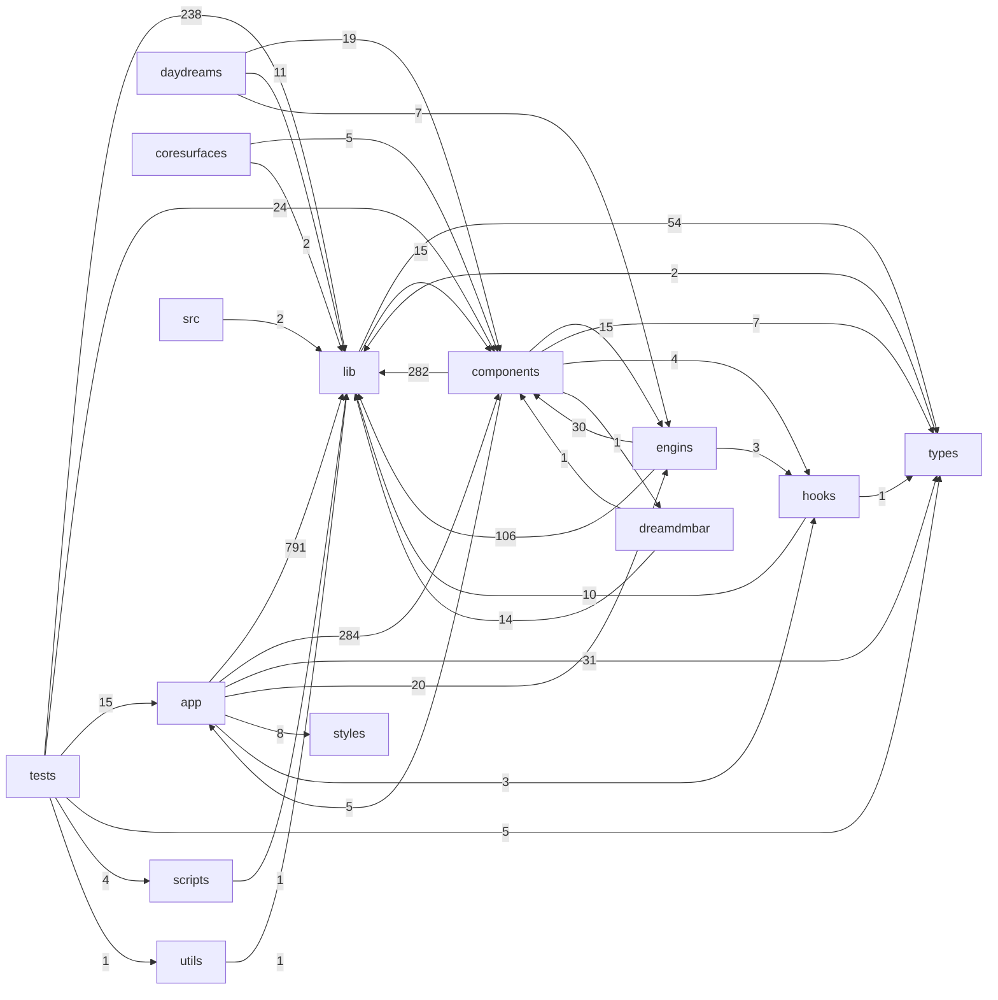

# VISUAL SCHEMATIC

This is the owner-facing Supabase-style visual schematic for the entire DREAMengin repository.
It shows every file, folder, symbol, and connection, including disconnected/floating orphan nodes.

**Live viewer:** https://appthemanger-ctrl.github.io/DREAMengin/

<!-- VISUAL-SCHEMATIC:AUTO-GENERATED:START -->
### Auto-Generated Repository Overview

- **Total files:** 1899
- **Total function/class nodes:** 3395
- **Total edges:** 5049
- **Orphan nodes:** 3000

#### Top-Level Folder Connectivity (auto-generated)

#### Orphan Files (floating/disconnected)
| Path | Type |
|---|---|
| `.ci/snapshot.diff.txt` | doc |
| `.ci/snapshot.md` | doc |
| `.cursorrules` | file |
| `.env.example` | file |
| `.env.local.example` | file |
| `.github/actions/resilient-engine/action.yml` | config |
| `.github/actions/setup-node/action.yml` | config |
| `.github/agents/dreamengin.agent.md` | doc |
| `.github/agents/error-tracker.agent.md` | doc |
| `.github/agents/gameengin-ai-agent.yml` | config |
| `.github/agents/gameengin.md` | doc |
| `.github/agents/humanAI.agent.md` | doc |
| `.github/agents/idari.agent.md` | doc |
| `.github/agents/my-agent.agent.md` | doc |
| `.github/agents/newagent.agent.md` | doc |
| `.github/agents/Spec-Engin HyperSICC.agent.md` | doc |
| `.github/agents/videogameAi.md` | doc |
| `.github/copilot-instructions.md` | doc |
| `.github/issue-triage/issue-552.md` | doc |
| `.github/issue-triage/issue-556.md` | doc |
| `.github/issue-triage/issue-560.md` | doc |
| `.github/issue-triage/issue-565.md` | doc |
| `.github/issue-triage/issue-571.md` | doc |
| `.github/issue-triage/issue-573.md` | doc |
| `.github/issue-triage/issue-600.md` | doc |
| `.github/issue-triage/issue-601.md` | doc |
| `.github/issue-triage/issue-602.md` | doc |
| `.github/issue-triage/issue-603.md` | doc |
| `.github/issue-triage/issue-604.md` | doc |
| `.github/issue-triage/issue-605.md` | doc |
| `.github/issue-triage/issue-606.md` | doc |
| `.github/issue-triage/issue-607.md` | doc |
| `.github/issue-triage/issue-608.md` | doc |
| `.github/issue-triage/issue-609.md` | doc |
| `.github/issue-triage/issue-610.md` | doc |
| `.github/issue-triage/issue-611.md` | doc |
| `.github/issue-triage/issue-612.md` | doc |
| `.github/issue-triage/issue-613.md` | doc |
| `.github/issue-triage/issue-617.md` | doc |
| `.github/issue-triage/issue-620.md` | doc |
| `.github/issue-triage/issue-621.md` | doc |
| `.github/issue-triage/issue-622.md` | doc |
| `.github/issue-triage/issue-623.md` | doc |
| `.github/issue-triage/issue-647.md` | doc |
| `.github/issue-triage/issue-753.md` | doc |
| `.github/issue-triage/issue-754.md` | doc |
| `.github/pull_request_template.md` | doc |
| `.github/PULL_REQUEST_TEMPLATE.md` | doc |
| `.github/ruleset/autofixvercelbuild.yml` | config |
| `.github/ruleset/bot-pr-automerge.yml` | config |
| `.github/ruleset/bouncer.yml` | config |
| `.github/ruleset/copilot-setup-steps.yml` | config |
| `.github/ruleset/daydream-all.yml` | config |
| `.github/ruleset/daydream-brand-engin.yml` | config |
| `.github/ruleset/daydream-code-engin.yml` | config |
| `.github/ruleset/daydream-create-engin.yml` | config |
| `.github/ruleset/daydream-engin-build-cycle.yml` | config |
| `.github/ruleset/daydream-engin-sicc-refinement.yml` | config |
| `.github/ruleset/daydream-games-engin.yml` | config |
| `.github/ruleset/daydream-lab-engin.yml` | config |
| `.github/ruleset/daydream-music-engin.yml` | config |
| `.github/ruleset/db-extension-audit.yml` | config |
| `.github/ruleset/db-extension-check.yml` | config |
| `.github/ruleset/deploy-artifact.yml` | config |
| `.github/ruleset/docs-auto-update.yml` | config |
| `.github/ruleset/dreamengin-preflight.yml` | config |
| `.github/ruleset/elite-gameengin-evolution.yml` | config |
| `.github/ruleset/engin-all.yml` | config |
| `.github/ruleset/exportrepo.yml` | config |
| `.github/ruleset/game-engin-patrol.yml` | config |
| `.github/ruleset/game-library-research.yml` | config |
| `.github/ruleset/gameengin-ai-agent.yml` | config |
| `.github/ruleset/gameengin-artisan.yml` | config |
| `.github/ruleset/gameengin-maestro.yml` | config |
| `.github/ruleset/gameengin-mechanic.yml` | config |
| `.github/ruleset/gameengin-prophet.yml` | config |
| `.github/ruleset/gameengin-upgrader.yml` | config |
| `.github/ruleset/gameengin-writer.yml` | config |
| `.github/ruleset/games-library-ai-agent.yml` | config |
| `.github/ruleset/garbageman.yml` | config |
| `.github/ruleset/generatesupabasetypes.yml` | config |
| `.github/ruleset/github-actions.yml` | config |
| `.github/ruleset/humanai-army-audit.yml` | config |
| `.github/ruleset/humanai-audit.yml` | config |
| `.github/ruleset/idari-daily.yml` | config |
| `.github/ruleset/issue-bot.yml` | config |
| `.github/ruleset/mobile-nextgen-spec-evolution.yml` | config |
| `.github/ruleset/mobile-ps5-spec-evolution.yml` | config |
| `.github/ruleset/neural-decision-engine.yml` | config |
| `.github/ruleset/optimize-dreamengin.yml` | config |
| `.github/ruleset/portfolio-optimization.yml` | config |
| `.github/ruleset/preflight.yml` | config |
| `.github/ruleset/print-codebase.yml` | config |
| `.github/ruleset/readme-autosync.yml` | config |
| `.github/ruleset/refreshlock.yml` | config |
| `.github/ruleset/repo-snapshot.yml` | config |
| `.github/ruleset/report-driven-coding-agent.yml` | config |
| `.github/ruleset/root-hygiene.yml` | config |
| `.github/ruleset/spec-engin-ai-agent.yml` | config |
| `.github/ruleset/sql-migration-guard.yml` | config |
| `.github/ruleset/sync-build-memory.yml` | config |
| `.github/ruleset/update-embed-feed.yml` | config |
| `.github/ruleset/update-repo-state.yml` | config |
| `.github/ruleset/vercel-deploy.yml` | config |
| `.github/scripts/ai_implement.py` | python |
| `.github/scripts/ai_neural_decision.py` | python |
| `.github/scripts/ai_propose.py` | python |
| `.github/scripts/ai_report_propose.py` | python |
| `.github/scripts/assemble_report_context.py` | python |
| `.github/scripts/catalog_games_for_ai.py` | python |
| `.github/scripts/check-root-hygiene.sh` | file |
| `.github/scripts/DREAMENGIN_CORE_COMPLETE.md` | doc |
| `.github/scripts/DREAMENGIN_CORE_USAGE.md` | doc |
| `.github/scripts/dreamengin_core.py` | python |
| `.github/scripts/humanai_audit.py` | python |
| `.github/scripts/issue-bot.js` | js |
| `.github/scripts/scan_dreamengin_context.py` | python |
| `.github/scripts/scan_gameengin_context.py` | python |
| `.github/scripts/validate_game_sandbox.py` | python |
| `.github/scripts/validate_report_agent_spec.py` | python |
| `.gitignore` | file |
| `.gitleaks.toml` | config |
| `.husky/pre-commit` | file |
| `.husky/pre-push` | file |
| `AGENTS.md` | doc |
| `agents/.gitkeep` | file |
| `agents/humanAI.persona.md` | doc |
| `agents/humanAI/orchestrator.md` | doc |
| `agents/humanAI/personas/accessibility.md` | doc |
| `agents/humanAI/personas/creator.md` | doc |
| `agents/humanAI/personas/ios-first.md` | doc |
| `agents/humanAI/personas/power-user.md` | doc |
| `agents/humanAI/personas/social-explorer.md` | doc |
| `app/actions/dream-docs.ts` | ts |
| `app/daydream/game/dream.GamePageClient.tsx` | tsx |
| `app/daydream/game/dream.shell.ImmersiveGameShell.tsx` | tsx |
| `app/dreamdmbar/_components/DreamWidgetGrid.tsx` | tsx |
| `app/error.tsx` | tsx |
| `app/global-error.tsx` | tsx |
| `app/globals-enhanced.css` | css |
| `app/loading.tsx` | tsx |
| `app/not-found.tsx` | tsx |
| `assembly/bus.ts` | ts |
| `assembly/index.ts` | ts |
| `assembly/mad-maxi-player.ts` | ts |
| `backend/.env.example` | file |
| `backend/docker-compose.yml` | config |
| `backend/dockerfile` | file |
| `backend/index.js` | js |
| `backend/package-lock.json` | config |
| `backend/package.json` | config |
| `backend/README.md` | doc |
| `backend/src/Routes/apiRoutes.js` | js |
| `backend/src/services/livekitService.js` | js |
| `build-memory/actions.json` | config |
| `build-memory/events.json` | config |
| `build-memory/routes.json` | config |
| `build-memory/schema.json` | config |
| `build-memory/ui-surfaces.json` | config |
| `CHANGELOG.md` | doc |
| `components/connectors/dream.ConnectDreamPrompt.tsx` | tsx |
| `components/core/dream.CoreDream.tsx` | tsx |
| `components/daydream/dream.CodeDreamIDE.tsx` | tsx |
| `components/daydream/dream.LabDreamIDE.tsx` | tsx |
| `components/daydream/dream.NGNEngin.tsx` | tsx |
| `components/daydream/dream.StandaloneEnginSurface.tsx` | tsx |
| `components/draggable/dream.DraggableModule.tsx` | tsx |
| `components/dream.AIAssistant.tsx` | tsx |
| `components/dream.BoogieWarningBanner.tsx` | tsx |
| `components/dream.CreatePostModal.tsx` | tsx |
| `components/dream.DrEamsModeToggle.tsx` | tsx |
| `components/dream.DrEamsVoiceAssistant.tsx` | tsx |
| `components/dream.FeedCard.tsx` | tsx |
| `components/dream.IconSelector.tsx` | tsx |
| `components/dream.InnerDreamsButton.tsx` | tsx |
| `components/dream.LandingHero.tsx` | tsx |
| `components/dream.LedgerChart.tsx` | tsx |
| `components/dream.OSShellActivator.tsx` | tsx |
| `components/dream.PhysicsLab.tsx` | tsx |
| `components/dream.ProfileEditor.tsx` | tsx |
| `components/dream.PullToRefresh.tsx` | tsx |
| `components/dream.ShrunkMode.tsx` | tsx |
| `components/dream.SkeletonLoaders.tsx` | tsx |
| `components/dream.ThemeToggle.tsx` | tsx |
| `components/dream.ToastSystem.tsx` | tsx |
| `components/dream.VoidThemeToggle.tsx` | tsx |
| `components/dream.widget.AnchorWidget.tsx` | tsx |
| `components/dream.widget.ProfileWidgetBlock.tsx` | tsx |
| `components/dream.widget.WidgetBubble.tsx` | tsx |
| `components/dreamengin/dream.bar.DrEamsSearchBar.tsx` | tsx |
| `components/dreamengin/dream.DrEamsCanvas.tsx` | tsx |
| `components/dreamengin/dream.overlay.ViewAllDreamsOverlay.tsx` | tsx |
| `components/dreamengin/dream.scene.BabylonGameScene.tsx` | tsx |
| `components/dreamengin/dream.scene.DrEamsScene.tsx` | tsx |
| `components/dreamengin/dream.scene.PortfolioOptimizationScene.tsx` | tsx |
| `components/dreamengin/dream.shell.EnginShell.tsx` | tsx |
| `components/dreamengin/dream.widget.AppearanceWidget.tsx` | tsx |
| `components/dreamengin/dreamsurface.dreamengin.tsx` | tsx |
| `components/dreamengin/engine/types.ts` | ts |
| `components/dreamnav/dream.DreamNavControls.tsx` | tsx |
| `components/dreamr/dream.CloseFriendsSettings.tsx` | tsx |
| `components/dreams/dream.connectorlayer.tsx` | tsx |
| `components/dreams/dream.featurelayer.tsx` | tsx |
| `components/dreams/dream.outputlayer.tsx` | tsx |
| `components/dreams/dream.shell.DreamShell.tsx` | tsx |
| `components/dreams/dream.shell.SharedDreamShell.tsx` | tsx |
| `components/dreams/dream.SlideOverPanel.tsx` | tsx |
| `components/dreams/dream.window.JourneyDreamWindow.tsx` | tsx |
| `components/dreams/dreamsurface.window.tsx` | tsx |
| `components/engines/index.ts` | ts |
| `components/feeds/dream.widget.EmbedFeedWidget.tsx` | tsx |
| `components/forge/dream.EngineBuilderCanvas.tsx` | tsx |
| `components/gameengin/dream.cartridge.FeaturedCartridges.tsx` | tsx |
| `components/gameengin/README.md` | doc |
| `components/games/css-modules.d.ts` | ts |
| `components/games/dream.hud.LegacyGameHUD.tsx` | tsx |
| `components/games/dream.Leaderboard.tsx` | tsx |
| `components/home/dream.widget.DreamWidget.tsx` | tsx |
| `components/menus/dream.menu.DreamRadialMenu.tsx` | tsx |
| `components/menus/dream.menu.RadialMenu.tsx` | tsx |
| `components/menus/dream.menu.SystemRadialMenu.tsx` | tsx |
| `components/onboarding/dream.OnboardingTip.tsx` | tsx |
| `components/optimizer/dream.scene.BabylonOptimizeroScene.tsx` | tsx |
| `components/panels/dream.panel.FeedPanel.tsx` | tsx |
| `components/profile/dream.ProfileCanvas.tsx` | tsx |
| `components/providers/dream.AppSurfaceShell.tsx` | tsx |
| `components/shaders/index.ts` | ts |
| `components/three/index.ts` | ts |
| `components/ui/dream.IconList.tsx` | tsx |
| `components/universal-editor/index.ts` | ts |
| `components/warp/dream.WarpCanvas.tsx` | tsx |
| `components/webgpu/neuralPostProcess.ts` | ts |
| `components/widgets/dream.AddDreamCTA.tsx` | tsx |
| `components/widgets/dream.ConfigureSheet.tsx` | tsx |
| `components/widgets/dream.EditModeBanner.tsx` | tsx |
| `components/widgets/dream.widget.PlayMediaWidget.tsx` | tsx |
| `components/widgets/dream.widget.WidgetPlaceholder.tsx` | tsx |
| `config/advanced-game-targets.json` | config |
| `config/optimizer.yaml` | config |
| `config/ui-ux-spec.yaml` | config |
| `COOP_AND_SOLO_ROADMAP.md` | doc |
| `core/.gitkeep` | file |
| `coresurfaces/dreamsurface.EditProfileDream.tsx` | tsx |
| `coresurfaces/dreamsurface.ViewProfile.tsx` | tsx |
| `daydreams/brand/page.tsx` | tsx |
| `daydreams/code/page.tsx` | tsx |
| `daydreams/create/page.tsx` | tsx |
| `daydreams/games/page.tsx` | tsx |
| `daydreams/lab/page.tsx` | tsx |
| `daydreams/music/page.tsx` | tsx |
| `docs/ACTION_AUDIT.md` | doc |
| `docs/ACTIVITY_FIRST_PROTOCOL.md` | doc |
| `docs/ADD_WORKFLOW.md` | doc |
| `docs/AGENT_PLAYBOOK.md` | doc |
| `docs/AI_MAP.md` | doc |
| `docs/alignment/DOCS_CHANGE_TRACKER.md` | doc |
| `docs/alignment/REPO_TO_SPEC.md` | doc |
| `docs/ARCHITECTURE.md` | doc |
| `docs/architecture/dreamengin_phase2.md` | doc |
| `docs/architecture/IMPLEMENTATION_NOTES.md` | doc |
| `docs/archive/.gitkeep` | file |
| `docs/AUTH_SETUP.md` | doc |
| `docs/AXIOMS.md` | doc |
| `docs/BOOGIEMAN_POLICY.md` | doc |
| `docs/BUGS.md` | doc |
| `docs/CHILD_SAFETY_POLICY.md` | doc |
| `docs/CONNECTOR_MATRIX.md` | doc |
| `docs/CONNECTORS.md` | doc |
| `docs/CONSTITUTION.md` | doc |
| `docs/COPILOT_TOOLKIT.md` | doc |
| `docs/DR_EAMS.md` | doc |
| `docs/dreamdm_bar_pass1.md` | doc |
| `docs/dreamdm_bar_pass2.md` | doc |
| `docs/dreamdm_messaging_phase2.md` | doc |
| `docs/dreamengin_phase1.md` | doc |
| `docs/dreamengin_phase6.md` | doc |
| `docs/dreamengin_phase8.md` | doc |
| `docs/DREAMGAME_FORMAT.md` | doc |
| `docs/DUALSENSE_EXAMPLE.md` | doc |
| `docs/DUALSENSE_INTEGRATION.md` | doc |
| `docs/ENGIN_RUNTIME.md` | doc |
| `docs/engin_workflows.md` | doc |
| `docs/engineering/guardrails.md` | doc |
| `docs/enginpipe/README.md` | doc |
| `docs/FEATURE_STATUS.md` | doc |
| `docs/GENERATION_LAW.md` | doc |
| `docs/GITHUB_CODING_AGENT.md` | doc |
| `docs/GOLD_BUTTON_DUAL_RUNTIME.md` | doc |
| `docs/GOLD_BUTTON_QUICK_REF.md` | doc |
| `docs/guides/GITHUB_PUSH_GUIDE.md` | doc |
| `docs/guides/README.agent.md` | doc |
| `docs/HANDOFF.md` | doc |
| `docs/icons.md` | doc |
| `docs/IDARI_CONTRACT.md` | doc |
| `docs/ISSUE_FIXES.md` | doc |
| `docs/issue-552-readme-section-bot-ai-agent-quick-reference.md` | doc |
| `docs/issue-556-readme-section-bot-canonical-route-system.md` | doc |
| `docs/issue-560-readme-section-bot-runtime-model.md` | doc |
| `docs/issue-565-readme-section-bot-3-os-layer-naming-law-canonic.md` | doc |
| `docs/issue-571-readme-section-bot-9-daydream-pair-system-6-dayd.md` | doc |
| `docs/issue-573-readme-section-bot-11-games-gameengin.md` | doc |
| `docs/issue-600-readme-section-bot-recent-changes.md` | doc |
| `docs/issue-601-readme-section-bot-repository-state-analysis.md` | doc |
| `docs/issue-602-readme-section-bot-homedream-system.md` | doc |
| `docs/issue-603-readme-section-bot-core-surfaces.md` | doc |
| `docs/issue-604-readme-section-bot-current-implementation-status.md` | doc |
| `docs/issue-605-readme-section-bot-daydream-surfaces.md` | doc |
| `docs/issue-606-readme-section-bot-daydream-engin-network-model.md` | doc |
| `docs/issue-607-readme-section-bot-dreamdmbar-interaction-rail-r.md` | doc |
| `docs/issue-608-readme-section-bot-1-product-law-16-foundational.md` | doc |
| `docs/issue-609-readme-section-bot-6-homedream-core-system-priva.md` | doc |
| `docs/issue-610-readme-section-bot-10-music-starmakerengin.md` | doc |
| `docs/issue-611-readme-section-bot-12-lab-labengin.md` | doc |
| `docs/issue-612-readme-section-bot-13-code-codeengin.md` | doc |
| `docs/issue-613-readme-section-bot-7-edit-profiledream-core-syst.md` | doc |
| `docs/issue-617-readme-section-bot-8-view-profile-public-shared-.md` | doc |
| `docs/issue-620-readme-section-bot-what-this-is.md` | doc |
| `docs/issue-621-readme-section-bot-start-here.md` | doc |
| `docs/issue-622-readme-section-bot-structure.md` | doc |
| `docs/issue-623-readme-section-bot-root-rules.md` | doc |
| `docs/issue-647-readme-section-bot-how-to-regenerate-this-spec.md` | doc |
| `docs/LAW.md` | doc |
| `docs/logs/README_PATCH.md` | doc |
| `docs/mobile-nextgen-web-gaming-engine-spec.md` | doc |
| `docs/mobile-ps5-web-gaming-engine-spec.md` | doc |
| `docs/MODULARITY_VIOLATION_LOG.md` | doc |
| `docs/NAMESPACE_PROTOCOL.md` | doc |
| `docs/NAMING_AUTHORITY.md` | doc |
| `docs/OBSERVABILITY.md` | doc |
| `docs/PHASE9_IMPLEMENTATION.md` | doc |
| `docs/POLICY_TESTS.md` | doc |
| `docs/policy/theboogie.md` | doc |
| `docs/PRINCIPLES_UPDATE.md` | doc |
| `docs/PRODUCT_DEFINITION.md` | doc |
| `docs/REPO_COMPANION.md` | doc |
| `docs/REPO_STATE_ANALYZER.md` | doc |
| `docs/REPO_STRUCTURE_CONTRACT.md` | doc |
| `docs/REVIEW_QUEUE.md` | doc |
| `docs/SECURITY.md` | doc |
| `docs/THEME.md` | doc |
| `docs/TRIAGE_LOG.md` | doc |
| `docs/wasm_gpu_vm_spec.md` | doc |
| `docs/WASM_GPU_VM_SUMMARY.md` | doc |
| `docs/WIDGET_SYSTEM_V2.md` | doc |
| `dr-eams/capabilities.yaml` | config |
| `dr-eams/tools.ts` | ts |
| `engins/CodeEngin/core/parser.ts` | ts |
| `engins/CodeEngin/orchestrator/dream.index.tsx` | tsx |
| `experiments/.gitkeep` | file |
| `frontend/public/favicon.ico` | file |
| `frontend/public/index.html` | file |
| `frontend/public/src/components/commentSection/CommentSection.jsx` | jsx |
| `frontend/public/src/components/feed/Feed.jsx` | jsx |
| `frontend/public/src/components/Videoplayer/VideoPlayer.jsx` | jsx |
| `frontend/public/src/DockerFile` | file |
| `frontend/public/src/index.js` | js |
| `frontend/public/src/package-lock.json` | config |
| `frontend/public/src/package.json` | config |
| `frontend/public/src/Services/api.js` | js |
| `frontend/public/src/Services/livekit.js` | js |
| `frontend/public/src/Utils/socialUtils.js` | js |
| `frontend/public/src/Utils/web3Utils.js` | js |
| `GameENGINspec.md` | doc |
| `grafana/dashboards/default.yml` | config |
| `grafana/datasources/prometheus.yml` | config |
| `hooks/useHideOnScroll.ts` | ts |
| `hooks/useTick.ts` | ts |
| `hooks/useViewCounter.ts` | ts |
| `lib/activity/boogieActivityPolicy.ts` | ts |
| `lib/agents/boogieManAI.ts` | ts |
| `lib/agents/dreamengin.ts` | ts |
| `lib/ai/boogie-verifier.ts` | ts |
| `lib/ai/capability-gate.ts` | ts |
| `lib/ai/CIC.ts` | ts |
| `lib/ai/confirm-token.ts` | ts |
| `lib/ai/handlers/index.ts` | ts |
| `lib/ai/idempotency.ts` | ts |
| `lib/ai/rate-limiter.ts` | ts |
| `lib/ai/tfBackend.ts` | ts |
| `lib/audio-fingerprint/index.ts` | ts |
| `lib/babylon/dreamengine-hybrid.ts` | ts |
| `lib/bot-detection/detector.ts` | ts |
| `lib/bot-detection/view-tally.ts` | ts |
| `lib/bus.wasm` | file |
| `lib/connectors/providers/devto.ts` | ts |
| `lib/connectors/providers/facebook.ts` | ts |
| `lib/connectors/providers/hackernews.ts` | ts |
| `lib/connectors/providers/medium.ts` | ts |
| `lib/connectors/providers/pinterest.ts` | ts |
| `lib/connectors/providers/podcast.ts` | ts |
| `lib/connectors/providers/substack.ts` | ts |
| `lib/connectors/providers/tiktok.ts` | ts |
| `lib/connectors/providers/tumblr.ts` | ts |
| `lib/connectors/providers/twitter.ts` | ts |
| `lib/connectors/youtube.ts` | ts |
| `lib/consent/consentManager.ts` | ts |
| `lib/content/generativeFill.ts` | ts |
| `lib/dream-docs/index.ts` | ts |
| `lib/dream-window/index.ts` | ts |
| `lib/dreamdm/useModuleBarIntent.ts` | ts |
| `lib/dreamengin/engineAssets.ts` | ts |
| `lib/dreamnav/gctAssist.ts` | ts |
| `lib/dreamnav/gestures6.ts` | ts |
| `lib/dreamr/socialHumanityScore.ts` | ts |
| `lib/engins/game/index.ts` | ts |
| `lib/engins/useEnginWorkflow.ts` | ts |
| `lib/forge-ngn/index.ts` | ts |
| `lib/gameengin/accessibility-ai.ts` | ts |
| `lib/gameengin/ai-npcs.ts` | ts |
| `lib/gameengin/brain/active-projects.json` | config |
| `lib/gameengin/brain/asset-registry/README.md` | doc |
| `lib/gameengin/brain/build-history/README.md` | doc |
| `lib/gameengin/brain/character-voices/mad-maxi.json` | config |
| `lib/gameengin/brain/composition-principles/leading-lines-landmark.json` | config |
| `lib/gameengin/brain/composition-principles/parallax-layers.json` | config |
| `lib/gameengin/brain/concept-library/neon-courier.json` | config |
| `lib/gameengin/brain/concept-library/README.md` | doc |
| `lib/gameengin/brain/concept-patterns/protagonists/reluctant-courier.json` | config |
| `lib/gameengin/brain/concept-patterns/README.md` | doc |
| `lib/gameengin/brain/concept-patterns/scope-formulas/one-day-runner.json` | config |
| `lib/gameengin/brain/concept-patterns/settings/neon-rain-megacity.json` | config |
| `lib/gameengin/brain/crash-reports/README.md` | doc |
| `lib/gameengin/brain/dialogue-patterns/callback-anchor.json` | config |
| `lib/gameengin/brain/dialogue-patterns/implied-subject.json` | config |
| `lib/gameengin/brain/dialogue-patterns/sentence-fragment-rhythm.json` | config |
| `lib/gameengin/brain/emotional-tones/determined.json` | config |
| `lib/gameengin/brain/emotional-tones/fierce.json` | config |
| `lib/gameengin/brain/emotional-tones/hopeful.json` | config |
| `lib/gameengin/brain/emotional-tones/reflective.json` | config |
| `lib/gameengin/brain/emotional-tones/weary.json` | config |
| `lib/gameengin/brain/fun-heuristics/meta-progression.json` | config |
| `lib/gameengin/brain/fun-heuristics/moment-to-moment.json` | config |
| `lib/gameengin/brain/fun-heuristics/session-loop.json` | config |
| `lib/gameengin/brain/genre-dna/action-rpg.json` | config |
| `lib/gameengin/brain/genre-dna/episodic.json` | config |
| `lib/gameengin/brain/genre-dna/live-service.json` | config |
| `lib/gameengin/brain/genre-dna/metroidvania.json` | config |
| `lib/gameengin/brain/genre-dna/open-world.json` | config |
| `lib/gameengin/brain/genre-dna/platformer.json` | config |
| `lib/gameengin/brain/genre-dna/puzzle.json` | config |
| `lib/gameengin/brain/genre-dna/racing.json` | config |
| `lib/gameengin/brain/genre-dna/roguelike.json` | config |
| `lib/gameengin/brain/genre-dna/sandbox.json` | config |
| `lib/gameengin/brain/genre-dna/template.json` | config |
| `lib/gameengin/brain/inspiration-corpus/celeste.json` | config |
| `lib/gameengin/brain/inspiration-corpus/dead-cells.json` | config |
| `lib/gameengin/brain/inspiration-corpus/hades.json` | config |
| `lib/gameengin/brain/inspiration-corpus/hollow-knight.json` | config |
| `lib/gameengin/brain/inspiration-corpus/outer-wilds.json` | config |
| `lib/gameengin/brain/material-recipes/neon-glass-tube.json` | config |
| `lib/gameengin/brain/material-recipes/rusted-iron.json` | config |
| `lib/gameengin/brain/material-recipes/sun-bleached-sandstone.json` | config |
| `lib/gameengin/brain/mechanic-library/camera/look-ahead.json` | config |
| `lib/gameengin/brain/mechanic-library/camera/screen-shake.json` | config |
| `lib/gameengin/brain/mechanic-library/camera/smooth-follow.json` | config |
| `lib/gameengin/brain/mechanic-library/combat/combo.json` | config |
| `lib/gameengin/brain/mechanic-library/combat/hit-stop.json` | config |
| `lib/gameengin/brain/mechanic-library/combat/parry.json` | config |
| `lib/gameengin/brain/mechanic-library/combat/ranged.json` | config |
| `lib/gameengin/brain/mechanic-library/movement/coyote-time.json` | config |
| `lib/gameengin/brain/mechanic-library/movement/dash.json` | config |
| `lib/gameengin/brain/mechanic-library/movement/double-jump.json` | config |
| `lib/gameengin/brain/mechanic-library/movement/grapple.json` | config |
| `lib/gameengin/brain/mechanic-library/movement/wall-slide.json` | config |
| `lib/gameengin/brain/mechanic-library/progression/metroidvania-gating.json` | config |
| `lib/gameengin/brain/mechanic-library/progression/roguelike-perks.json` | config |
| `lib/gameengin/brain/mechanic-library/progression/skill-tree.json` | config |
| `lib/gameengin/brain/mechanic-library/structural/ability-gating.json` | config |
| `lib/gameengin/brain/mechanic-library/structural/meta-progression.json` | config |
| `lib/gameengin/brain/mechanic-library/structural/procedural-generation.json` | config |
| `lib/gameengin/brain/mechanic-library/structural/run-persistence.json` | config |
| `lib/gameengin/brain/mechanic-library/structural/season-pass.json` | config |
| `lib/gameengin/brain/mechanic-library/structural/world-streaming.json` | config |
| `lib/gameengin/brain/narrative-pacing/default.json` | config |
| `lib/gameengin/brain/originality-registry/by-cartridge/mad-maxi.json` | config |
| `lib/gameengin/brain/originality-registry/signatures.json` | config |
| `lib/gameengin/brain/principles/emotional-core.md` | doc |
| `lib/gameengin/brain/principles/feedback.md` | doc |
| `lib/gameengin/brain/principles/mastery.md` | doc |
| `lib/gameengin/brain/principles/progression.md` | doc |
| `lib/gameengin/brain/principles/responsiveness.md` | doc |
| `lib/gameengin/brain/principles/risk-reward.md` | doc |
| `lib/gameengin/brain/progression-state/README.md` | doc |
| `lib/gameengin/brain/rd-sessions/README.md` | doc |
| `lib/gameengin/brain/README.md` | doc |
| `lib/gameengin/brain/technique-library/lighting/three-point-mood.json` | config |
| `lib/gameengin/brain/technique-library/modeling/edge-flow.json` | config |
| `lib/gameengin/brain/technique-library/modeling/silhouette-first.json` | config |
| `lib/gameengin/brain/technique-library/optimization/texture-atlasing.json` | config |
| `lib/gameengin/brain/upgrade-history/prioritization-rules.json` | config |
| `lib/gameengin/brain/upgrade-history/README.md` | doc |
| `lib/gameengin/brain/visual-bible/characters/mad-maxi.md` | doc |
| `lib/gameengin/brain/visual-bible/environments/neon-wasteland.md` | doc |
| `lib/gameengin/brain/work-queue/README.md` | doc |
| `lib/gameengin/cartridges/index.ts` | ts |
| `lib/gameengin/cloud-compute.ts` | ts |
| `lib/gameengin/generative-audio.ts` | ts |
| `lib/gameengin/neural-render.ts` | ts |
| `lib/gameengin/path-tracing.ts` | ts |
| `lib/gameengin/predictive-stream.ts` | ts |
| `lib/gameengin/procgen.ts` | ts |
| `lib/gameengin/systems/index.ts` | ts |
| `lib/gameengin/webgpu-runtime-shell.ts` | ts |
| `lib/gameengin/world-crdt.ts` | ts |
| `lib/gameengin/xr.ts` | ts |
| `lib/games/DualSenseManager.ts` | ts |
| `lib/games/lucid-avenue-world.ts` | ts |
| `lib/games/useAIDirector.ts` | ts |
| `lib/gestures/useTouchGestures.ts` | ts |
| `lib/home-buttons/button-groups.ts` | ts |
| `lib/hooks/useResponsive.ts` | ts |
| `lib/hooks/useTap.ts` | ts |
| `lib/journey/withJourney.ts` | ts |
| `lib/music/wasmAudioBridge.ts` | ts |
| `lib/navigation/index.ts` | ts |
| `lib/navigation/README.md` | doc |
| `lib/observability/healthTrend.ts` | ts |
| `lib/observability/index.ts` | ts |
| `lib/offline/useOfflineSync.ts` | ts |
| `lib/optimizer/README.md` | doc |
| `lib/renderer/index.ts` | ts |
| `lib/runtime/quantumCircuit.ts` | ts |
| `lib/runtime/snapshotFingerprint.ts` | ts |
| `lib/runtime/useDragSurface.ts` | ts |
| `lib/runtime/useDualRuntime.ts` | ts |
| `lib/runtime/useDualRuntimePersistence.ts` | ts |
| `lib/supabase/realtime.ts` | ts |
| `lib/torridity/index.ts` | ts |
| `lib/vm/index.ts` | ts |
| `lib/vm/README.md` | doc |
| `lib/webgpu/useWebGPUDirector.ts` | ts |
| `lib/widgets/CrossWidgetPosting.ts` | ts |
| `lib/widgets/parse.ts` | ts |
| `lib/widgets/useWidget.ts` | ts |
| `lib/widgets/WidgetEngine.tsx` | tsx |
| `LICENSE` | file |
| `misc/images/arm2_transparent.png` | file |
| `misc/images/coat_transparent.png` | file |
| `misc/images/head_transparent.png` | file |
| `misc/images/iconslist.png` | file |
| `misc/images/logo_DREAM_transparent.png` | file |
| `misc/images/logo_ENGIN_transparent.png` | file |
| `misc/images/logo_transparent.png` | file |
| `misc/images/shoe1_transparent.png` | file |
| `misc/images/shoe2_transparent.png` | file |
| `misc/images/sprite_2x_transparent.png` | file |
| `misc/images/sprite_transparent.png` | file |
| `next-env.d.ts` | ts |
| `output/patch-plan.json` | config |
| `output/result.json` | config |
| `prometheus/prometheus.yml` | config |
| `public/arm1_transparent.png` | file |
| `public/arm2_transparent.png` | file |
| `public/cartridges/mad-maxi/logic/main.wasm` | file |
| `public/cartridges/mad-maxi/MANIFEST.json` | config |
| `public/cartridges/mad-maxi/tuning.json` | config |
| `public/coat_transparent.png` | file |
| `public/dr-eams-pbr.html` | file |
| `public/favicon.ico` | file |
| `public/feeds/embed-feed.json` | config |
| `public/file.svg` | file |
| `public/globe.svg` | file |
| `public/head_transparent.png` | file |
| `public/images/iconslist.png` | file |
| `public/images/logo1.PNG` | file |
| `public/images/logo2.PNG` | file |
| `public/images/logo3.PNG` | file |
| `public/logo_DREAM_transparent.png` | file |
| `public/logo_ENGIN_transparent.png` | file |
| `public/logo-icon.png` | file |
| `public/manifest.json` | config |
| `public/manifest.webmanifest` | file |
| `public/models/madmaxi.glb` | file |
| `public/module-loader.html` | file |
| `public/next.svg` | file |
| `public/shoe1_transparent.png` | file |
| `public/shoe2_transparent.png` | file |
| `public/sprite_2x_transparent.png` | file |
| `public/sprite_transparent.png` | file |
| `public/vercel.svg` | file |
| `public/videos/signup-bg.mp4` | file |
| `public/window.svg` | file |
| `public/workers/asset-optimizer.worker.js` | js |
| `public/workers/engin-shader.wasm` | file |
| `public/workers/engin-shader.worker.ts` | ts |
| `README.md` | doc |
| `REPO_STATE.md` | doc |
| `repo-visualizer/analyzer.mjs` | mjs |
| `repo-visualizer/index.html` | file |
| `repo-visualizer/README.md` | doc |
| `repo-visualizer/server.mjs` | mjs |
| `research-and-development/LICENSE` | file |
| `research-and-development/tech-spec-v1.md` | doc |
| `research/ccc-ada-twin-engine/code/README.md` | doc |
| `research/ccc-ada-twin-engine/data/README.md` | doc |
| `research/ccc-ada-twin-engine/notes/sharpening_notes.txt` | doc |
| `research/ccc-ada-twin-engine/paper/ccc_ada_axioms_and_invariants.tex` | file |
| `research/ccc-ada-twin-engine/paper/ccc_ada_black_hole_gravitational_wave_memory.tex` | file |
| `research/ccc-ada-twin-engine/paper/ccc_ada_holography_and_information_boundary.tex` | file |
| `research/ccc-ada-twin-engine/paper/ccc_ada_predictions_and_falsifiability.tex` | file |
| `research/ccc-ada-twin-engine/paper/ccc_ada_twin_engine_framework.tex` | file |
| `research/ccc-ada-twin-engine/README.md` | doc |
| `research/data/README.md` | doc |
| `research/data/torr_vs_mond_lock_n11.csv` | file |
| `research/DISCOVERY.md` | doc |
| `research/equations/torridityequate.txt` | doc |
| `research/paper/torridity_ledger.tex` | file |
| `research/README.md` | doc |
| `scripts/analyze-repo-state.mjs` | mjs |
| `scripts/archive/proxy.ts` | ts |
| `scripts/archive/validate-deployment.js` | js |
| `scripts/autofix-vercel-build.mjs` | mjs |
| `scripts/check-build-memory-drift.mjs` | mjs |
| `scripts/check-engin-filenames.mjs` | mjs |
| `scripts/check-licenses.mjs` | mjs |
| `scripts/check-root-hygiene.mjs` | mjs |
| `scripts/close-all-open-prs.sh` | file |
| `scripts/deploy.sh` | file |
| `scripts/export-full-code.mjs` | mjs |
| `scripts/feature-build/generate-features.mjs` | mjs |
| `scripts/gameengin/architect-run.ts` | ts |
| `scripts/gameengin/artisan-run.ts` | ts |
| `scripts/gameengin/maestro-analyze.ts` | ts |
| `scripts/gameengin/mechanic-run.ts` | ts |
| `scripts/gameengin/package-cartridge.ts` | ts |
| `scripts/gameengin/prophet-run.ts` | ts |
| `scripts/gameengin/upgrader-run.ts` | ts |
| `scripts/gameengin/writer-run.ts` | ts |
| `scripts/generate-mobile-nextgen-spec.mjs` | mjs |
| `scripts/generate-mobile-ps5-spec.mjs` | mjs |
| `scripts/generate-webapp-final-form.mjs` | mjs |
| `scripts/law-check.sh` | file |
| `scripts/migrate-imports.sh` | file |
| `scripts/optimize-dreamengin.mjs` | mjs |
| `scripts/postbuild.js` | js |
| `scripts/postbuild.ts` | ts |
| `scripts/score-pass.cjs` | cjs |
| `scripts/setup-database.sql` | sql |
| `scripts/spec-check.cjs` | cjs |
| `scripts/sync-build-memory.mjs` | mjs |
| `scripts/ui-ux-agent.py` | python |
| `scripts/update-bugs.mjs` | mjs |
| `scripts/update-embed-feed.mjs` | mjs |
| `scripts/update-handoff.mjs` | mjs |
| `scripts/update-readme.mjs` | mjs |
| `scripts/validate-schema-sync.sh` | file |
| `scripts/vercel-ignore.cjs` | cjs |
| `scripts/vercel-preflight.cjs` | cjs |
| `src/components/dream.DreamEnginLogo.tsx` | tsx |
| `src/components/dream.LogoHero.tsx` | tsx |
| `src/components/dream.Nav.tsx` | tsx |
| `src/dream/rulesets/homedream/index.ts` | ts |
| `src/dreamsurface/index.ts` | ts |
| `src/engin/core/index.ts` | ts |
| `src/engin/state/base.json` | config |
| `src/launcher.ts` | ts |
| `src/lib/ai/client.ts` | ts |
| `src/lib/babylon/useDreamLogoScene.ts` | ts |
| `styles/theme.css` | css |
| `supabase/config.toml` | config |
| `supabase/migrations/20240120000000_initial_schema.sql` | sql |
| `supabase/migrations/20240120000001_enable_rls.sql` | sql |
| `supabase/migrations/20260129000000_upgrade_schema.sql` | sql |
| `supabase/migrations/20260210_ai_core.sql` | sql |
| `supabase/migrations/20260210000000_widget_system_v2.sql` | sql |
| `supabase/migrations/20260210000001_ai_system_v2026.sql` | sql |
| `supabase/migrations/20260214000000_security_axioms.sql` | sql |
| `supabase/migrations/20260226000000_admin_lock.sql` | sql |
| `supabase/migrations/20260305000000_create_notes.sql` | sql |
| `supabase/migrations/20260305000001_comments.sql` | sql |
| `supabase/migrations/20260305000002_leaderboard.sql` | sql |
| `supabase/migrations/20260307000000_readme_gaps.sql` | sql |
| `supabase/migrations/20260307000001_conversations_messages.sql` | sql |
| `supabase/migrations/20260310000000_widget_instances_visibility.sql` | sql |
| `supabase/migrations/20260310000001_profiles_widget_config.sql` | sql |
| `supabase/migrations/20260310000002_profile_dream_widgets.sql` | sql |
| `supabase/migrations/20260310000003_connector_accounts.sql` | sql |
| `supabase/migrations/20260310000004_feed_items.sql` | sql |
| `supabase/migrations/20260310000010_dreamdm_bar_pass2.sql` | sql |
| `supabase/migrations/20260315000000_content_drafts.sql` | sql |
| `supabase/migrations/20260316000000_visibility_mappings.sql` | sql |
| `supabase/migrations/20260319000000_journey_dots.sql` | sql |
| `supabase/migrations/20260319065444_new-migration.sql` | sql |
| `supabase/migrations/20260319120000_connector_accounts_schema_reload.sql` | sql |
| `supabase/migrations/20260320000000_scheduled_posts.sql` | sql |
| `supabase/migrations/20260320100000_game_scores_all_games.sql` | sql |
| `supabase/migrations/20260320110000_user_blocks.sql` | sql |
| `supabase/migrations/20260321000000_ads_platform_promotions.sql` | sql |
| `supabase/migrations/20260321200000_phase8a_feed_and_layout.sql` | sql |
| `supabase/migrations/20260322000000_phase8b_dream_windows.sql` | sql |
| `supabase/migrations/20260322000000_policy_events.sql` | sql |
| `supabase/migrations/20260322000001_message_boards.sql` | sql |
| `supabase/migrations/20260323100000_embed_feed_items.sql` | sql |
| `supabase/migrations/20260324000000_phase8e_orders.sql` | sql |
| `supabase/migrations/20260324000001_phase8e_shop_marketplace.sql` | sql |
| `supabase/migrations/20260325000000_phase8f_daydream_network.sql` | sql |
| `supabase/migrations/20260325100000_child_safety.sql` | sql |
| `supabase/migrations/20260401000001_platform_utilities.sql` | sql |
| `supabase/migrations/20260402000001_control_mappings.sql` | sql |
| `supabase/migrations/20260402000002_game_assets.sql` | sql |
| `supabase/migrations/20260403000001_pgvector_embeddings.sql` | sql |
| `supabase/migrations/20260403000002_pgvector_search_rpc.sql` | sql |
| `supabase/migrations/20260405000001_dreamr_feed_registry.sql` | sql |
| `supabase/migrations/20260405042406_auto_scaffold.sql` | sql |
| `supabase/migrations/20260413000000_phase9_activity_first_protocol.sql` | sql |
| `supabase/migrations/20260417000000_repurpose_nods_as_dream_docs.sql` | sql |
| `supabase/migrations/20260417000001_dream_docs_search_rpc.sql` | sql |
| `supabase/migrations/20260418000000_gameengin_core.sql` | sql |
| `supabase/migrations/20260420000001_consent_settings_audit.sql` | sql |
| `supabase/migrations/20260426000000_activity_coop_gameengin_completion.sql` | sql |
| `supabase/migrations/20260426000100_rename_widgets_to_dreams.sql` | sql |
| `supabase/migrations/20260426000200_build_memory_schema_gaps.sql` | sql |
| `supabase/schema-final.sql` | sql |
| `supabase/seed.sql` | sql |
| `system/ci/archive/root-workflows/github-actions.yml` | config |
| `tailwindcss-animate.d.ts` | ts |
| `terraform/main.tf` | file |
| `tsconfig.games.json` | config |
| `tsconfig.gamesengin.json` | config |
| `types/ccc.ts` | ts |
| `types/experience.ts` | ts |
| `types/marketplace.ts` | ts |
| `types/rivet-dev-agent-os.d.ts` | ts |
| `VISUAL-SCHEMATIC.md` | doc |
| `workflow/archive/appthemanger-ctrl_DREAMengin_95779c.json` | config |
| `workflow/archive/config.yaml` | config |
| `workflow/archive/docker-compose.yml` | config |
| `workflow/archive/Dockerfile` | config |
| `workflow/archive/Dockerfile.dev` | config |

_Generated by `repo-visualizer/analyzer.mjs`._
<!-- VISUAL-SCHEMATIC:AUTO-GENERATED:END -->

Use the interactive viewer in `repo-visualizer/index.html` (served via `pnpm viz`) for click/zoom/filter exploration.
